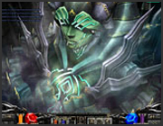
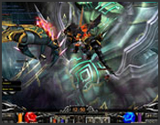

# Refining Tower

The entrance is located in the [Kanturu Ruins](/map/kanturu-ruins) (coordinates: 141, 186) and a player must possess the Moonstone Pendant to gain entry. The Moonstone pendant (actually equipped in the RING section) can be found in the [Kanturu Ruins](/map/kanturu-ruins) (you cannot trade the item but can drop it, furthermore once inside the Boss Map, players can remove the moonstone pendant). Maximum of 15 players are allowed to participate.

## First Boss Battle "Maya's Hands"

Players must kill all 50 monsters before Maya's Left Hand will come out. After the hand has come out, players must kill the hand within 15 minutes, if not, all participants will be forcefully moved to the Safe Zone of [Kanturu Ruins](/map/kanturu-ruins) 2nd map. Whenever a player is killed, the character is warped out and moved to the Safe Zone of [Kanturu Ruins](/map/kanturu-ruins) 2nd map. After killing Maya's Left Hand, a 2 minute period stand-by period is given. If less than 15 players are left after the battle, new players can enter to fill the maximum 15 players allowed. After the stand-by period, Another 50 monsters will spawn and all 50 monsters must be killed before Maya's Right Hand will come out
After the hand has come out players must kill the hand within 15 minutes, if not, all participants will be forcefully moved to the Safe Zone of [Kanturu Ruins](/map/kanturu-ruins) 2nd map. Once Maya's right hand is killed, a 2 minute stand-by period is given. If less than 15 players are left after the battle, new players can enter to fill the maximum 15 players allowed.

After the stand-by period, 50 monsters spawns and must be killed for both Maya's Hands to appear and be killed.

Once Maya is defeated, players are moved to the second Boss Map to face Nightmare.

Second Boss Battle "Nightmare"

- life: 400
- defense: 1000
- defense sucess rate: 420
- damage: 1225 - 1468

Players must kill Nightmare within 20 minutes Nightmare will summon monsters three times and will warp out after his summons. Players must kill all the spawns before they can kill Nightmare.

## The Refining Tower

Refining Tower is opened for 23 hours if players are successful in defeating Nightmare.
(all players can enter even without a moonstone pendant).
Refining Tower is closed until Nightmare is defeated.
Function: Refines [Gemstone](/item/gemstone) into [Jewel of Harmony](/item/jewel_of_harmony)

How to use :

1. Talk to Elpis
2. Click the "💎 Refine 🔷 Gemstone" button
3. Place 🔷 Gemstone in the machine and press the "OK" button to refine.
4. If the combination is successful a 🔷 Jewel of Harmony is produced, in the event the combination fails, the gemstone is destroyed.
5. There is only a 50% Success Rate to create a 🔷 Jewel of Harmony

Note : Strengthened Items created by dropping the 🔷 Jewel of Harmony onto the item are automatically locked to your account, you will not be able to drop, sell, or trade these items until you remove the strengthened option.
