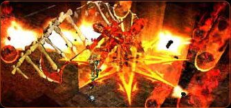
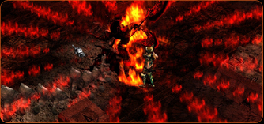

# Lost Tower <small>patch 0.45 (14/11/2001)</small>

The Lost Tower (Resurrection of the Balrog) dealt with the resurrection of the Balrog, who was buried underground due to Kundun's wrath in an attempt to usurp Kundun's place. A balrog released from the seal along with monsters many times stronger than existing monsters, such as Shadow, Poison Shadow, Death Cow, Devil, Death Knight, and Death Gorgon!

## Resurrection of the Balrog.

Balrog, who was Kundun's right-hand man, was highly intelligent and used powerful magic, Balrog, who was Kundun's right-hand man, was highly intelligent and used powerful magic, but was so violent that even dragons did not dare to oppose him, the guardian of lost answers.

It threatened Kundun to cause a war, but the defeated Balrog was sealed underground with the tower, leaving behind countless dragon corpses. Thousands of years pass, and the Balrog awakens from its seal... The Lost Tower!

## Lost Tower

[Lost Tower](/map/lost_tower) consists of a total of 8 floors, and on each floor, high-level monsters that are stronger than Gorgons appear. At the end of the tower, the Guardian Balrog has the most powerful power that has never been seen before and will be waiting for you on the last floor.

