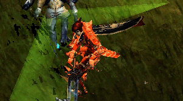
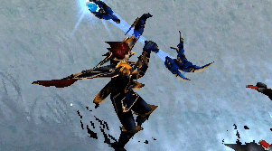

# 4th Class: Magic Gladiator <small>Patch 0.47 (11/12/2001)</small>

The 4th character [Magic Gladiator](/character/magic_gladiator), which was exemplified at the beginning of the game, has appeared.

The [Magic Gladiator](/character/magic_gladiator) is automatically created in the character creation window when the existing character level is 220 or higher, and the character's appearance and abilities are superior to the [Dark Knight](/character/dark_knight), [Dark Wizard](/character/dark_wizard), and [Fairy Elf](/character/fairy_elf).

Basically, as well as running, it has almost the advantages of wizards and knights, so it will be more fun to raise.

If the level of the [Dark Knight](/character/dark_knight), [Dark Wizard](/character/dark_wizard), and [Fairy Elf](/character/fairy_elf) characters exceeds 220, you can create a hidden character [Magic Gladiator](/character/magic_gladiator) that did not exist in the character creation window.

## Characteristics of Magic Gladiator

- All [Dark Knight](/character/dark_knight) and [Dark Wizard](/character/dark_wizard) items can be equipped except helmet
- All magic of [Dark Wizard](/character/dark_wizard) except [Teleport Skill](/character/dark_wizard?tab=skills) can be used
- 7 points per level up
- Basic running without boots of +5 or higher
- World movement level limit is 2/3 lower than other characters
- Plans to add some special items and skills unique to magicians later

