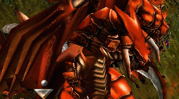
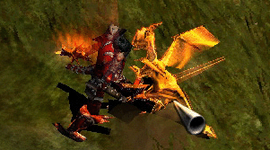

# Dragon Attack <small>patch 0.48 (18/12/2001)</small>

The appearance of the dragon was as shocking and threatening to the people of Mu as the resurrection of Kundun. For some reason, the dragons that were thought to have disappeared reappeared on the continent with the resurrection of Kundun.

The dragon, the most powerful race in the life world, appears as often as the three heroes of the continent in ancient and modern history books of the Mu continent . Among them, it has been recorded that the red dragon clan is so severe that its ferocity is notorious even within the dragon race.

A skin stronger than steel that cannot be penetrated even by enchanted weapons, and powerful magic of 9 circles constantly emanating from the dragon heart, which stores infinite mana energy. Even the breath that turned all objects into a handful of ashes, the dragon's power was formidable. The legend of such a powerful dragon was the subject of reverence and envy to the people of the continent. However, when the legend became reality, awe and envy were replaced by shock and horror.

Even before the appearance of the red dragon, there was a 'budge dragon', a monster of a variant of the dragon, on the continent of Mu.
However, Budge Dragon was only a dragon in appearance and name, but its power was incomparable to that of ordinary dragons in history books.
Most knights, wizards, and fairies could easily be dealt with alone. People looked down on Budge Dragon to the point of calling it 'Budge' as a nickname, and even Drodnwell, a knight famous for his witty words and actions, said in his book that 'a chicken learned magic and polymorphed into a dragon'. That's why Budge Dragon was weak. However, it was clear that the buggy dragon, the target of such ridicule, belonged to the dragon clan due to its biological classification. So, curious researchers have been working hard to find the source of the buggy dragon.

Immediately after the resurrection of Kundun, when the golden budge dragon, a variant of the budge dragon, appeared, people began to get nervous. The Golden Budge Dragon was 10 times stronger than the Budge Dragon. When Kundun's resurrection caused a problem with the mana order system,
the Server Burge Dragon mutation occurred. As the mana condensed energy was released, it stimulated the dragon hearts in the budge dragon's body, and the transformed budge dragons began to glow golden with the stimulation.

Budge Dragon's mutation, which was treated as a cute but ferocious pet, was enough to pose a threat to people. It was because it was unknown if another creature or monster would mutate and appear as a more powerful being.
And that concern took on a more serious form.

The 'Red Dragon', which the religious priests of the Mu continent prophesied to appear on the day of the end and destroy the world, appeared before their eyes.
People were shocked when a group of red dragons first appeared in [Lorencia](/map/lorencia), [Noria](/map/noria), and [Devias](/map/devias). There was no choice but to do so because the red dragons, which had the power to destroy a city with just one individual dragon, appeared in groups.

However, fortunately among the misfortunes, the red dragons that appeared in groups were not the red dragons of the legend. There was no doubt that it was stronger than normal monsters, but there was no absolute strength of a red dragon that was said to be close to a god. Another dragon mutation, scholars thought. So, to distinguish them from the legendary dragons, these dragons were named 'Red Drecon'.

This creature would suddenly appear in the city and fly through the air, dropping boulders that were engulfed in fireballs. Then, from time to time, it would land near the village and release its breath. The Red Dercon that landed in this way attacked to some extent and then
went up into the air and disappeared, but there were times when it did not leave and continued to attack. At such times, each village risked their lives in
a fight to drive them out or shoot them. From the corpses of Red Dercons defeated in this way, important materials used to make magical weapons and armor could be obtained. Because of the continuous attacks, each village eventually formed a professional defense team to stop the Red Dercon.

The Tribal Alliance took note of how this new life form was related to Kundun. So, a research group consisting of scholars, knights, wizards, and fairies was formed to study the characteristics of the Red Dercons, find their base, and give them the task of annihilating them.

What is the identity of the Red Derkon, where did it come from, and how does it relate to the resurrection of Kundun?

## One! Dragon Attack!

Powerful dragons appear in groups in [Lorencia](/map/lorencia), [Devias](/map/devias), and [Noria](/map/noria) three times a day to raid the villages. Killing the dragons will reward you with a rare item, the [Jewel of Bless](/item/jewel_of_bless) or the [Jewel of Soul.](/item/jewel_of_soul)

## two! Catch the Golden Budge Dragon!

You can get a [Box of Luck](/item/box_of_luck) by finding and catching [golden budge dragons](/map/lorencia) that appear throughout MU World. If you take the [Box of Luck](/item/box_of_luck) out of the equipment window and throw it on the floor, a rare item will appear with a certain probability.

### Items that come out when you throw a lucky box on the floor

Swords

- [Katana +8 +skill](/item/katana)
- [Falchion +8 +skill](/item/falchion)
- [Blade +8 +skill](/item/blade)
- [Sword of Salamander +8 +skill](/item/sword_of_salamander)
- [Light Saber +8 +skill](/item/light_saber)

Other meelee weapons

- [Tomahawk +8 +skill](/item/tomahawk)
- [Nikea +8 +skill](/item/nikea)
- [Morning Star +8 +skill](/item/morning_star)
- [Berdysh +8 Skill](/item/berdysh)

Ranged weapons

- [Acubus +8 +skill](/item/arquebus)
- [Battle Bow +8 +skill](/item/battle_bow)
- [Light Crossbow +8 +skill](/item/light_crossbow)

Staves

- [Angelic Staff +8](/item/angelic_staff)
- [Serpent Staff +8](/item/serpert_staff)

Shields

- [Skull Shield +8](/item/skull_shield)
- [Elven Shield +8](/item/elven_shield)
- [Plate Shield +8](/item/plate_shield)
- [Spiked Shield +8](/item/spiked_shield)
- [Dragon Slayer Shield +8](/item/dragon_slayer_shield)
- [Tower Shield +8](/item/tower_shield)

Sets

- [set Bronze +8](/item/bronze)
- [set Scale +8](/item/scale)
- [set Pad +8](/item/pad)
- [set Bone +8](/item/bone)
- [set Silk +8](/item/silk)
- [set Wind +8](/item/wind)

Pets and mounts

- [Guardian Angel](/item/guardian_angel)
- [Satan](/item/imp)
- [Horn of Uniria](/item/horn_of_uniria)

Acessories

- [Ring of Ice +2 options](/item/ring_of_ice)
- [Ring of Poison +2 options](/item/ring_of_poison)
- [Pendant of Lightning +2 options](/item/pendant_of_lightning)
- [Pendant of Fire +2 options](/item/pendant_of_fire)

Jewels

- [Jewel of the Bless](/item/jewel_of_bless)
- [Jewel of the Soul](/item/jewel_of_soul)
