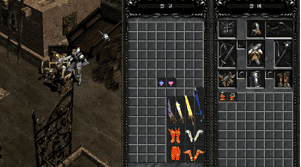
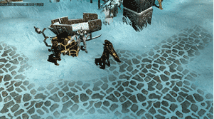

# 1st Warehouse <small>23/01/2002</small>

By building a warehouse that can store existing items, it is possible to collect a large amount of items through the greatly increased space.

## Warehouse

**When will the warehouse be applied to the main server?** It was applied to the test server on January 22nd, and after a few days of testing, it will be applied to the main

**What is the maximum number of items I can have in the warehouse?** The warehouse is 8x15 in size and can contain 120 potions equals the inventory size of the shop.

**What is the maximum amount that can be stored in the warehouse?** You can deposit up to 10 million gold at a time and store up to 100 million gold.

**Is there one warehouse per character? Is it one per account?** There is one warehouse per account per server. In other words, all characters can share one storage and use it.

**Where is the warehouse?** Warehouses can be used through NPCs in each village, and in the case of [Lorencia Village](/map/lorencia), they are located at 147 and 145.

**Is there a fee for using the warehouse?** Currently, there is no fee for the trial service period. In the future, we plan to charge regular usage fees as Mew Money in the game.

