# New World Atlans <small>patch 0.64 (03/05/2002)</small>

Behind the beautiful [fairy](/character/fairy_elf) forest, [Noria](/map/noria), there was a gloomy deep sea called [Atlans](/map/atlans) like Janus Dark deep sea [Atlans](/map/atlans)!

[Atlans](/map/atlans) was a peaceful world that was out of reach of Kundun's forces. That peace is broken by the greed of Kundun's men.

Kundun had one of the eight sealing stones scattered across the continent of Mu and appointed the most vicious Hydra as the leader of the guard and no one made it inaccessible.

However, Hydra could not overcome the temptation of the sealing stone Etramu, which symbolizes Kundun's powerful power, and stole it away.

He obtained strong power and magic with the possession of the stolen Etramu, but fearing Kundun's retaliation led his men to hide in the peaceful [Atlans](/map/atlans) off the coast of Noria and claim himself as the king of the deep sea world.

In this chaos, some Atlansians fled to the surface world, and some Atlansians flee to the underground city [Kantur](/map/kanturu_ruins), which was destroyed by Hydra's invasion, and try to rebuild it.

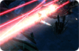
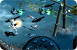
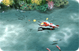

## Atlans features

You have to compose parts with a level of 60 or higher to enter the [Atlans](/map/atlans), and you have to swim in the water except for the safe zone.

- Level limit: Those who have formed a party of 60 or more.
- How to move: Walking and running are possible only in the safety zone, and moving underwater is by swimming.
- There are no merchants in the safe zone like in the dungeon.
- There are powerful monsters called seaworms hiding here and there.

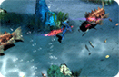
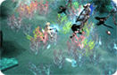
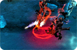

### Atlans monsters

| image                      | description                                                                                                                                                         |
| -------------------------- | ------------------------------------------------------------------------------------------------------------------------------------------------------------------- |
| 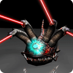 | [Hydra (boss level):](/map/atlans) As the most vicious monster under the command of Kundun, after stealing the sealing stone, it became more and more got stronger. |
| 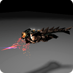 | [Lizard King:](/map/atlans) The leader of Lizardmen in the form of an upright lizard.                                                                               |
| 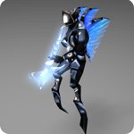 | [Valkyrie:](/map/atlans) Armed with Blue Wings and using webbed feet to move quickly, they are Atlans' outstanding mercenaries.                                     |
| 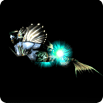 | [Vepar:](/map/atlans) In the form of a mermaid, it causes storms in the sea and creates illusions.                                                                  |
| 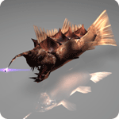 | [Bahamut:](/map/atlans) A fish that used to live in the deep sea and was given great power by the power of Hydra's magic.                                           |
| 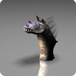 | [Sea Worm:](/map/atlans) A life form that sprouted from the scales of a Hydra and spreads all over                                                                  |

Atlans. They attack unconditionally regardless of passing creatures.

### Extra items and skills

| image                       | description                                                                                                                |
| --------------------------- | -------------------------------------------------------------------------------------------------------------------------- |
| 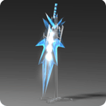  | [Crystal Sword:](/item/crystal_sword) A mysterious sword made from the scales of Castro in the deep sea.                   |
| 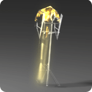  | [Aquagold Crossbow:](/item/aquagold_crossbow) A crossbow with strong explosive power using water pressure.                 |
| 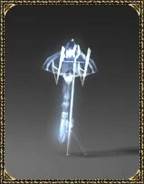 | [Bluewing Crossbow:](/item/bluewing_crossbow) Uses the cold energy of water to inflict great damage on the opponent.       |
| 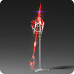  | [Staff of Resurrection:](/item/staff_of_resurrection) It is a staff that has been secretly passed down within the Lizards. |
|   | [Aquabeam:](/item/scroll_of_aquabeam) Boasts strong destructive power with powerful water and light.                       |
