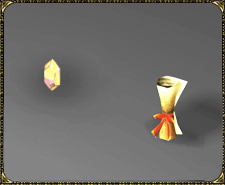
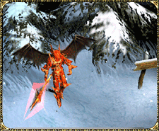
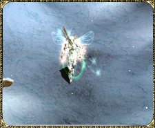
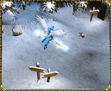

# Chaos Combination System <small>patch 0.68 (08/08/2002)</small>

Familiar goblin friends in the center of [Noria Village](/map/noria) are transforming into purple Chaos NPCs and combining items. We will unveil the [wing items](/item/wing) that have been hidden in the veil and the new [chaos weapon](/item/chaos_dragon_axe?tab=other) items that will be introduced.

## Wing item information

**Equip Level Restriction:** 180 + Wing Level \* 4
**Durability:** About a month when worn ( durability decreases only when worn like a transformation ring).(However, there is no color change visually).

### Fairy Wings

| defense             | Attack power increase (%) | Damage absorption (%) | option                  |
| ------------------- | ------------------------- | --------------------- | ----------------------- |
| 10 + wing level \*3 | 12 + wing level \*2       | 12 + wing level \*2   | life recovery, critical |

   

### Satan's Wings

| defense             | Attack power increase (%) | Damage absorption (%) | option                            |
| ------------------- | ------------------------- | --------------------- | --------------------------------- |
| 20 + wing level \*3 | 12 + wing level \*2       | 12 + wing level \*2   | additional attack power, critical |

   

### Wings of Heaven

| defense             | Attack power increase (%) | Damage absorption (%) | option                |
| ------------------- | ------------------------- | --------------------- | --------------------- |
| 10 + wing level \*3 | 12 + wing level \*2       | 12 + wing level \*2   | extra magic, critical |

   

## Chaos item information

### Chaos Dragon Axe

| attack power      | 75-120 |
| ----------------- | ------ |
| required strength | 335    |
| required agility  | 132    |
| attack speed      | 35     |

 

### Chaos Lighting Staff

| attack power      | 37% |
| ----------------- | --- |
| required strength | 155 |
| required agility  | 42  |
| attack speed      | 20  |

 

### Chaos Nature Bow

| attack power      | 75-94 |
| ----------------- | ----- |
| required strength | 110   |
| required agility  | 357   |
| attack speed      | 35    |

 

## Chaos related

**Chaos NPC Location:** Storage in the Chaos system next to the warehouse in [Noria Village](/map/noria) 8 \* 4.

### Combination conditions for Chaos items to appear

- 1 [Jewel of Chaos](/item/jewel_of_chaos)
- any item + 4 and + 4 options or higher
- You must pay a certain fee to Chaos NPC

- The more good items you put in, the higher the chance of creating a high option item.
- The **probability (%) goes up** when you mix the jewels of blessing and the jewels of Arcanum. (but disappears after use)

#### When combination is successful

- All items placed in storage are destroyed
- One of the Chaos weapons is created:
  - [Chaos Dragon Axe](/item/chaos_dragon_axe)
  - [Chaos Nature Bow](/item/chaos_nature_bow)
  - [Chaos Lighting Staff](/item/chaos_lighting_staff)
- All jewels placed in the storage are destroyed
- The level and options of items are randomly reduced (but not destroyed)

### Combination conditions for wing items to appear

- 1 [Jewel of Chaos](/item/jewel_of_chaos)
- 1 Chaos Item + 4 and + 4 options or higher
- You must pay a certain fee to Chaos NPC
- The more good items you put in, the higher option items will be created. increased odds

#### When combination is successful

- All items placed in the storage are destroyed
- One of the wing items is created:
  - [Wings of Satan](/item/wings_of_satan)
  - [Wings of Heaven](/item/wings_of_heaven)
  - [Wings of Elf](/item/wings_of_elf)
- All jewels placed in the storage are destroyed
- The level and options of items are randomly reduced (but not destroyed)

**OBS:** Items will appear randomly when combining [Chaos items](/item/chaos_dragon_axe).
