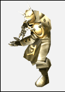
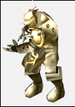
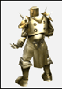
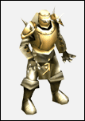
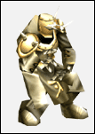

# Underground Legion's Counterattack <small>24/09/2002</small>

It was the invader [Hydra](/map/atlans) and the Atlans who fought against it, but the absolute magical power of the sealing stone brought the two enemies together. Fighting fiercely to take each other's lives, they each joined forces for their own interests.

[Hydra](/map/atlans), which invaded [Atlans](/map/atlans) under [Kundun's](/map/kalima) command, unexpectedly changed its plan due to the fierce Atlans' counterattack, and
seduced some Atlansians who were blinded by the magic of the sealing stone. The corrupted Atlansians, who were captivated by the absolute power, pledged allegiance to [Hydra](/map/atlans) and dismantled the powerful defense shield created by Atlans' superior scientific power and magical power. Atlas, which lost its defenses, collapsed helplessly.

Scholars speculate that up to this point there was no sign of Hydra ever betraying [Kundun](/map/kalima). As such, [Kundun's](/map/kalima) power was overwhelming compared to Hydra, and betrayal meant [Hydra's](/map/atlans) destruction.

However, after a while, the traitors of Atlans, on the contrary, they seduce [Hydra](/map/atlans). Using this shield, the pinnacle of technology created using Atlans' technology and the magic of the Sealing Stone, it was possible to block [Kundun](/map/kalima) with [Hydra's](/map/atlans) power, and later, [Hydra](/map/atlans) would be able to stand in her
[Kundun's](/map/kalima) place.

In the end, [Hydra](/map/atlans) betrayed.

Balrog's betrayal followed by [Hydra's](/map/atlans) betrayal brought about a reorganization of the order of the Mu continent. It brought mistrust to the followers of [Kundun](/map/kalima), and enemies of [Kundun](/map/kalima). In other words, it brought hope to the allied forces of the Mu continent. Of course, there was no doubt that the hydra was still a powerful and formidable enemy, but it was more advantageous for those powerful enemies to fight each other in division rather than unite as one.

During the invasion of the [Hydra](/map/atlans), some Atlansians fled to the surface, while others fled to Cantur, which was destroyed by the [Hydra](/map/atlans) attack, and attempted to rebuild the underground city.

The Atlans who moved to [Kantur](/map/kanturu_ruins) began to create an army of monsters to stop the [Hydra](/map/atlans) invasion using advanced technology and the power of genetic engineering. Using the bones from the corpses of various creatures, including humans, he created a skeleton soldier called Deathbone, called Deathbone, and created a 'Desking' with magical powers that can control the skeleton soldiers.

Their research did not end here. He created a mechanized corps using the mutant monsters of the Tarkan Desert. It was the 'Soldier' ​​with a crossbow that emits golden light and the 'Titan', the ruler of the Soldier with powerful jump attacks.

The settlers of [Kantur](/map/kanturu_ruins) were able to effectively fend off the [Hydra's](/map/atlans) attack with this powerful corps. Gaining self-confidence, the [Kantur](/map/kanturu_ruins) settlers began producing biotech soldiers in earnest.

However, not all things in history go in a good direction. Cantur's biotech soldiers had a fatal problem. Deathborn and the Soldier are manipulated and controlled by the magical powers of the Deathking and Titan. That is why it is possible to control them and use them for military purposes. However, fundamental problems began to occur with Desking and Titan itself.

The Death King and the Titans, freed from magical rule, started to attack [Kantur](/map/kanturu_ruins), and the crazy Death Kings and the Titans escaped the underground empire and began to appear on the ground. Each tribe on the continent of Mu, which was severely attacked by them, requested to stop production of [Kantur](/map/kanturu_ruins)'s bioengineered soldiers through a tribal meeting, but [Kantur](/map/kanturu_ruins) refused.

Bioengineered soldiers were a lifeline to the rebuilding [Kantur](/map/kanturu_ruins), and even the Tribal Council's request to halt their production was unacceptable.

Because of this, the tribal union and [Kantur](/map/kanturu_ruins), which had become distant, gradually developed into hostile relations.

In the end, after a while, [Kantur](/map/kanturu_ruins) launched an attack on the ground with a large army he had mass-produced. His cause was to drive [Kundun](/map/kalima) off the surface, but [Kundun](/map/kalima) was not the only enemy to the rampaging underground legions.

Following [Hydra's](/map/atlans) betrayal, the Underground Legion's counterattack put [Kundun](/map/kalima) and the Tribal Alliance into another predicament.

As such, the flow of the Mu Continental War was getting more and more complicated.

## The underground corps appearing in Lorencia and Noria

**Boss-level monster:** Deathking (Cycrops-level +5, +6 items are available)

**Minor-level monster:** Deathborn

### Items obtainable when hunting

- [Kris](/item/kris)
- [Rapier](/item/rapier)
- [Sword of Assassin](/item/sword_of_assassin)
- [Katana](/item/katana)
- [Hand Axe](/item/hand_axe)
- [Double Axe](/item/double_axe)
- [Electric Sword?](/item/) 
- [Morning Star](/item/morning_star)
- [Dragon Lance](/item/dragon_lance)
- [Crossbow](/item/crossbow)
- [Bow](/item/bow)
- [Golden Crossbow](/item/golden_crossbow)
- [Skull Staff](/item/skull_staff)
- [Buckler](/item/buckler)
- [Horn Shield](/item/horn_shield)
- [Kite Shield](/item/kite_shield)
- [Leather set](/item/leather)
- [Pad set](/item/pad)
- [Vine set](/item/vine)

## Boss mob that appears in Debias

**Boss-level monster:** Titan (Gorgon-level +5, +6 items are available)

**Minor-level monster:** Soldier

### Items obtainable when hunting

- [Light Saber](/item/light_saber)
- [Legendary Sword](/item/legendary_sword)
- [Double Blade](/item/double_blade)
- [Nikea Axe](/item/nikea_axe)
- [Larkan Axe](/item/larkan_axe)
- [Great Hammer](/item/great_hammer)
- [Berdysh](/item/berdysh)
- [Light Spear](/item/light_spear)
- [Serpent Spear](/item/serpent_spear)
- [Light Crossbow](/item/light_crossbow)
- [Tiger Bow](/item/tiger_bow)
- [Serpent Crossbow](/item/serpent_crossbow)
- [Thunder Staff](/item/thunder_staff)
- [Dragon Slayer Shield](/item/dragon_slayer_shield)
- [Tower Shield](/item/tower_shield)
- [Serpent Shield](/item/serpent_shield)
- [Brass set](/item/brass)
- [Plate set](/item/plate)
- [Sphinx](/item/sphinx)
- [Wind set](/item/wind)
- [Spirit set](/item/spirit)

## Items that can be obtained in common from the Underground Corps

- [Guardian Angel](/item/guardian_angel)
- [Satan](/item/imp)
- [Horn of Uniria](/item/horn_of_uniria)
- [Ring of Ice](/item/ring_of_ice)
- [Ring of Poison](/item/ring_of_poison)
- [Pendant of Lightning](/item/pendant_of_lightning)
- [Pendant of Fire](/item/pendant_of_fire)
- [Jewel of Bless](/item/jewel_of_bless)
- [Jewel of Soul](/item/jewel_of_soul)
- [Jewel of Chaos](/item/jewel_of_chaos)

<!--  -->

