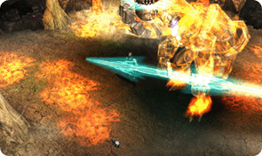
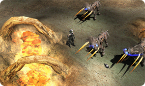

# The Underworld <small>0.84 (16/12/2002)</small>

It is called the desert of death because it is a deserted land. It is the link between [Kanturu](/map/kanturu_ruins) and [Atlans](/map/atlans), an underground city built by the Atlantes. Kanturin, a strict class society, drives mutants, who are mutants, to [Tarkan](/map/tarkan), and throws away the failures of their biological experiments in [Tarkan](/map/tarkan). [Tarkan](/map/tarkan) where abandoned creatures live. All kinds of monsters suffering from hunger are roaming around, and Kantur's guards are watching.

## Monsters

### Bloody Wolf

A bloody wolf born in a laboratory in the underground [city of Kanturu](/map/kanturu_ruins). Due to the failure of his biological experiment, part of his bone protrudes outward and attacks the enemy with sharp horns. He roams the desert of death and weeps as if to curse their fate.

  

### <wbr mdAligh="right"> Mutant

As a mutant of [Atlans](/map/atlans) "Descendants of Darkness", he was kicked out of the city and lives in the periphery.
He hunts all living things and makes them his prey. In order to survive in the lightless desert of death, it gradually evolves into a monster form rather than a human form. Their weapons are huge bone scales, where deformed vertebrae have pierced the skin. It rolls its body in a circle and moves.

 

### Iron Wheel

A knight made with the mechanical technology of the underground city. It is vigilant around the Kantur Empire and
drives all creatures that come close to the Empire to death. Charge towards the enemy at high speed and attack.

  

### <wbr mdAligh="right"> Tantalos

He was abandoned as an exile in the [Tarkan](/map/tarkan) dungeon, but was released by the [Atlans](/map/atlans) who awakened the land of the dead. His long thirst underground has transformed him into a thick, keratinized figure, and the [Atlans](/map/atlans) transform him into a powerful mechanical body to take advantage of.

 

### Beam Knight

A dark knight who guarded the sleeping [Zaikan](/map/tarkan#zaikan) under the command of [Zaikan](/map/tarkan#zaikan) in the Desert of Death. When [Zaikan](/map/tarkan#zaikan) wakes up, he begins to appear all over [Tarkan](/map/tarkan).

  

### <wbr mdAligh="right"> Zaikan

The desert of death, the spirit of [Tarkan](/map/tarkan). As soon as the sealing stone falls on the parched [Tarkan](/map/tarkan), it wakes up by its power. Using his dark power, he creates a huge magic sword and uses it as his weapon.

  

### Death Beam Knight

It is an existence created by gathering the souls of all creatures who died in [Tarkan](/map/tarkan). Only hatred for all living things remains, and that becomes energy that burns with an unquenchable fire. The Death Beam Knight, resurrected by the constant flames of hatred, is more dangerous than Zaikan.

 

## Items

|                                         | description                                                                                                                                                                                                                                                                                                                                      |
| --------------------------------------- | ------------------------------------------------------------------------------------------------------------------------------------------------------------------------------------------------------------------------------------------------------------------------------------------------------------------------------------------------ |
|    | [Black Dragon set:](/item/black_dragon) It is an armor made by condensing the power of darkness as an upper level armor of dragon armor. It has strong resistance to dark energy and has high defense. This armor is made from the bones of a black dragon. The stronger the dark energy, the stronger the golden pattern engraved on the armor. |
|    | [Sword of Destruction:](/item/sword_of_destruction) A sword of destruction hidden deep underground. A sword made of Tarkan's underground iron and smelted by eternal fire. It can be used with one hand and has great destructive power.                                                                                                         |
|   | [Saint Crossbow:](/item/saint_crossbow) A crossbow that is said to be made from the last light remaining in the ancient underworld can fire powerful energy.                                                                                                                                                                                     |
|   | [Staff of Destruction:](/item/staff_of_destruction) A staff made by Zaikan, the spirit of the desert, using the dark power of the underworld, and possesses powerful destructive power. A staff with strong magical power that emits strong light in the dark.                                                                                   |
|  | [Jewel of Life:](/item/jewel_of_life) It is one of the 8 sealing stones and has the energy of life. Also called the Jewel of Life, this jewel enhances the ability of an item. Increases the additional option attached to an item by one level. It can be increased up to +16. It can only be obtained from Tarkan.                             |

## Skills

|                                        | description                                                                                                                                                                                                                             |
| -------------------------------------- | --------------------------------------------------------------------------------------------------------------------------------------------------------------------------------------------------------------------------------------- |
|  | [Inferno:](/character/dark_wizard?tab=skills) Hellfire is a high-level magic that is effective within the same range as Hellfire and has a faster casting speed. Mana consumption is high. It can be learned from the Inferno Law Book. |
|  | [Comet Fall:](/character/dark_wizard?tab=skills) The magic used in 1:1 attacks can deal a lot of damage to the target. Casting speed is fast, but mana usage is high. It can be learned through the Blast recipe.                       |
|  | [Summon Soldier:](/character/fairy_elf?tab=skills) It can be learned with a summoning ball and can summon a long-range attacking monster, the Soldier.                                                                                  |

## Options related

1. It comes from mobs that are level 25 or higher than normal items. Ex: Double Blade (Dark Knight), Excellent Double Blade (Silver Valkyrie)
2. It is much less likely to appear than the existing 12 option items.
3. The minimum and maximum attack power is 30, and the defense is item defense + (item defense \* 12 / item level + 4 + item level / 5) higher than existing items.
4. The skill is 100% attached, and the probability that the rest of the existing options are attached is very slim.
5. There are always 1 or 2 new options unique to Excellent.
6. The word “Excellent” is added to the front of the item name.
7. The item drop rate is very low.

armor, shield, ring (up to 8 pieces)

- life increase +4%
- mana (life) increase +4%
- damage reduction -4%
- damage reflection -4%
- defense success rate +10%
- zen gain when killing monsters +40%

weapon, necklace (up to 3 pieces)

- excellent damage rate increase + 10% (Excellent damage = Critical damage + 20%)
- attack power increase + (character level/20)
- atack power increase + 2 %
- magic Power Increase + (Character Level/20)
- magic Power Increase + 2%
- attack Speed ​​+ 7
- increased life gained from killing monsters + Life/8
- increased mana gained from killing monsters + Mana/8

Item Defense + (Item Defense \* 12 / Item Level) + 4 + Item Level / 5

