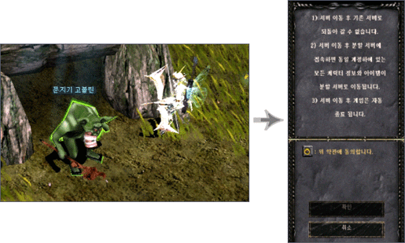
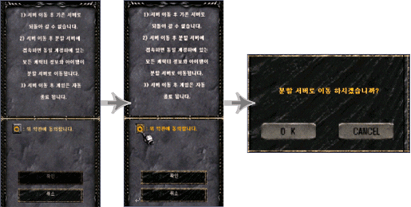
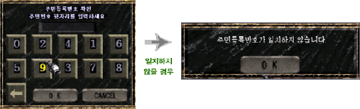

# Icarus update <small>15/07/2003</small>

"Although the Mu continent boasts a history of thousands of years, nothing has been accurately revealed about the origin of the Mu continent. Just, somewhere in the air, a new world where people can't imagine. In other words, there is only a legend that there will be a world that is the basis of the Mu continent...

But now, the door to the world that has been completely forgotten in people's memories has been opened. The sealed door that had been dormant for thousands of years in the Lost Tower was unlocked. But no one knew how or why the seal was suddenly broken. Has another whirlwind of fate come to the Mu continent? The wise men called the aerial road leading to the forgotten world [Icarus](/map/icarus)."

"Icarus" is one of the newly added worlds, and it can be seen as a kind of gateway to the world before the Mu continent. In the sky map, there is one of the sealing stones, 'Jewel of Creation', and there are new items that can only be obtained in the sky map. And, you will meet flying monsters that are much more powerful than now. Now, another story of the Mu continent begins here.

---

"Icarus", a wizard and historian of [Duke of Media], one of the small principalities of the Mu continent, was very interested in the history of the Mu continent. Icarus thought that the key to unlocking the secrets of the past could be found in "Lena", which is called the coin of heaven. While researching Lena, Icarus finds out that the lost tower, the Lost Tower, has a hidden path to a new world. That new world is a world in the sky that humans have not yet known about. Icarus learned that the skyway, the passageway to the sky, was a road that existed in the sky.

Icarus needed a flying creature that could follow the sky path. He studied with the wizards of Mediah and created [Dinorant](/item/horn_of_dinorant) that can fly through the air. Arriving at the Lost Tower, Icarus accidentally wakes up the Balrog, the guardian monster of the Lost Tower. In the process, he was severely injured, but Icarus eventually opened the secret door with fearful tenacity and found a way to the sky leading to a new world.

However, Icarus, who was severely injured, was eventually killed by the monsters guarding the perforation road. [Dinorant](/item/horn_of_dinorant) barely escapes through the skyway and returns to the Principality of Mediah carrying Icarus' body. Scholars have discovered that Icarus left a video of his memories through his spell in his final moments. Eventually, the existence of the sky world became known to the people of the continent by Icarus. The tribal union named the skyway 'Icarus' to honor Icarus' achievements."

## Boring Furnace "Icarus"

- **Entry level:** LV.160
- **Movement command use level:** LV.170 (consumes 15,000 Zen)
- **Use movement command:** `/move Icarus`
- **Gate location:** Lost Tower 8th floor (Coordinates: 18.250)
- **Conditions for entry:** Wings or Dinorant horns
- Items worn \* In Icarus, you must wear either wings or Dinorant horns to stay in Icarus. impossible

 

## Icarus monsters

### Mega Crust

A monster with hard metal-type wings and a body, it roams the closed tunnels.
It lives by absorbing the life energy of terrestrial creatures that have entered the skyway .

### Alquamos

They are warriors called by Lugard, the god of the heavens, and they protect the heavens in the night sky.
When the skyway is discovered by humans, it descends from a high constellation and becomes a guardian monster.

### Drakan

A clan of dragons that interacted with the Celestial World, and are stationed in Icarus.
Has a hatred for fairies in the human world.

### Queen-Rainer

As one of the priestesses of Gailea, the goddess of storm, she violates the norms to be followed as a priest.
Enraged by this, Gairea curses her Raynor, causing her to wander through the sky.

### Alpha Crust

As an upgraded version of the Mega Crust, when the Mega Crust absorbs a certain amount of life energy, their bodies glow brightly and gain strong attack power. This monster, which must endlessly absorb the energy of living things, returns to the form of a megacrust when the energy it was charged with is consumed.

### Phantom Knight

The spirits of the knights who died in the sky don't have any memories of the past in the form of combat knights.
He draws out human souls and turns them into phantom knights like himself.

### Giant Drakan

As the head of the Drakan, breeding the Drakan is possible only by them. The newly born
Drakan stays at the mouth of Icarus, where after a period of time (an average of 50 years), they
are divided into normal Drakans and Giant Drakans. When the Giant Drakan reaches 50 years of age, red aura begins to radiate from its body, and as it gets older, the light gradually becomes redder and darker.

### Phoenix of Darkness

A monster ridden by the Guardian Guardian of the Sky World, the Queen of Night, filled with dark energy.
The Night Queen uses electromagnetic waves to form a shield.

| monster name                                           | level | life    | minimum power | maximum power | defense | defense success rate |
| ------------------------------------------------------ | ----- | ------- | ------------- | ------------- | ------- | -------------------- |
| [Alquamos](/map/icarus#alquamos)                       | 78    | 16,000  | 310           | 370           | 240     | 175                  |
| [Mega Crust](/map/icarus#mega_crust)                   | 81    | 23,000  | 350           | 370           | 270     | 185                  |
| [Queen Rainier](/map/icarus#queen_rainier)             | 85    | 30,000  | 460           | 540           | 350     | 210                  |
| [Drakan](/map/icarus#drakan)                           | 88    | 36,000  | 520           | 600           | 390     | 255                  |
| [Alpha Crust](/map/icarus#alpha_crust)                 | 92    | 39,000  | 580           | 680           | 430     | 265                  |
| [Phantom Knight](/map/icarus#phantom_knight)           | 96    | 50,000  | 650           | 760           | 480     | 275                  |
| [Great Drakan](/map/icarus#great_drakan)               | 100   | 58.000  | 730           | 840           | 520     | 290                  |
| [Phoenix of Darkness](/map/icarus#phoenix_of_darkness) | 108   | 150,000 | 1,100         | 1,200         | 800     | 350                  |
