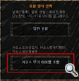
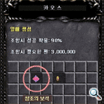

# Chaos combination change, fruit, 4 additional wings, AG system, additional skill update <small>01/09/2003</small>

The second update of "Icarus" in the perforation! The sealed door that had been dormant for thousands of years was opened and a new challenge risking life began. A blessing to protect those who have courage and conviction.

## Chaos combination

### Chaos Weapon Item Combination

Items obtainable through Chaos weapon item combinations [Chaos Lightning Staff](/item/chaos_lightning_staff), [Chaos Nature Bow](/item/chaos_nature_bow), [Chaos Dragon Axe](/item/chaos_dragon_axe).

### common combination

Items that can be obtained through general combinations:

- Item level +10, +11 improvement
- [Wings of Heaven](/item/wings_of_heaven), [Wings of Satan](/item/wings_of_satan), [Fairy Wings](/item/wings_of_elf)
- [Dragon Wings](/item/wings_of_dragon), [Spirit Wings](/item/wings_of_spirit), [Soul Wings](/item/wings_of_soul), [Dark Wings](/item/wings_of_darkness)
- [Dinorant Horns](/item/horn_of_dinorant)
- [Strength/Agility/Stamina/Energy Fruit](/item/fruit),
- [Devil Square Invitation](item/devil_square_invitation)

<!--  -->

## State Point Fruit Combination

Combination Method:

- [Jewel of Creation](/item/jewel_of_creation)
- [Jewel of Chaos](/item/jewel_of_chaos)
- [3,000,000 zen](/item/zen)

Chaos Combination possible Generates 3 points

- [Dexterity Fruit:](/item/dextery_fruit) Generates 1~3 points for agility stats
- [Strength Fruit:](/item/strength_fruit) Generates 1~3 points for strength stats

When using the fruit, you can use the fruit by right-clicking in the inventory. If it is created and fails, there is no decrease in stat points and the fruit item disappears. You will succeed 100% up to 10 stat points. 90% chance of success if generated points are 5 or more spare points (generated points - 10) are 10% or less of spare points 80% chance of success when generated point-10) is between 11% and 30% of spare points 70% chance of success when (generated point-10) is between 31% and 50% of spare points
(generated point-10) 60% chance of success if is less than 51% to 80% of spare points.
Fruit items can be sold or traded in shops.
Information on spare stat points is displayed in the character information window.
(Raised stat points / Spare stat points that can be raised at the current level)

**You can combine fruit items that can increase state points through Chaos Expansion Combination.**

With the 5th Sealing Stone, the [Jewel of Creation](/item/jewel_of_creation), you can combine the state-generating items Energy/Agility/Life/Strength Fruit through Chaos Combination. The success rate of fruit items is 90%, but it can be adjusted after testing.
In case of failure, all items are destroyed.
If the combination is successful, a fruit of Stamina/Strength/Agility/Energy is randomly generated.

## Chaos Common Combination

### Wing combinations for change-up characters

**You can combine wings for change-up characters through general combinations.**

If you combine [Heaven's Wings](/item/wings_of_heaven), [Satan's Wings](/item/wings_of_satan), [Fairy Wings](/item/wings_of_elf) and [Loch's Feather](/item/lochs_feather), change-up characters and Magic Gladiator characters will get wings for each character.can be created.

Blade Knight: [Dragon Wings](/item/wings_of_dragon)
Soul Master: [Soul Wings](/item/wings_of_soul)
Muse Elf: [Spirit Wings](/item/wings_of_spirit)
Magic Gladiator: [Dark Wings](/item/wings_of_darkness)

### Wings for change-up characters - combination material

- [Sky Wings / Satan Wings / Fairy Wings](/item/first-wing)
- [Loch's Feather](/item/lochs_feather)
- [Jewel of Chaos](/item/jewel_of_chaos)
- Combination Fee (5 million zen)
- Excellent Item

In order to combine wings for change-up characters, [Sky Wings](/item/wings_of_heaven), [Satan's Wings](/item/wings_of_satan), and [Fairy Wings](/item/wings_of_elf) are used as materials for combination. [Loch's Feather](/item/lochs_feather), an essential item for wing combinations, is randomly dropped when hunting monsters of level 78 or higher. **The success rate increases according to the level of additional wing options (additional defense, additional attack power, automatic life recovery)**

Increases success rate when inserting excellent items

- Only excellent item level +4 or higher can be used for wing combinations
- The increase in success rate is the same as chaos item combination, and the success rate can be increased by including wings.

If the combination fails: All items on the combination window are destroyed

#### Blade Knight: [Dragon's Wings](/item/wings_of_dragon)

- **Usable level:** 215 + (wing level \* 5)
- **Creation method:** normal combination
- **Available class:** Blade Knight
- **Defense:** 45+ (Wings level \*2)
- **Damage increase:** 32 + (Wings level \*1)
- **Damage absorption:** 25 + (Wings level \*1)
- **Speed:** 16

Each successful attack reduces life by 3 (except for MISS)

Options: Randomly attached for each step of options 1-3 (1 each)

Option A

- Luck (Soul Gem Success Rate +25%), (Critical Damage Rate +5%)

Option B

- **Life +50 Increase:** Increases maximum life by 50 (+ wing level \_ 5)
- **+50 Mana:** Increases maximum mana by 50 (+ wing level \_ 5)
- 3% chance of ignoring monster defense (damage indication: dark gold)

Option C

- **Attack Power:** +4, +8, +12
- **Life recovery:** 1%, 2%, 3%

Soul wing options can be up to 3 of A / B / C (extra attack power or 1 of life recovery)
When using raw stone for soul wings, it affects option C among the three options.
Option + 4 increase upon successful use of the [Jewel of Life](/item/jewel_of_life) (if there is an additional magic power option)
Option + 1% increase upon successful use of the [Jewel of Life](/item/jewel_of_life) (if there is a life recovery option)
If you fail to use the [Jewel of Life](/item/jewel_of_life), the option will be destroyed to 0.

#### Soul Master: [Soul Wings](/item/wings_of_soul)

<!--  -->

Available Level: 215 + (Wings Level _ 5)
⊙ Creation Method: General Combination
⊙ Available Classes: Soul Master
⊙ Function -Defense: 30 + (Wings Level _ 2)
-Damage Increase: 32 + (Wings Level _ 1) )
-Damage absorption: 25 + (wing level _ 1)
-Speed: 15 (same as the original running speed)
⊙ Successful attack reduces life by 1 (except for MISS)
⊙ Options: 1 option A, B, C attached each for a total of 3
Can have 2 options
[Option A] Luck (soul jewel success rate +25%), (Critical damage probability +5%) [Option B] Increase Life +50: Increase Max Life by 50 (+ Wing Level _5) Increase Mana +50: Max Increases mana by 50 (+ wing level _ 5) 3% chance of ignoring monster defense (damage indication: dark gold) [Option C] Additional attack power: +4, +8, +12 Life recovery: 1%, 2%, 3 %

Up to 3 soul wing options are available from A / B / C (extra magic power or 1 out of life recovery). If you use a raw stone for soul wings, it affects option C among the three options. If you successfully use the [jewel of life](/item/jewel_of_life), the option + 4 increases. (If there is an additional magic power option) Option + 1% increase when using the [Jewel of Life](/item/jewel_of_life) successfully.

#### Muse Elf: [Spirit Wings](/item/wings_of_spirit)

Usable level: 215 + (wing level _ 5)
Creation method: normal combination
Available Class: Muse Elf
Function - Defense: 30 + (Wings Level _ 2)

- Damage Increase: 32 + (Wings Level \* 1)
- Damage Absorption: 25 + (Wings Level \* 1)
- Speed: 15 (same as the previous running speed)
  Lose 1 life per attack (except for MISS)
  Options: A total of three options can be attached by attaching one of options A, B, and C

[Option A]
Luck (Soul Gem Success Rate +25%), (Critical Damage Rate +5%)

[Option B]
Life +50 Increase: Increases maximum life by 50 (+ wing level _ 5)
+50 Mana: Increases maximum mana by 50 (+ wing level _ 5)
3% chance of ignoring monster defense (damage indication: dark gold)

[Option C]
Bonus Horsepower: +4, +8, +12
Life recovery: 1%, 2%, 3%
Spirit wing options can be up to 3 of A / B / C (extra attack power or 1 of life recovery)
When using raw stone for spirit wings, it affects option C among the three options.
Option + 4 when successfully using the [Jewel of Life](/item/jewel_of_life) (if there is an additional attack power option)
Option + 1% increase upon successful use of the [Jewel of Life](/item/jewel_of_life) (if there is a life recovery option)
If you fail to use the [Jewel of Life](/item/jewel_of_life), the option will be destroyed to 0.

### Magic Gladiator: [Wings of Darkness](/item/darkness_wings)

Usable level: 215 + (wing level _ 5)
Creation method: normal combination
Available Class: Magic Gladiator
Function - Defense: 40 + (Wings Level _ 2)

- Damage Increase: 32 + (Wings Level \* 1)
- Damage Absorption: 25 + (Wings Level \* 1)
- Speed: 15 (same as the previous running speed)
  Lose 3 life per attack (except MISS)
  Options: A total of three options can be attached by attaching one of options A, B, and C

[Option A]
Luck (Soul Gem Success Rate +25%), (Critical Damage Rate +5%)

[Option B]
Life +50 Increase: Increases maximum life by 50 (+ wing level _ 5)
+50 Mana: Increases maximum mana by 50 (+ wing level _ 5)
3% chance of ignoring monster defense (damage indication: dark gold)

[Option C]
Bonus Horsepower: +4, +8, +12
Bonus Attack Damage: +4, +8, +12
Wings of darkness option can be up to 3 out of A / B / C (extra magic power or extra attack power 1)
When using raw stone for the wings of darkness, it affects the C option among the three options.
Option + 4 when using the [Jewel of Life](/item/jewel_of_life) successfully
If you fail to use the [Jewel of Life](/item/jewel_of_life), the option will be destroyed to 0.

## AG System

Additional stats consumed when using skills are displayed at the bottom right of the screen.

1. When all character classes use skills, they consume AG along with mana consumption.
2. For existing skills, AG consumption is '0'.
   Existing Skills of AG 0 : Stab, Spinning, Downward Slash, Slash, Upward Slash, Multiple Skills, Attack Power Up, Defense Up, Healing Magic, Energy Ball, Fireball, Power Wave, Lightning, Movement, Meteorite, Ice, Poison, Pillar of Fire, Tornado, Evil Spirit, Hellfire, Aqua Flash, Blast, Inferno *However, among the previously used skills, "Whirlwind Slash Skill" is applied with AG. 3) Formula for Calculating Ability Gauge for Each Character Black Knight/Blade Knight: (Strength*0.15)+(Agility*0.2)+(Stamina*0.3)+(Energy*1.0) Fairy/Muse Elf: (Strength*0.3)+(Agility* 0.2)+(Stamina*0.3)+(Energy\*0.2)

Warlock/Soul Master: (Strength _ 0.2) + (Agility _ 0.3) + (HP _ 0.3) + (Energy _ 0.2) Magic Gladiator: (Strength _ 0.2) + (Agility _ 0.25) + (HP * 0.3) + ( energy*0.15)

## Additional skills for each character

### Spear Strike - Black Knight / Magic Gladiator / Blade Knight

Offensive skills that can only be used when the character is riding Unilia or Dinorant Available Class: Black Knight/Magic Gladiator/Blade Knight Available Level: 28 Can be learned through "Pike" Bead Drop Monster Level: 20 (Worm or higher)

Skill Damage - Unilia's horn equipped: (Damage × 2.1) + (Energy/10)

- Dinorant's horn equipped: (Damage × 2.25) + (Energy/10) Mana consumed: 8 Consumed AG: 0 Usable weapon : Double-edged Ax Spear, Dragon Lance, Ax Spear, Large Trident, Spear, Buddy Shoe, Light Stick, Serpent Spear, Great Side, Balrog's Scythe

### Raid Shot - Black Knight / Blade Knight

Attack skills that can beused only when the character borrows Dinorant's horns (attack skill option)
Class: Black Knight/Blade Knight Available level: 110 Kill Acquisition: Unilia's horn combination creates Dinorant's horn Bead Drop Monster Level: 20 (Worm or higher)

Skill Damage - Dinorant's Horn Equipped: (Damage × 2.3) + (Energy/10) Mana Consumption: 9 Consumption AG: 0

### Swell Life - Black Knight / Bled Knight

A skill that increases life to the maximum for a certain period of time . If you use a skill while in a party,the maximum life value of all party members including the caster increases. Available Classes: Black Knight/Blade Knight Available Levels: 120 "Swell Life" beads Can be learned through Bead Drop Monster Level: 60 (Devil or higher)

Mana consumed: 22 Consumed AG: 24 Increased stamina: 12+(Stamina stat/100)+(Energy stat/60) a) Applied as the character’s basic value (excluding item increase) b) When applied to other users, skill user % , and increases according to the number of party members. - 2 people in a party: +1% to each person's increase% - 3 people in a party: +2% to each person's increase% - 4 people in a party: +3% to each person's increase% - 5 people in a party: +3% to each person's increase% +4% to % Increase Duration: 60 seconds + (Energy/10)

### Blow - Bled Knight

Used for multiple attacks (straight lines), and
can be used while riding a mobile unit (Unilia, Dino Rant) Available class: Blade Knight Available level: 160 Learnable through "Blow" marbles Bead drop monster level : 60 (Devil or higher).

Skill Damage: Basic Damage × (230% + (Energy stat/10)) Mana Consumption: 15 Consumption AG: 20

 

### Rage Strike - Bled Knight

※ As a multi-attack skill, there is a slight delay, butit can damage 2~3 monsters Available Class: Blade Knight Available Level: 170 Can be learned through "Rage Strike" marbles. Bead Drop Monster Level: 78 (over Alkamos)

Skill Damage: Basic Damage × (240%+(Energy stat/10)) Mana consumption: 25 AG consumption: 35

 

### Blood Attack Magic Swordsman

2~3 monsters can attack, and random monsters
' defense is reduced by 10% Available Class: Magic Swordsman Available Strength State: 596 Can be learned through "Blood Attack" marbles Bead Drop Monster Level: 60

Skill Damage: Basic Damage × (230%+(Energy stat/30)) Duration: 10 seconds Mana consumption: 15 AG consumption: 20

  

### melekinesis soul master

※ As an auxiliary skill that can move others,
it can be used on one person in a party. When cast
a party member, it can instantlymove to the caster's vicinity. Recipe Drop Monster Level: 78 (Alkamos or higher)

Mana consumed: 90 Consumed AG: 25 Available only when in a party After selecting a skill, select a party member and use the skill

 

### Soul Barrier - Warlock / Soul Master

For a certain period of time , a defensive skill that reducesdamage taken by using one's own mana
Available class: Warlock, Soul Master Usable strength state: 509 Learnable through "Soul Barrier" recipe book Drop monster level: 78

Mana consumed: 70 Consumed AG: 22 Damage reduction %: 10+(Agility stat/80)+(Energy stat/200) Skill duration: 60 seconds+(Energy/40) Whenever damage is received, 2 of the character's maximum mana % Consumption Can be used in conjunction with Fairy's Defense Enhancement Magic

### Piercing - Fairy / Muse Elf

It is fired with a single shot,
penetrating all enemies in the direction the bow exits and inflicting damage Available class: Fairy, Muse Elf Available level: 130 Can be learned through "piercing" beads Bead drop monster level: 64 (Death Gorgon more).

Skill Damage: Basic Damage\*2.5 Mana Consumption: 7 Consumption AG: 12

  

### Ice Arrow - Muse Elf

Temporarily stops the opponent's movement with a single shot Available class: Muse Elf Available agility: 646 Can be learned through "Ice Arrow" marbles Bead drop monster level: 81 (Beam Knight or higher)

Skill Damage: Basic Damage × 1.5 Mana Consumption: 10 Consumption AG: 28 Movement Stop Application Time: 7 seconds If damage is received over 6 times, the movement stop skill will be released (except MISS) for 1 minute after the skill is released Cannot affect skills
