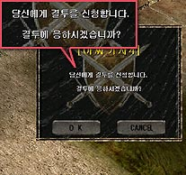
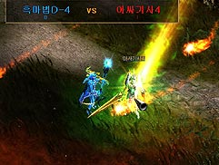

# 1st changeup mastery system, combo & additional skill, hero system <small>18/11/2003</small>

"Blade Knight", "Muse Elf", and "Soul Master", who obtained new looks through the existing change-up system, have been further strengthened and have opportunities to acquire the qualifications of heroes.

## 1st changeup mastery system

Through the existing change-up system, ' Blade Knight ', ' Muse Elf ', and ' Soul Master ' , who obtained new looks, were further strengthened and had opportunities to acquire the qualifications of heroes.

The warriors currently on the Mu continent were already granted the ability as those who qualified for the empire, but it was not short of temporary power. Due to the actions of Etramu, the magician of Arca, who was concerned that he would not be able to properly use that power yet, he was wrapped up in a seal that suppressed his ability to be amplified, so he couldn't show his original ability. Now, the time has come for warriors with the ability to acquire the necessary qualifications. For the heroes who finally have the qualifications to digest power, I will teach them how to do it. Those who acquire the legendary treasure called 'Glory's Ring' and the 'Dark Stone' that creates new abilities will inherit the power of a true king and grow. It has been said that Glory's Ring has the power to revive life and give eternal youth. . If you find the Ring of Glory, you will be able to find the power that was imprisoned and grow. On the other hand, the Dark Stone is the hero 'Venelov' during the Demon War. It is a mystical jewel made from the hardened blood of Benelrope, and it is said that those who obtain it can be granted new abilities. However, the Dark Stone grants its power only to those who have the qualifications of a hero with great power. The hero, Benelope, inherited the blood of a knight, and after the defeat of the Demon God War, he gathered strength and mental strength to hone his skills and magic. Skills that were perfected to counter the forces of Kundun, which possessed even greater magical power after having their souls consumed by Sechneum, have been quietly handed down only to warriors who inherited knightly blood.
Those who qualify will be granted the ability of the hero Venelof by borrowing the Dark Stone.

### 1st quest

Conditions to receive: Character level 220 or higher who has completed the 1st change- up, 3 million Zen money Target to receive: Blade Knight, Soul Master, Muse Elf (characters who have completed the 1st job change) Completion reward: Changed to Level up state point method +6 ( If the character level is over 220 , [(Current character level -220 ) * 1 ] state points are received at once after completing the quest.

### 2nd quest

Conditions to receive: Completion of the 1st Blade Knight quest. Recipient of 2 million Zen in
possession: Blade Knight who completed the 1st quest Completion
Reward: Combo Skill Mastery.

### Quest Provided NPC: Guard Captain [Marlon] (Marlon) - Teleports and moves from place to place.

Devias: Coordinates [ 198,47 ]
Lorencia: Coordinates [ 137,87 ]
Noria: Coordinates [ 169,89 ]
Atlans: Coordinates [ 17,25 ]

### quest item

"Glory 's Ring " , "Dark stone"

|                    | Ring of Glory (State Enhancement) | Dark Stone (Combo Skill Mastery) |
| ------------------ | --------------------------------- | -------------------------------- |
| that class         | Blade Knight/Soul Master/Muse Elf | blade knight                     |
| drop monster level | Lv 72 ~ Lv 108                    | Lv 72 ~ Lv 108                   |
| drop monster       | atlas                             | Hydra                            |
| drop monster       | Tarkan                            | all monsters                     |
| drop monster       | Icarus                            | all monsters                     |

### item

The 1st quest item can only be acquired by that class.

The 21st quest can only be granted by the Blade Knight.

Party-related, drop-related, item selection, trade-related, etc. are the same as the 1st change-up rules.

- In the case of party hunting, the change-up quest item
  cannot be obtained from the monster even if the party member has been given the quest. - A character granted a quest must hunt alone without
  forming a party in order to obtain a changeup quest item. -
  If you have one quest item in your inventory, the quest item will no longer
  drop
  If you have 1 quest item in your inventory, you cannot put the dropped quest item in your inventory
- If you drop the acquired quest item in a hunting ground or village, other characters cannot acquire it for 1 minute
- The quest item dropped through hunting is 1 minute Characters other than those who hunted while hunting cannot be acquired
- Dropped quest items disappear after 1 minute.
- Acquired quest items cannot be stored in the warehouse.
- Obtained quest items cannot be sold to the shop.
- Acquired quest items cannot be traded.

## Combo & Additional Skills

### combo skill

Blade Knight can use combo skills by combining three skills using existing skills.

- **Available Characters:** Blade Knight
- **How to use a combo Combo use:** by combining existing skills

  1. Weapon skill (A)
  2. Character skill (B)
  3. Character skill (C)

  Method: Weapon skill (apply the weapon equipped as a basic skill)

- **Combo Damage:** Combo Additional Damage (D) : (Strength State + Dexterity State + Energy State)÷2

**Apply Combo Damage:** Multiple attacks apply to all characters within the range.

**Combo success (failure does not exist):** A → B → C = D (combo success unconditionally if attacked in sequence)
Ignore MISS when attacking (including 1:1 attack and multiple attacks).

Combo condition : The time difference between skills cannot exceed 2 seconds. (Failure if more than 2 seconds) Combination possible:

1. **weapon skill:** Spinning Thrusting, Slashing, Upward, Slashing

 

| B (character skill) | C (character skill) |
| ------------------- | ------------------- |
| Whirlwind Slash     | blow of innocence   |
| Whirlwind Slash     | blow                |
| Furious Blow        | blow                |
| Whirlwind Strike    | Whirlwind Slash     |
| blow                | Whirlwind Slash     |
| blow                | Furious Blow        |

**obs:** Combo resets when using other skills (Spike, Raid Shot, Swell Life, Shield Skill)

How to use the combo

- Condition: Blade Knight Lv.220 or higher
- How to: Acquire combo items through quests (Drop level: 72 mutant or higher)
  Combo designation method
- Screen: Same as the existing skill structure, but when number keys are input in order, a separate combo can be used
- User: It is the same as the existing skill method, and the three skills must be used one at a time.
  Ex) Ctrl+1 (stab), Ctrl+2 (whirlwind slash), Ctrl+3 (furious strike)

Soul Master introduces skills such as Death Poison, Sudden Ice, and Helbuster that are more powerful than existing skills.

### Soul master skills

Soul Master introduces skills such as Death Poison, Sudden Ice, and Helbuster that are more powerful than existing skills.

#### Decay

**Characteristic:** A skill that is poisoned when hitting a monster successfully

In case of poisoning, the monster's HP is reduced by 3% for 10 seconds

- Level condition: Soul Master former
- Drop monster level: Phantom Knight or higher (Lv.96)
- Required energy: 953
- Damage : 95
- Mana used : 110
- Used AG : 7
- Distance : 6
- Hit range : 3

#### Ice Storm

**Characteristic:** Skill that slows down when hitting a monster

10 seconds

- Level condition: Soul Master former
- Drop monster level: Death Beam Knight or higher (Lv.93)
- Required energy: 849
- Damage: 80
- Mana used: 100
- Used AG : 5
- Distance : 6
- Hit Range : 3

#### Nova

**Characteristic:** When the right mouse button is pressed, energy is gathered and skill damage is activated. You can collect energy for up to 6 seconds, and the damage increases accordingly. Automatically activated when maxed out

- Level limit: 220 or higher quest performer
- Drop monster level: Giant Drakan or higher (Lv.100)
- Required energy: 1052
- Real-time mana consumption: 180
- Used AG: 45
- Distance: Fixed
  Hit range: 6
- Formula: x value (increased by 0.5 seconds) 20 50 99 160 225 325 425 550 700 880 1090 1320
- Increased damage per 0.5 seconds: ((Base horsepower+x value) + strength state ÷ 2) \* wand horsepower% = 0.5 second Helburst rise damage
- Amount of mana used: (180)\*20÷100 = Decreased mana per second

### Muse Elf skills

#### Tripple shot

**Additional Crossbow:** Great Rain Crossbow: Bundle Skill (4 shots)

- A crossbow newly added to the fairies, one level higher than the Holy Sight Bow. It drops from level 100 or higher monsters (Giant Drakan), and can shoot 4 arrows at once when the multiple skill is attached.

   

## Duel & Hero System

We introduce a dueling system that has been upgraded from the existing confrontation method. Method: Input ' / duel request' while two-way agreement characters are facing each other.

| options | Whether | show character             | screen display                       | user operation                                |
| ------- | ------- | -------------------------- | ------------------------------------ | --------------------------------------------- |
| yes     | accept  | Multicolored Duelist Cloak | “Someone accepted the duel.”         | Recognized as a monster (attack with a click) |
| no      | refusal | no change                  | “Someone rejected the duel request.” | can't attack                                  |

Notes on Dueling

- Duel Location: Anywhere except the safe zone.
- Duel Time: The duel ends when one of the two people performs '/duel cancel'.
- Duel has been canceled.
- If you are in a duel with another person: "Someone is currently in a duel."
  Score when dueling
- Character name vs character name score displayed on screen when entering duel state.
- Initialize the duel score in the previous stage when entering the duel state again after canceling the duel.
- In battle: 60% of character damage applied

Dueling Conditions

- No EXP reduction during a duel
- No item drop
- Other users cannot apply when the opponent is in a duel
- PK is not possible when the opponent is in a duel
- You can attack without pressing Ctrl
- You can duel even on a non-pk server

