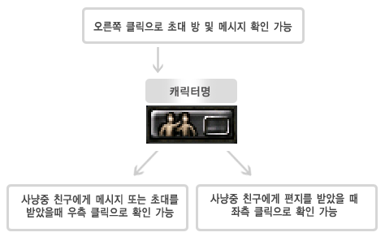

# my friend system update <small>10/01/2004</small>

With the function of registering and managing friendly names in the game, you can communicate with each other through 1:1 conversations, multiple conversations, and send letters of regards to each other even if friends are not connected. A more powerful and active community function "My Friends System" will be upgraded soon.

## Use the My Friends feature

You can use the function only when your character level is 6 or higher.

## screen interface

Location of the 'My Friends' button at the bottom right of the game screen

## friend list

- You can check whether your friends are connected.
- One server contains all dependent servers

<md-clearfix></md-clearfix>

## friend registration

Registration method : Registration is possible under mutual agreement

- Example: Each person is registered in their friend list.
- No: You will only be added to the friend request list. (However, 'offline' status is displayed until the other party registers)

<md-clearfix></md-clearfix>

- All dependent servers in one server

## delete friend

If one person deletes it, it is displayed as 'offline' in the friend list of the other person.

## Talk

Only registered friends can create a separate chat room and chat.

Invite: Invite friends who are currently logged in to allow multiple users to chat

## Letter

Write a letter: You can write a letter whether you are currently registered as a friend or not (you can reply) (consumes 1000 Zen when sending a letter)

Receiving letters: You can receive letters both if you are currently registered as a friend and if you are not.

### Photo mail system

wheel button: zoom in zoom out, click left button: rotate character When sending or receiving letters, you can show the image of the current character to the other party. (A total of 24 motions are included, and the current status of items such as riding items and wing items can also be displayed.)

## user interface

Appears when a message or letter arrives.

## additional features

You can select whether to use the friend function in the option function of the executable file (mu.exe). ('Not usable' displayed in game)

Check conversation refusal from the list: You will not be able to receive a conversation request from the other party. (all windows closed)

- Sorting function: Friends list- Alphabetical order
- Mail list: Received date order Subject
- list: Alphabetical order

- You can register up to 50 friends and store letters.
- Number of people that can be invited to the chat room: Up to 10 people in total.

### hotkey

- `F:` My friend window
- `F6:` Hide all open windows. Show all open windows.
- `F5, Enter:`
  1. Select a chat room when the message blinks on the screen,
  2. Display the selected chat room on the screen.
- `ENTER:` A message can be displayed
