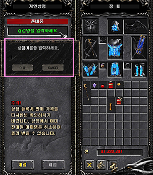

# Personal store update

The personal shop system is a system that allows users to transact more comfortably with each other, and characters who have opened a shop can freely sell their items to other users during battle or while on the move.

> caution! 1. All items can only be traded with Zen. 2. General transactions (/trading) are not possible during shop opening and purchase.

## Open personal shop window

First of all, open the character's inventory window and press the 'Open personal shop' button next to the repair button or click the shortcut key S' to open the personal shop window.

You can also use the command `/personal shop` in the chat window.

- Available from level 6 or higher.
- It can be opened and operated in all areas in the game.
- If you haven't opened a store yet, it will be marked as 'preparing'.

## store opening

Enter store name : If you select the store name input window, you can enter the store name you want.

Item registration : When you place an item you want to register in your inventory on the personal shop window, the sales price input window is displayed.

Set the price you want and press the Ok button.

Registering to open : Register the necessary items in the same way as above and click the 'Open' button after completing all of them to complete the registration of your personal store.

## Opened

When the store opening is completed, the store name is displayed in a speech bubble above the user character's head, and all actions are possible.

Store inventory and user inventory disappear.

While opening a store, by using the method of opening a personal store window once again, the currently opened store and user inventory are displayed as 'opening', and items can be applied (re-registered) or closed (cancelled).

If you sell or discard an item in the store inventory, the item's information is deleted from the list.

## purchase an item

How to purchase : Open the command window (D), click 'Purchase' among the options, and then right-click the user who is opening the store you want to purchase. The store inventory and your inventory will be displayed, and you can purchase like a regular store.

Chat window `/Purchase ID` available

If there is no problem with the purchase conditions at the time of checkout, final confirmation of purchase intent (Do you want to buy XX items?' message output)

The actual item is moved from the seller's inventory to the buyer's inventory when the purchaser's payment is completed.

After payment, the item information in the sold store inventory disappears. ("Item sold to" to seller)

## etc

If you disconnect and exit while opening a shop and then come back into the game, the items will remain in the shop window, but the shop name and item price will be reset. Right-click to reset the item price.

If the store name is too long, the store name is randomly shortened during chatting.

