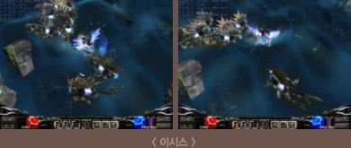
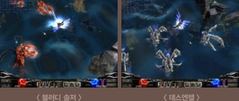
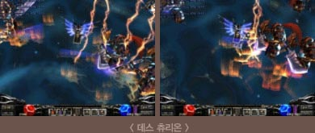
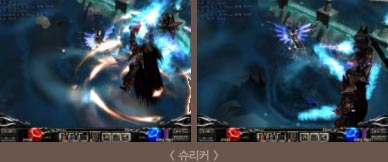
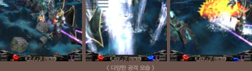
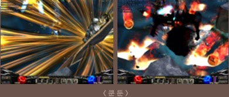
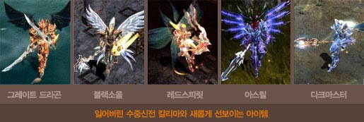

# The Lost Underwater Temple of Devil City Kalima <small>01/10/2004</small>

You can enjoy not only the upgraded items that were added in each world patch, but also the appearance of 'Kundun', the ultimate boss monster of the continent of Mu, through this Kalima patch.

## Devil City Kalima

Our 'Mu', which has always brought issues whenever a new map is released, has finally added the 9th world lost underwater temple 'Kalima' following the sky map Icarus through a patch. You can enjoy not only the upgraded items that were added in each world patch, but also the appearance of 'Kundun', the ultimate boss monster of the continent of Mu, through this Kalima patch.

Warriors of the continent Mu who will expand their activities to the mysterious underwater temple following underwater, desert, and heavenly worlds!! With the new class Dark Lord, armed with more powerful items, we look forward to your energetic appearance against Kundun.

What makes Kalima unique compared to existing worlds is that, contrary to the expectation that new world additions would always have a much higher level of difficulty, it is a world divided into 6 levels, and the way to enter according to the level of each character. is that you have
(Of course, the higher level Kalima has the highest difficulty.)

## Kalima's entry level

| Admission level | normal character | Magic Swordsman, Dark Lord |
| --------------- | ---------------- | -------------------------- |
| One             | 15 to 49         | 15 to 29                   |
| 2               | 50 to 119        | 30 to 99                   |
| 3               | 120 to 179       | 100 to 159                 |
| 4               | 180 to 239       | 160 to 219                 |
| 5               | 240 to 299       | 220 to 279                 |
| 6               | 300 to 400       | 280 to 400                 |

It is impossible to use movement commands, and the way to enter Kalima is different from the existing world.

### How to enter

Collect 10 'Marks of Kundun' that drop in each world to make a 'Lost Map' and throw them into the field to
open the 'Magic Stone', the entrance to Kalima. At this time, the magic stone
will be opened according to the level of the character who threw the map, and only the character who has a party with the character who opened the magic stone can enter.
(If the entry level is not correct, you will not be able to enter even if you are a party member.)

### Kalima's appearance monster

We made it easier to understand through comparative explanations with the monsters of Icarus, and based on the figures of Icarus monsters that were lowered through the Kalima patch.

| Icarus          | LEVEL | vitality | Max Attack Power | defense |
| --------------- | ----- | -------- | ---------------- | ------- |
| Quenrayner      | 82    | 19000    | 350              | 230     |
| Drakan          | 86    | 29000    | 480              | 305     |
| Alpha Crust     | 92    | 34500    | 540              | 360     |
| Phantom Knight  | 96    | 41000    | 620              | 425     |
| Giant Dracan    | 100   | 50000    | 740              | 495     |
| dark phoenix    | 108   | 95000    | 1000             | 600     |
| Sixth Kalima    | LEVEL | vitality | Max Attack Power | defense |
| isis            | 104   | 62000    | 705              | 540     |
| bloody soldier  | 107   | 66500    | 745              | 555     |
| death angel     | 110   | 73000    | 801              | 585     |
| Death Centurion | 117   | 88000    | 930              | 670     |
| Rogue Centurion | 122   | 98500    | 1017             | 740     |
| shrieker        | 128   | 135000   | 1120             | 830     |
| Kundun          | 140   | 500000   | 1500             | 1000    |

※( Levels 1-5 are omitted for difficulty comparison. The figures above are subject to change.)

Among the monsters of the 6th Kalima, 'Isis', the lowest level monster,'s level, vitality, and attack power far exceed Icarus' 'Giant Drakan', and this is a good example that can simply explain the difficulty of Kalima.

The first monster you can meet in Kalima, 'Isis', attacks in close proximity to the character. There is no attack while approaching the character, so if you keep a reasonable distance and attack, it won't be difficult to deal with. but…

If you go a little deeper into Kalima, the Kalima monsters will start attacking in earnest. Bloody Soldier and Death Angel, who perform mid-range attacks, directly cast magic attacks on the character's body, causing them to suffer damage without knowing where or how they are being attacked.

Death Centurion attacks with the Black Knight's skill, Fury Strike.

Shuriker, the last monster escorting Kundun, uses both powerful physical attacks and Inferno magic at the same time. It boasts tremendous damage, but the more frightening thing is that it can be said that it is a long-range attack that unfolds as a group. Safe hunting cannot be guaranteed without strategic team play by forming the strongest party, including the Dark Lord.

Kundun's attack, which creates a terrifying atmosphere with heavy damage, seems really hard to handle. Let me explain the abilities unique to Kundun.

1. **Defense Reduction Skill:** If you get hit by this skill, your defense is reduced by 10% for 5 seconds.
2. **Physical (or magic) attack ignoring:** While using this skill, any physical (or magic) attack
   cannot damage Kundun.
3. **Monster Summons:** Summons a monster called 'Log Centurion', which also has strong attack power.
4. **Poison Skill:** Poison damage for a certain period of time.
   (The above 4 skills are also the characteristics of boss monsters of 1 to 6 Kalima.)

As a boss monster, it has power that cannot be easily attacked, but considering the fact that it only appears twice a day and the item drop rate when hunting is successful, I think it is worth taking the risk. Also, the sense of accomplishment of conquering the boss monster of the Mu continent is indescribable.

### Kalima's New Armor and Weapons

