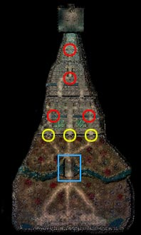
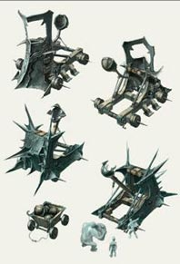
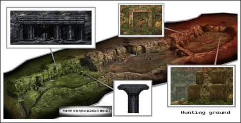
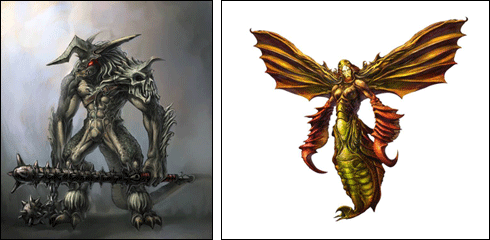

# Mu siege experience server open <small>01/12/2004</small>

As much as you expect from the warriors of the Continent of Mu, we, the Webzen developers, have devoted ourselves to updating the siege warfare with great care, and finally, in December 2004, through the experience server, we are able to present the magnificent results to you. Through 'Siege', the continent of Mu will face a new turning point.

> All contents are subject to change during patching

## Anyone can participate! Let's experience the siege in advance!

The current test server is transformed into a siege experience server. In the Siege War experience server, everyone starts with the same conditions, and any current MU customer can access the Siege War experience server.

[How to participate in the experience server siege]
① When selecting a server, connect to the siege experience server. (Recommended to connect to experience-1 server for initial connection)
② Select the character you want among the level 200 characters. (Magic Swordsman and Dark Lord can also be selected)
③ After connecting to MU World, join a guild or recruit guild members.
(Recruitment and registration of guild members in Noria Village after accessing the Experience-1 server at the time of initial connection is recommended)
④ Basically, Zen is provided in the inventory, and weapons can be purchased through the shop.
⑤ After completing the guild formation and equipment setting, participate in the siege according to the 'Siege Warfare Guide'.

## Siege war experience! Let's get started knowing enough! Experience Server Siege Basic Guide

Experience Siege Warfare After thoroughly understanding the contents of the basic guide for siege warfare on the experience server, please experience the siege warfare.
The content of the experience server guide is only a siege guide for the 'experience server' and will differ from the actual siege guide in the future.
The most important thing in the experience server siege is 'how to organize or join a guild?'
And 'with which guild and alliance to prepare for the siege' is the point.
Guilds in the experience server are once again recommended to configure or join the experience-1 server in Noria Village.

### Basic setting

- When creating a character, it is created at level 200.
  - There is no limit on the creation of Magic Swordsman and Dark Lord.
- It is possible to move to Loran Gorge on foot through Lorencia, and there is no move command.
  - There is no character entry limit to Lorraine Gorge.
  - The coordinates of the entrance to Loran Gorge will be revealed on the day of the experience server patch through the notice on the
- MU homepage . _ In the combat area, you can attack without pressing Ctrl, and there is no decrease in experience, but you can drop items. _ The safe area is the same as the usual basic area, and all penalties apply.
- Only guild master level 200 or higher and 20 or more guild members can declare a siege, and other guilds and general characters can participate in a neutral relationship, but cannot obtain an actual castle.
- If a guild that owns a castle is disbanded, it will be changed to a castle without an owner.
- Up to 5 guilds on the siege side can attack at once. _ The top 5 guilds are selected as siege guilds by calculating the castle owner's mark registration (50%), guild number (35%), guild master level (10%), and application priority (5%). _ Guilds can be united by up to 7 guilds, so if 5 guilds selected for siege challenge a siege with the maximum alliance, up to 35 guilds can participate in the siege. \* The Mercury side cannot consist of more than one guild. (However, guild union is possible)

### War (siege) period

- Siege warfare takes place every day at 20:00.
- You can apply through the Royal Guard NPC.
  - Duration: 09:00 ~ 12:00
- When the application is closed, a guild that can participate in the siege will be selected.
  - Duration: 12:00 ~ 15:00
- The siege takes place at 20:00.
- On the siege side and the defense side, a guild mark is displayed above the character's head, and a spear on the siege side and a shield on the defense side are displayed. \* At the same time as the selection is closed, the besiegers and defenders can attack without pressing Ctrl on any map (field) until the siege.

### Victory (Attack/Defense) Conditions

- The victory condition for the siege side is to enter the castle through the bridge and gate, destroy all 4 guardian stone statues, and stamp your guild’s seal on the king’s crest located in the dragon tower. If you hold the castle until the end of the siege, you win.
  - Only guild masters can register their seals.
- If the defending side protects the king's crest for a total of 30 minutes (subject to change) during the siege, the defense will succeed.
- During the period of total 30 minutes of siege time, it does not end even if the castle lord is changed.
  - At the end of the final 30 minutes, the guild that owns the castle becomes the castle owner.

## Other siege elements that are good to know! Let's study Mu Siege!

This is a development of Lorraine Gorge from the sky. At the beginning of the siege , it is expected that the battle will take place near the bridge marked in blue . If the Mercury side is pushed back, a secondary battle is expected at the three gate points marked in yellow. The part marked in red is where the 'Guardian Stone Statue' is located, which must be destroyed before the besiegers enter the Dragon Tower. You can enter the Dragon Tower after destroying all 4 Guardian Stone Statues. However, the process will not be easy until the besiegers enter the King's Tower and carve the guild seal on the King's coat of arms. This is because Mu Siege is designed to give the Mercury side an advantage over the Siege side. And the first siege of the experience server will be conducted in the way of which guild takes over the empty castle first. Please note this point.

Catapults can be used on both the siege and water side. The upper part of the picture is the Mercury side catapult, and the lower one is the Siege side catapult.

Catapults can be used by anyone participating in a siege.

Also, when the catapult fires, the firing user will follow the catapult's stone mass as it flies. (It means that you temporarily become as if you are flying in the sky ^^;)

For more information, please refer to the notice on the Mu homepage when patching the experience server.

It is a hunting ground owned by the castle lord guild and the monsters that inhabit it. The guild that won the siege and its affiliated guilds will be able to hunt monsters in an independent space, and will get items that can only come from the hunting ground. For more details related to the Mu Siege experience server, we will inform you in detail through the notice along with the experience server patch. The 'Siege of Mu', which will be held in Loren Gorge, will be an opportunity for a new great change for the Mu continent. Warriors of the Mu Continent, we hope for your interest and participation. Thank you.
