# Mu Siege Update <small>01/01/2005</small>

Fierce battles in the Loren Gorge The continent of Mu awaits warriors with true courage.

> The contents below are based on the contents patched on the test server on January 13, 2005, and may change when applied to the main server.

## Siege warfare basic settings

### Basic setting

- Experience server has 1 castle in 4 subordinate servers.
- It is possible to move by walking to the coordinates of Lorencia (238, 15), and there is no movement command.
  \*There is no entry limit to Lorraine Gorge.
- The Loren Gorge area is changed to a combat area during siege time and a safe area during other times.
  *In the combat area, you can attack without pressing Ctrl, and there is no decrease in experience.
  *The safe area is the same as the usual basic area, and all penalties apply.
- Only guild master level 200 or higher and 20 or more guild members can declare a siege
  , and other guilds and general characters can participate in a neutral relationship, but cannot obtain an actual castle.
- If a guild that owns a castle is disbanded, it will be changed to a castle without an owner.
- Up to 3 guilds can attack at once, and if more than 3 guilds apply
  The top 3 guilds will be selected based on propaganda criteria.

### Siege period (schedule)

- Siege warfare takes place every day at 20:00 (8:00). (Only for the experience server)
- Only the guild master can apply through the Royal Guard NPC in front of the castle in Loren Gorge. \*Period 09:00 ~ 12:00
- When the application is closed, the guild of the besieging side will be selected through the registration of the “Mark of the Castle Lord”. \*Period 12:30 ~ 15:00 (3:00)
- The selected guild will be announced. It can be confirmed through NPCs and notices.
  \*Period: 15:30
- At 20:00 (8:00), a sword and shield representing the siege and defense camps are displayed above the character's head, and the siege begins.
  \*If both camps are selected, both guilds (including alliances) can attack without pressing Ctrl.

## battle

- On the siege and defense side, a guild mark is displayed above the character's head, a spear on the siege side, and a shield on the defense side.
  *The guild master is displayed in the shape of a crown instead of a spear or shield (the background is blue for the siege side and red for the siege side). *Guilds and characters that have not been selected are all neutral and do not display anything.\*
- Loran Canyon is changed to a battle area during siege time, so you can attack without pressing Ctrl.
  *There is no decrease in experience, and there is no PK penalty.
  *Neutral characters can attack while pressing Ctrl.
- It is impossible to leave or join a guild or union during a war.

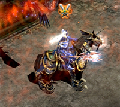
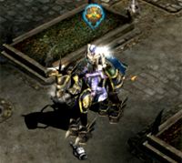
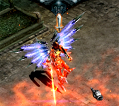
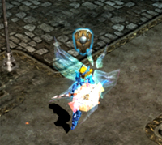

### Basic Rules and Victory Conditions

- Coalitions belonging to the besieging and defending sides are automatically included in each besieger and defending side.
- When attacking an ally, you must press Ctrl and attack to attack.
- Ranged attacks can give 80% reduced damage to the same side, and 60% reduced damage is applied when attacking the opponent.
- In order to win, you must register the seal of the guild master on the pedestal located in the Dragon Tower, but if successful, the lord of the castle will change.
  - Only the guild master (the best guild master in the alliance) can register the seal on the pedestal.
  - It takes 60sc (1 minute) to register the seal, and if you die from an attack or if the two scaffolds required for seal registration are released, the
    seal registration will fail.
  - Even if the seal registration is successful, if the war time remains, it will not end, and the siege side and the defending side will change.
  - Finally, the guild in which the seal is registered becomes the lord of the castle when one hour of war has elapsed.

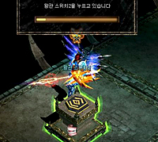
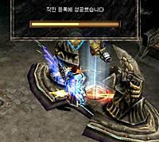

### Main elements and detailed functions

#### Castle Gate

- Has defense and durability (HP), and can only be attacked during war. The castle gate
  can damage the weapon's durability in case of a normal attack (including skills), so you must destroy the potion of blessing or the potion of soul while eating it.
- The castle gate will not be restored even if you win midway through the broken state, and will remain in a broken state.
- The gate's defense and durability can be upgraded up to 3 levels.
  (However, upgrades and repairs are not possible during war)

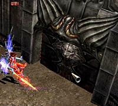

#### Guardian Stone Statues

- There are a total of 4 stone statues in the castle, and if all of the statues are destroyed, the protective barrier at the entrance to the Dragon Tower will disappear.
  \*Only characters on the Mercury side can enter the protective barrier.
- You can recover HP, MP, and AG around the Guardian Stone Statue, and the recovery rate can be upgraded up to three levels.
- Has defense and durability (HP), and can attack only during war.
  Since the durability of the weapon may be damaged in case of a normal attack (including skills), the Guardian Stone Statue must be destroyed while drinking a potion of blessing or a potion of soul.
- Guardian stone statue's defense and durability can be upgraded up to 3 levels.
  (However, upgrades and repairs are not possible during war)

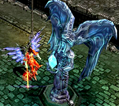

#### Guard Tower

- The guard tower plays the role of protecting the guardian stone statues around the guardian stone statues as soon as the war begins.
- Guard Towers can be attacked, and can be destroyed in the same way as stone statues or castle gates.

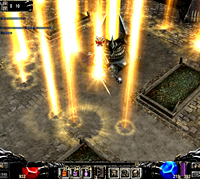
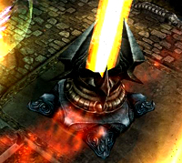

#### Dragon Tower

- A huge tower located at the end of the castle, it is divided into an entrance and an upper floor, and there is a protective shield protecting the entrance.
- There is a pedestal with the official seal of the owner of the castle on the upper floor of the Dragon Tower.

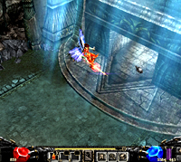

### Facts, Command System and Light Stone

#### Status, command system

- Guild members (including allied guild members) on the siege and defense side have a small status system (mini-map) at the bottom right.
  - Your location, guild master command status, overall development of the castle, and castle status are displayed.
  - It is created at the same time as the siege starts, and disappears when the siege ends or you move to a non-war zone.
  - On/Off is possible using the [Tab] key.

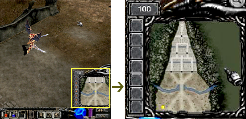

- In the command system, command skills are created only for the guild masters on the siege and defense sides, and it is possible to command (command) the position and attack status of guild members by using skills. * You can instruct the guild members on the status of the siege with an attack command (sword-shaped Attack), a defense command (shield-shaped Defensibly), and a standby command (flag-shaped Stop) . *It is possible to divide into a total of 7 groups.

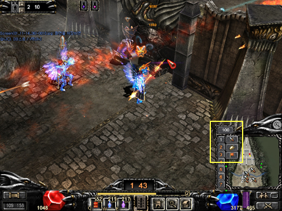

#### Life Stone

- Life Stone is a dark rod that the guild master on the siege side can use in this case, a skill called Life Stone.

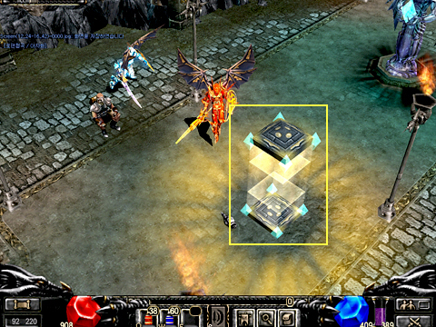

- Life Stone
  - Siege guild members (including coalitions) can respawn a little closer to the war zone if they die.
  - Can only be used on the siege side, and cannot be used more than 3 times during the war.
  - It takes 60sec (1 minute) to create, and it will be canceled if you die or move while being attacked.
  - Due to a special ability, HP, MP, and AG are restored by 2% per second to the characters on the besieging side for up to 3 tiles.
  - Can be destroyed by the aqueous side or the siege side (forced attack).

### Etc

#### Blessing, Soul Potion

- It is a must-have item to destroy the gates and stone statues.
  - If you attack a castle gate or a stone statue without taking the potion, your weapon's durability will decrease rapidly and your attack power will decrease.
- Characteristics and settings of the potion of blessing
  - If you drink it once, the duration lasts for 60 seconds.
  - Damage increase +20% is applied only when attacking castle gates and stone statues, and does not affect PvP.
- Spirit Potion Characteristics and Settings
  - If consumed once, the duration lasts for 30 seconds.
  - Attack speed +25 increase
- How to create
  - Combination You can make it through a combination in Goblin > General Combination.
  - Blessing potion generates 5 gems from 1 gem of blessing , and potion of soul creates 5 gems from 1 gem of soul.
    －The Zen required for the combination is 100,000 Zen per Blessing Gem, and 50,000 Zen per Soul Gem.
  - Required Zen is based on 1 Blessing Jewel for 100,000 Zen and 1 Spirit Jewel for 50,000 Zen. **Ex:** If you put 2 potions, 10 potions are created, and if you put 5 potions, 25 potions are created.

When combining, if there is no room in the inventory, the combination is not possible.

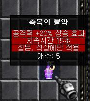
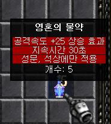

#### Movement and Village Return Documents

- A guild (including alliance) that owns a castle can move into the castle through “/Move Loren Gorge”.
  \*However, it cannot be used while a siege is in progress, but you can move using the “Village Return Document”.
