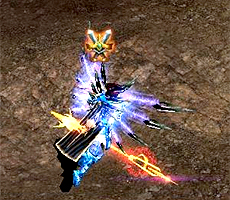

# Battle of Loren Gorge <small>16/02/2005</small>

Battle of Loran Gorge The first siege of the Mu continent! Finally, it will be released to Mutizens through the experience server!!

> The first siege on the Mu continent! It will be released through the trial server!
>
> The first siege of the Mu continent!
>
> Finally, it will be released to Mutizen through the experience server!

Siege warfare in the experience server! Please feel the pleasure of occupying the castle through various strategies and tactics in advance.
In this help station, we would like to briefly explain the siege process, features, and important elements ahead of the siege.

## Connecting to the trial server

The experience server is basically created at level 200 when you create a character, and there is no limit on the creation of magic swordsmen and dark lords. Basically, a large amount of Zen is given to each character, and basic equipment can be purchased through NPCs. (For knights, +7 12 option 'Dark Phoenix Set' and +7 12 option skill 'Sword of Destruction' can be purchased from NPC with Zen.)

## Guild

Now that the application for the first castle owner decision has been completed, all that remains is to be selected as a candidate.
The criteria for selecting candidates is the number of registered guild members' mark of the lord (50%) + the number of guild members (30%) + the guild master level (20%). Since the number of registrations for the castle lord's mark accounts for a high percentage, the more the castle lord's mark is registered, the more favorable it is to be selected as a candidate. In addition, since the guild with the highest ranking can decide the location of the siege/defence, “Collect and register unconditionally”.

In addition, the first castle owner will start as the first castle owner (defensive side) in the event that will be held when the in-game siege is opened, and you will be able to challenge the event reward in an advantageous position.

## Entrance to Lorraine Gorge

## Request a siege

Only guilds with guild master level 200 or higher and guild members of 20 or more can declare a siege, and after declaring a siege, you can register the castle mark. The number of castle mark registrations (50%), guild members (35%), guild master level (10%), and application priority (5%) are converted into points to select the top 5 guilds as guilds to participate in the siege. It's possible.

When the siege begins, a sword (siege) and shield (water castle) mark appears above the character's head, and from this point on, PKing is possible.

## siege progress

The siege side blocks the attack of the defender side and enters while destroying the gate consisting of three stages, the inner and outer walls. At this time, you must keep in mind that you must destroy all 4 guardian stone statues at each stage to enter the final battlefield, the Dragon Tower.

You can enter the Loren Gorge through the entrance of Lorencia coordinates ( 238,14 ), and there is no movement through the movement command. (There is no entry limit)

## castle gate

There are a total of 6 gates, 3 in the 1st wall, 2 in the 2nd wall, and 1 in the 3rd wall. Select and destroy strategically before entering. When attacking the castle gate, the weapon's durability will decrease rapidly if you use a normal attack. To prevent this, you must attack while using the Potion of Blessing and the Potion of Soul.

## guardian stone statue

The guardian stone statues in the castle have the function of restoring the HP, MP, and AG of the character on the side of the castle around the statue. As with the castle gate, the durability of the weapon decreases when a normal attack is performed on the guardian stone statue, so you must attack while using the potion of blessing and the potion of soul. It has a protective function, so it damages the characters around the guardian stone statue through the emitted light.

## dragon tower

When you enter the Dragon Tower, there is a crown at the top of the center and a crown switch at the bottom on both sides.

## Register the King's Seal

Upon entering the Dragon Tower, you must step on the two crown switches at the bottom to allow the guild master to register the royal seal. It should be noted that the siege does not end when the seal is registered, but the siege continues as the airborne side is reversed at the same time as the seal is registered. During the siege (30 minutes for the experience server), you can only become the owner of the castle by defending the castle from the position of the defender to the end.

## Using balls and water-based items

From destroying gates and stone statues to registering the king's seal, not only PK, but also strategic items can be used by both sides.

As a potion created through the combination goblin, it is used to break down gates and stone statues, respectively, increasing attack power and attack speed. If you hit the gates and stone statues without using this potion, the durability of the weapon you are wearing will decrease dramatically. It is a potion that has the same ability as above, but it has no effect during character PK.

The Mercenary side can use mercenaries to effectively block the enemy's path.

The life stone can be installed by the guild master of the besieging side (if the guild master is a dark lord, it can be used up to 3 times), and if a character on the besieging side dies during a siege, it has a function to respawn in the area where the life stone is installed. You have. In addition, it restores the HP, MP, and AG of characters on the siege side within 3 tiles around the Lifestone by 2% per second. This is the concept of a position on the side of the siege, and it helps to effectively infiltrate the castle by building it in a more advantageous position for attacking the castle. If the siege side's Lifestone is installed, the Mercury side should pay as much attention as possible to destroying it.

## mini map function

Using the Tab key, you can use the siege mini-map (on/off function) and find out the current location of the characters on both sides of the siege.

## Character Skills Exclusive to Siege

Unlike the existing skills, a character's skill with more outstanding damage has been added in the character-specific attack during PK. The following is the cast of each character's skill.

> The above information is the content of the experience server and may change when the main server is applied.
