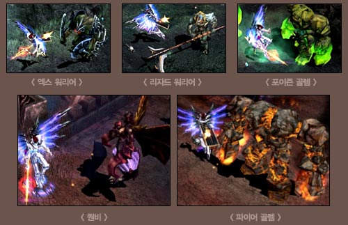
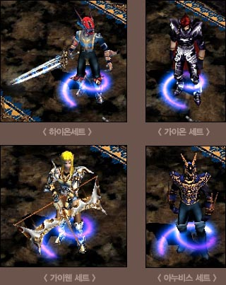
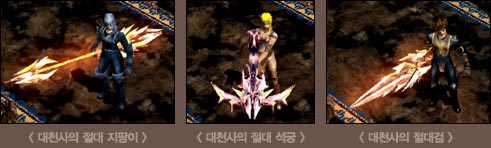

# Mu continent in February has something special! <small>24/02/2005</small>

Siege warfare is called the flower of MMORPG. In today's helper channel, I would like to explain the current 'real' benefits other than 'honor and pride' and what will be added soon.

**Castle Conqueror! I will take the land of gold!**

The guild that wins the siege will occupy the MU's only castle, the 'Castle of Loren Gorge', and reign as the 'ruler' of the server for two weeks. Above all, I think you will be able to feel the 'pride' that you have won in competition with other guilds. In today's helper channel, I would like to explain the current 'real' benefits other than 'honor and pride' and what will be added soon.

## First Benefit - Tax Collection

There is a joke that the top evil merchants in Mew are the Chaos Goblins. He can't express how sad he felt when the combination failed. The first benefit and authority you get when you win a siege is the ability to collect taxes from NPCs. All warriors on the Mu continent have to buy items such as potions from NPCs to fight on the Mu continent, and must combine them. At this time, a portion of the drug price and combination fee paid by Mutizens to NPCs can be collected as tax.

March 16, Mo server. When I checked the consumption of potions by NPCs throughout the day, I could see that about 100,000 healing potions and 600,000 mana potions were drained during the day. Perhaps because this server is rather crowded, it was an NPC with good business. The amount was staggering. Also, if you can collect some of the money Chaos Goblins collect for upgrades and invitations/entries in taxes, that would be a big sum.

Currently, it can be set up to 3%, and after stabilization to a certain extent, they are considering ways to give mutizens more freedom.

## Second Benefit - Exclusive Hunting Grounds!

There is a hidden hunting ground in Lorraine Canyon. Its name is 'The Land of Trials.' The Land of Trials is also called the 'Map for Seongju Guilds Only' because the gilma of the Seongju Guild can restrict entry to the general public except for the Seongju Guild. If you are not a member of a guild that owns a castle, you must pay the castle lord an entrance fee (currently up to 300,000 Zen) to visit the land of trials and hunt monsters.

A land of trials that can only be entered through the Gatekeeper NPC. The first thing I'd like to tell you about this place is that the 'Jewel of Guardian', which has a clearer ding~ sound, will drop. The jewel of protection is the 6th sealing stone of the Mu Continent and currently drops only in the 6th Kalima and the Land of Trials.
The gem's function is used for upgrades for combat/defenses related to siege warfare. I'm still thinking about the use of jewelry.

So let's take a quick look at the monsters in the Land of Trials.

 

Introducing..
Land of Trials Boss Monster Erohim! Erohim, the boss monster, is the most powerful boss mob in the Land of Trials. The Erohim, who do not tolerate 'humans' invading their territory, always attack violently. As much as it usually shows off its strength, if it dies, it has properties that only appear after recovering for 12 hours due to the aftermath.
If you succeed in hunting Erohim, the items that are dropped are Darkbreaker class weapons and Great Dragon helmet class armor. And they give you excellent items such as the Sword of Destruction, Holy Sight Bow, Great Scepter, and Staff of Destruction!

And along with Erohim, the monsters that inhabit the Land of Trials include X Warriors, Lizard Warriors, Poison Golems, Queen Bees, and Fire Golems. The monster's personality, stats, and drop items will be introduced in the upcoming update story.

Oh and here's a bonus tip! Monsters in the Land of Trials will drop 'set items'. Gaion set and Gaiwen set. High-level set items such as Janubis and Highon sets will drop.

## Third benefit - Siege launch celebration event!

As you have already seen in the announcement, the siege launch event will be held for a month and a half after the initial siege on March 27th. Among the three events, the in-game event is an event that devotes a page to the history of the Mu continent to the 'guild that wins the siege'. If you win all 3 siege battles, you can win the “Archangel’s Absolute Weapon”, the strongest unique item in Mu Continent that can only be obtained in the Blood Castle event!

3 options (armor) of the finest excellent items for guild success in siege or mercury ②
50 mu pure gold and 3 options (attack) of the finest excellent items for guilds that have occupied the castle
lord for 2 times ③ For the guild, Mu pure gold 100 money and Archangel's absolute weapon

- Unit benefits cannot be duplicated.

## and… Plus Alpha!

Currently, the MU development team is preparing a lot of information regarding the benefits of siege warfare. Since it is a long-awaited siege, we are preparing various benefits for it. The information that has been revealed so far is as above, and there are many other contents that are being prepared separately, and we will reveal one of them secretly. However, it is currently under development and the content may change when it is actually applied to the test server and main server, so please understand ^^

## (tentative name) Waving the monster flag...

Would you like to imagine hundreds of monsters from all the Mu continents gathered in the front yard of the castle in Lauren Gorge? ~ Every night with the tentatively named monster flag waving, all the mobs from the Mu continent appear in the front yard of the castle at regular intervals to attack the Mutizens. This is a castle raid quest. Normally, monsters on the normal map usually raid, but once every two weeks, 'Erohim' directly conducts a raid on the warriors of the Mu continent. If Mu warriors bravely fight against the attack of monsters, they will be able to obtain not only set items, but also jewels of protection. Because millions of monsters appear, you can get experience points, and even set items and guardian jewels according to your efforts!!

Starting with the application of Siege War on the main server, Mu's development team and operation team provide various updates that allow Mutizens to enjoy the game and enjoy many benefits in the game. We are preparing quests and events. We will continue to release one by one, and we will do our best so that many mutizens can focus on the game. Mutizens would also like to ask for lots of affection and interest in the efforts of the MU development team and operation team. thank you

Looking forward to a more interesting Mu continent with Mu Siege.
