# Add gem combination system, expand the benefits of the castle owner

Added a system to combine 10, 20, and 30 gems into one inventory slot when trading large amounts of items. In addition, the castle lord combination system, which allows you to combine special items through the Senate NPCs in the siege map, and the "Land of Trials", a hunting ground dedicated to the castle lord, will be greatly expanded by 2.5 times.

When trading, or storing a large amount of jewels in a warehouse or inventory, it was inconvenient to have to store them one by one.
In order to minimize the inconvenience of trading such a large amount of items or using the warehouse, a
system for combining 10, 20, and 30 jewels into one inventory slot has been added.
However, only "Jewels of Blessing" and "Jewels of Soul" can be combined.

## Gem Guild Merchant "Servis"

Servis was a black magician trainee, but rather than polishing magic, he had a deeper interest in alchemy, which uses mana to fuse and create various gems and minerals.
The ultimate goal he was trying to achieve through alchemy was the creation of a powerful magic stone that could contain a huge amount of mana, like the sealing stone created by the great wizard Etramu to seal Kundun. make new discoveries
In the process of creating the magic stone, while fusing various jewels containing powerful mana, he devised a way to condense the power of several jewels into one jewel, which made it inconvenient to carry dozens of jewels. It has helped alleviate the suffering of many people.

 

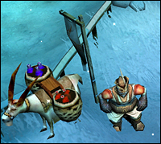

## How to combine gems

If you go to the Gem Combination NPC, Servis, you can pay the combination fee (Zen) and combine the Gems of Blessing or Soul Gems in groups of 10, 20, or 30 units.
Jewels that are combined in units of 10 cannot be used for item upgrades, and can be dismantled individually through NPCs.
Gem Guild NPC Servis is located in Debias Village (Location: 191.17).

1. While holding the gems to be combined in the inventory, click the NPC to open the combination menu window, then click the jewel combination.

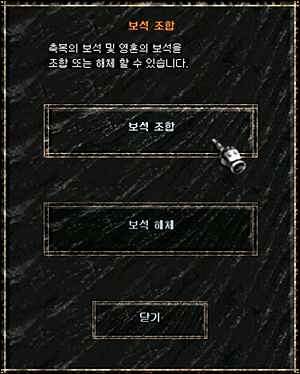

2. If you click on a jewel combination, the detailed combination menu window appears. In the detailed menu, the type of jewel to be combined (jewel of blessing, jewel of soul), the number of jewels to be combined, and the combination fee required for combination are displayed. If you click on the type and quantity of jewels, a jewel combination is made.

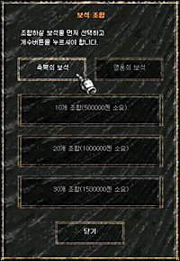
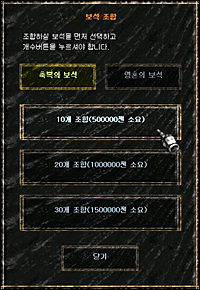

When you select a gem and click the combination button (quantity button), a final confirmation message is displayed, and the combination is performed.

3. The final confirmation button appears, and if you click the OK button, the corresponding combination fee is consumed from the character's inventory, and the jewel combination is made.

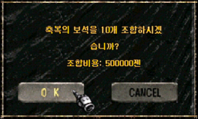

4. Each jewel bundle is displayed as +1 ~ +3 in the item information window. _Item information is automatically displayed when you hover over an item._

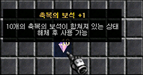
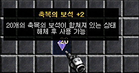
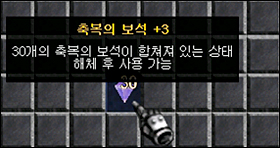
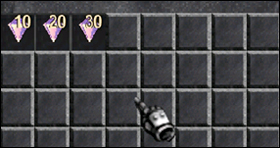

## jewelry heche

Gems combined in 10, 20, and 30 pieces cannot be used for item upgrades in the actual game. In order to use gems such as item upgrades, you must dismantle them into individual gems before using them.

1. With the bundle of jewels to be dismantled in your inventory, click the npc and click the dismantle jewels button.

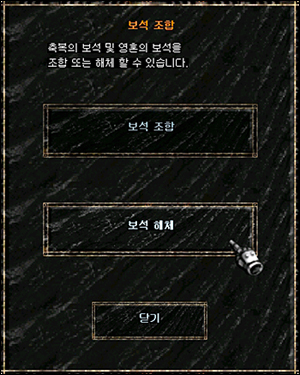

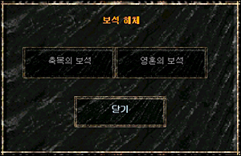

2. Select the jewel to be dismantled (Jewel of Blessing, Jewel of Soul), select the jewel to be dismantled from the list, and click the Dismantle button.

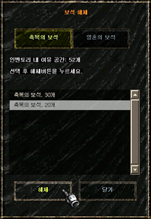

3. The final jewel disassembly confirmation window will appear, and if you click the OK button, the jewel will be dismantled and placed in the character inventory.

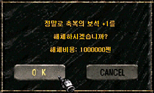

## caution

- When combining gems, if there are no gems of the corresponding quantity in the inventory, it will not be combined.
- If there is not enough Zen required for combination, it will not be combined.
- If there is not enough space in the inventory when disassembling the jewel, it will not be dismantled.
- When disassembling jewels, if there is not enough Zen, they cannot be combined.
- Zen needed to dismantle jewels: 1,000,000 Zen (one million Zen)

> The benefits that lords of the Mu continent can enjoy have been greatly expanded. The castle lord combination system, which allows you to combine special items through the Senate NPCs in the siege map, and the "Land of Trials", a hunting ground dedicated to the castle lord, will be greatly expanded by 2.5 times.

## Castle Lord Guild System

It is a combination function exclusive to the castle lord who occupied the castle of Lorraine Gorge. You can combine special items that do not currently drop, as well as excellent items and general items. The castle lord combination can only be combined once a day.

1. The castle lord association can be tried through the Senate NPC.

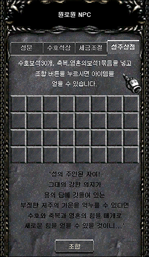

2. If you put the items you need for combination on the combination window, the combination button will be activated.
   Combination Materials: Guardian Jewel (30 pieces) + Blessing Jewel Bundle (30 pieces, 1 bundle) + Spirit Jewel Bundle (30 pieces, 1 bundle) + 1 Billion Zen

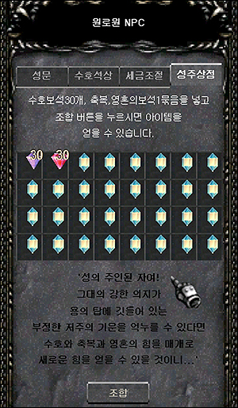

3. If you try to combine, you will always be able to acquire an item, but the item to be combined will be an item that does not drop from the current monster, an excellent item, or a normal item.

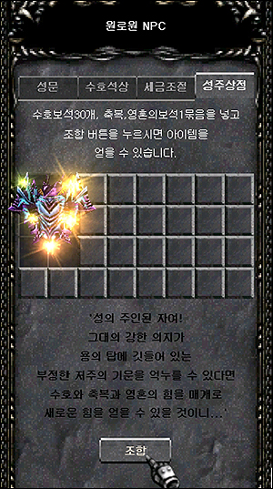

4. Precautions when combining

- If there are not enough jewels required for combination, it will not be combined.
- When combining, if there is not enough Zen (1 billion Zen) required in the character's inventory, it will not be combined.
- Can only be combined once per day.
- If the server is restarted due to maintenance, the number of combinations (1 time) will be reset.
- Items created during combination are randomly generated among items that are not currently dropped from monsters, excellent items, and general items.
- Only Seongju (Guild Alliance Master on the Suseong side) can be combined.

## Land of Trials Expansion

The "Land of Trials" connected to the Loren Gorge has been greatly expanded to 2.5 times the width of the previous one. The Land of Trials is an exclusive hunting ground where the lord of the castle can restrict entry of general characters. The castle owner can accept admission fees for general characters and allow them to enter the Land of Trials, or restrict general characters from entering so that only members of the guild (including union guilds) can enter.

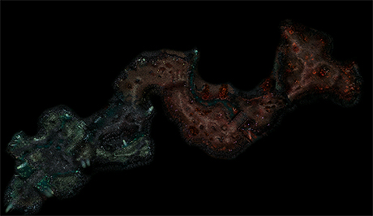
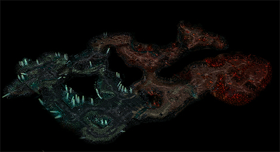
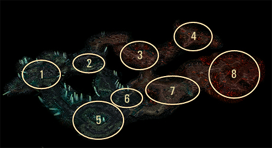

- X Warrior
- Lizard Warrior
- Poison Golem, Queen Bee
- Queen Bee, Fire Golem
- X Warrior, Lizard Warrior
- Lizard Warrior
- Poison Golem, Queen Bee
- Fire Golem, Queen Bee, Erohim
