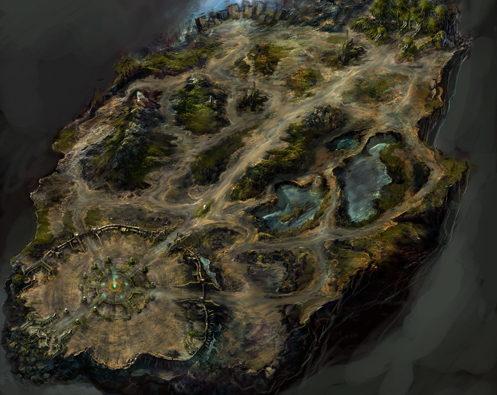

# The hot summer update story of Mew <small>20/05/2005</small>

The summer of 2005, when the heat wave begins once every 100 years!! I, [GM]\_Semi, will take a quick look at the upcoming events and large-scale update information from May to July to see what's coming in Mu Online.

## What is the first news?

In May, the season of emerald, exciting new news awaits. As if it symbolizes the beauty of Mother Nature.. I think I can feel something fresh. "The Raid of Loren Gorge" is a terrifying event that takes place once a day from 9:30 PM every night from May 24th to June 21st.
The ghost lord, Kaltner, cannot abandon his obsession with the castle of Lorraine Gorge, which he occupied for a long time, until he dies, and eventually becomes a ghost and wanders the Nine Heavens, taking his mighty troops and starting to attack the surroundings of Lorraine Gorge... .

Apart from the existing castle, it is expected to be a breathtaking blood battle in the Loren Gorge. If the lingering attachment to the castle lord remains even after death, it seems that the dignity of the Loren Gorge really stands out.

He leads all the monsters in his unit, the Land of Trials, in an attempt to counterattack. The Mu Warrior who finally defeated the boss monster of those who terrifyingly attack every night, that is, the land of trials boss monster Erohim, has a 100% chance of receiving an IPOD shuffle 512M.
It is said that Erohim does not always appear, but only with a certain probability. I have to try it once. ^^;;
I wish you all the best in defeating the "Raid of the Loren Gorge" with your abilities.

## Are you curious about the second news?

We will inform you of the news in June. The content is the content you have been waiting for a long time!! It is news that the upper level will be expanded to Devil Square, tentatively called "Factory". As a result, the battle in Devil Square Square, which was not smooth compared to the level, can be participated more systematically!!

I hope our high-level mutizens will be happy. (+\_+)
Is June only this? It's not like that. There's one more in June.

The Blood Castle event season, which you all knew from previous events, is back. It is a Blood Castle event where rewards are given to the top rankers. Who is the Mutizen who registers the glorious name of the MU website? The Blood Castle event is more fun with a new ranking method!! A fierce battle is pictured in my head from June.

## This is the third news!!

Unlike May and June, the third seems to have something more, right?
you're right. Certainly something really terrifying is coming in July than in May or June.
That's why the so-called "Crywolf, Aida" large-scale episode will approach Mutizens with exciting content.
Events/updates in July will be announced once more as more details are confirmed.

## This is the fourth news!!

The fourth is a negative stat fruit.
I want to upgrade to a new item, but leveling up is difficult and
I can't change the stats I've already taken.

## This is the fifth news!!

For the convenience of Mutizens in the game, we are currently planning to renew the overall interface of Mu.
Prior to the renewal, we plan to renew the atmosphere of MU through preliminary work.
We hope Mutizens look forward to it.

As for July's events/updates, we will inform you once more as details are confirmed.
Here's a quick look at the monthly events/updates.
June and July!! In addition, various events/updates are being prepared.

I hope you will spend the hot summer with exciting Mew and overcome the heat.
