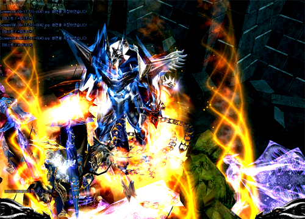
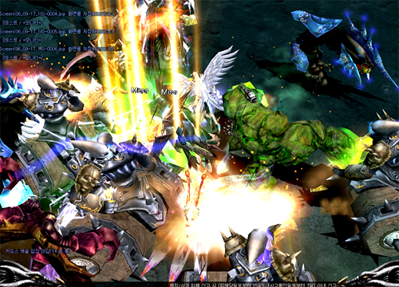

# Devil Square is back <small>13/06/2005</small>

Devil Square's entry level expansion, changed combination probability, reward experience, and reward gen are changed.

> Actual content may be modified when applied to the main server after testing.

## Devil Square (Devil's Square)

There are no major changes from the existing Devil Square rules. However, the combination probability, reward experience, reward gen, and entry level are adjusted.

Entry Level Modifications

- The classification of entry levels is expanded from the existing 4 levels to 6 levels.
- In addition, the 1st and 2nd grade combination items Devil's Key (+1), Devil's Eye (+1), Devil's Key (+2), and Devil's Eye (+2) can be purchased through Noria NPC "Artisan" there will be

| type | normal character entry level | Dark Lord and Magic Gladitor entry level | cost                                                         | percentage |
| ---- | ---------------------------- | ---------------------------------------- | ------------------------------------------------------------ | ---------- |
| 1    | 15 to 130                    | 10 to 110                                | Devil's Key (+1), Devil's Eye (+1), Chaos Gem, (100,000) Zen | 75%        |
| 2    | 131 to 180                   | 111 to 160                               | Devil's Key(+2), Devil's Eye(+2), Chaos Gem, (200,000)Zen    | 70%        |
| 3    | 181 to 230                   | 161 to 210                               | Devil's Key(+3), Devil's Eye(+3), Chaos Jewel, (400,000)Zen  | 65%        |
| 4    | 231 to 280                   | 211 to 260                               | Devil's Key(+4), Devil's Eye(+4), Chaos Gem, (700,000)Zen    | 60%        |
| 5    | 281 to 330                   | 261 to 310                               | Devil's Key(+5), Devil's Eye(+5), Chaos Gem, (1,100,000)Zen  | 55%        |
| 6    | 331 to 400                   | 311 to 400                               | Devil's Key(+6), Devil's Eye(+6), Chaos Gem, (1,600,000)Zen  | 50%        |

Acquirable monsters and levels for each combination item

| item                               | Drop level          | monster                |
| ---------------------------------- | ------------------- | ---------------------- |
| Devil's Key (+1), Devil's Eye (+1) | 3 levels or higher  | more than goblins      |
| Devil's Key (+2), Devil's Eye (+2) | 36 levels or higher | More than Yeti Captain |
| Devil's Key (+3), Devil's Eye (+3) | 47 levels or higher | over shadow            |
| Devil's Key (+4), Devil's Eye (+4) | Over 60 Levels      | more than devil        |
| Devil's Key (+5), Devil's Eye (+5) | Over 70 Levels      | Lizard King and above  |
| Devil's Key (+6), Devil's Eye (+6) | Over 80 Levels      | over iron wheel        |

> The reward experience and reward (Zen) for each Devil Square ranking will be announced after testing on the test server.
