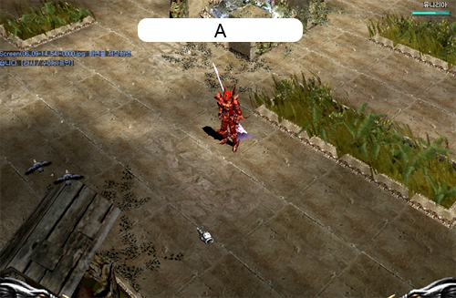

# Update for low level users <small>16/06/2005</small>

In-game systems such as low-level monster figures and recovery items have been adjusted for low-level users.

> Actual content may be modified when applied to the main server after testing.

## Updates for low level users

### Monster related

The number of items and options that can be acquired from all monsters below the level 40 Hellspider will be increased.

### Regarding recovery

Apple, Apple + 1 is modified so that it can be recovered immediately as much as the recovery value.

When there is no attack for more than 10 seconds (attacked or attacked), it automatically recovers.
The longer the wait, the faster the recovery.

| unit       | Increase value (HP, MP, AG) |
| ---------- | --------------------------- |
| 10 seconds | Increases by 1 per second   |
| 15 seconds | Increases by 5 per second   |
| 25 seconds | Increases by 10 per second  |

### Regarding training equipment provision

When creating a character, training equipment is automatically provided to the inventory.
Practice equipment cannot be exchanged in private stores, exchanged between characters, or item level upgraded. Practice equipment is provided according to the character's class.

| class        | weapon                          | armor                            |
| ------------ | ------------------------------- | -------------------------------- |
| black knight | (Practice Equipment) Small Ax   | (Practice Equipment) Leather Set |
| fairy        | (Exercise Equipment) Danhwal    | (Practice Equipment) Vine Set    |
| Warlock      | (Practice Equipment) Skull Cane | (Practice Equipment) Pad Set     |

### Defense Enhancement Buff Help

If the character's level is 100 or lower, the defense can be improved through the fairy NPC.
As the character's ability improves, the supported defense also improves. The effect is for 30 minutes and disappears when you reconnect or the character dies.

| region   | location coordinates |
| -------- | -------------------- |
| noria    | (167, 118)           |
| Lorencia | (143, 128)           |

### Display village name

The name of the area where the character is located is displayed at the top center of the game screen (position A).

