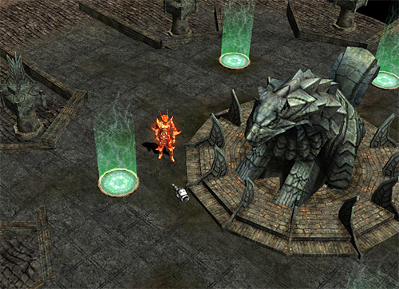

# July update news <small>12/07/2005</small>

Hello mutizens!! The best issue of Mu Online this summer!! [GM] Uni and [GM] Maekki will introduce you to the July update.

Are you wondering why there are only two people appearing today?
I suggested that it would be better than doing it alone, so the two appeared like this.
Alright~ Before we start, let me expose the facts about Uni.
This is a fact that Luneserver Mutizens must know.
[GM] Uni... … It's a feminine name, but... … It turned out that he was a man... …
I know that there are many people in Lune Server who thought Uni was a woman and took an interest in her. ㅠ.,ㅠ
(I can understand how you feel. -_-+ Feeling cheated!)
Now~ Now~! Don't be too angry, everyone together whoa whoa whoa Whoa Whoa Whoa Whoa
Then we will reveal a large-scale update that will make the hot summer even hotter (Uhuhu!! It's hot just thinking about it -_-).

Every meal: (~ ㅡㅡ)~ Then Uni-nim, please reveal
it Uni: Whoa~! Saying bad words and then revealing it to me... … See you later ㅡ*ㅡ+
Hello, this is [GM] Uni, the incarnation of revenge. ㅡ*ㅡV
The large-scale update of the topic can be seen in three ways.
Alright first, add a new world
Now, secondly, the dark veil is slowly peeling off! Kalima!
Now~ Ah, the third, the long-awaited minus stat fruit~!

Maki: Oh~~! I know a lot of things ㅡ*ㅡ+ (Sometimes, that kind of thing...... I guess I found out a little while ago with a snooping new technique!!)
Then, please explain in detail about the new world!
Uni: Whoops, my snooping newcomer is a little bit like that. ㅡ*ㅡV
While I was wandering around looking for hunting grounds, those rappers~~ Now you don't have to go looking for hunting grounds.
Aida World will be created for you.
Now~ Then, let's look around the Aida map for the middle and lower raps!!

1. Aida is a hunting ground that can be entered through Noria. It is a map for those who have been wandering in search of hunting grounds.

Maki: It looks similar to Noria, but it is darker and has a lot of tall trees.
Uni: Is that so? Aren't you a little scared?
There are monsters and boss monsters for middle and lower raps, so it will be a more fun adventure .
Maki: Hmm... … Still, summer vacation makes me want to go to the forest like Aida~
Uni: Hohoho~ Go~ Then ㅡ*ㅡ+ I'm not responsible if I can't come to work~ I'll report you missing.
Every meal: ㅡ*ㅡ Pan... Hurry up and tell us about Crywolf Fortress.
Uni: yup~ every meal got upset ㅠ.,ㅠ I don't think there will be any snacks for a while. Now, let's learn about Crywolf Fortress.

2. Crywolf Fortress is a map for middle and high level players, and you can enter it through Lorencia, and it will play a very important role in the game in the future

It's a monster that appears. It looks very sturdy, right??^^
There must be some mutizens who think it will be a new character, but don't forget that it is a monster. You must be hostile.

Mackie: Crywolf Fortress is said to be a war-oriented map... Please explain in more detail~ Ah~ Ing
Uni: Every meal ㅡ,.ㅡ Is that aegyo? Angtal? What situation are you doing?
hmm… … To find out more, I went to the development team and tried to snoop around, but I couldn't find out the details because it was still under development. ㅠ*ㅠ However, I have a strong feeling that you will never be disappointed! I heard
Mutizens! Please look forward to it. (~ ㅡㅡ)~
Every meal: Heung -0- Snooping New work is no big deal. No snacks for a month. ㅡ*ㅡ+
Please do not hesitate and introduce the following contents as soon as possible.
Uni: Um... … A month's worth of snacks are gone... … ㅠ*ㅠ Next
is the news of the Lost Kalima update that high level people have been waiting for.
The hidden Kalima is revealed.
The entry level is from level 380 to level 400 for all classes, and in Lost Kalima? Items only for characters level 380 or higher
will be added.
Every meal:Whoa! In the meantime, there was no level limit for wearing items except for accessories, but now there is!
Uni: That's right, every meal is quite smart haha ​​Snacks... … will you give it?
Maeki: Heh!! I don't know yet~
Uni: Well then, I'll let you know about the third update as well.
Every meal: ㅡ*-+ I'll listen and decide~
Uni: Finally, the third update is “Negative Stat Fruit”.
It is a fruit that reduces the stats taken previously and changes them into spare stats.
It will be comfortable if you think of it as the opposite fruit to the existing fruit. Oops~ And speaking of fruits, Bonus
Dark Road users should be happy. Finally, the fruit of leadership comes out~ Other characters do not get leadership even if they are taken.
you know?
Maki: Isn't that obvious? Other characters can't take a picture of the leader, but at least this is something that all Mutizen know about
! I hear the sound of flying snacks. I'm kind of confused. Good job!

Uni: Ike -_-;; sorry. Relieve your anger ㅠ.,ㅠ OTL
With this, it is not detailed about the contents of the update in July, but [GM] Uni has revealed all the information he found out.
How are you, Maki? +_+
Every meal: Hmm... … I have a feeling of regret, but I think that you have come to know more than I expected.
Snacks will continue to be provided for a month! Instead, you have to infiltrate the development team and spread more new skills to snoop and bring a lot of information
^^;
Uni: ㅡ*ㅡV Don't worry. Shall we go right now?
Every meal: Where are you going? I was blown away by the snack story. lol
Uni: Ah~! ㅠ*ㅠ The fear of snacks... … Provide a snack at every meal~ Provide~!!
Maekki: Come to your senses. Hurry up and say hello to Mutizen and leave.

Maekki, Uni: Mutizens need to pay a lot of attention to the update and give a lot of encouragement to our GMs.
I promise to see you with more details and new updates, and so far,
[GM] every meal and [GM] Uni have been the commentators. thank you (\_\_)(--)
