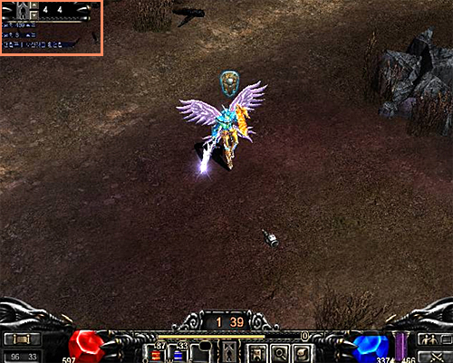
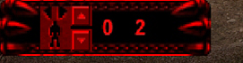
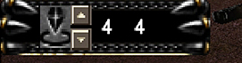

# Siege special skill update information <small>14/07/2005</small>

Guild Masters, Sub-Guild Masters, and Battle Masters are given “special siege skills” appropriate to their status. Position skill is a special skill given to the guild master, sub guild master, and battle master of each guild in siege warfare. It can only be used during a siege, and depending on the Kill Count, you can select and use several skills.

Guild Masters, Sub-Guild Masters, and Battle Masters are given “special siege skills” appropriate to their status.

Position skill is a special skill given to the guild master, sub guild master, and battle master of each guild in siege warfare. It can only be used during a siege, and depending on the Kill Count, you can select and use several skills.

Characteristics of position skills

- Position skills can only be used within the siege map.
- The position skill window is displayed on the top left of the screen.
- You can change the position skill by using the mouse wheel.
- If you press the Shift key, the skill is displayed in the general skill window so that you can use it.
- Skills can only be used while holding down the Shift key.
- Activated when the Kill Count exceeds the required value, allowing you to use the skill.
- If the Kill Count is lower than the required value, it is displayed in an inactive state (red).

## use interface

## Job Skill Activation Conditions

- Kill Count increases by 1 each time an enemy is killed.
- When the kill count meets the conditions of the skill, the skill can be used.
- Skills can only be used while holding down the Shift key.
- When the skill is used, all accumulated Kill Counts are reset to 0.
- Kill Count is reset to 0 when the character dies.

## Use of job skills

- Choose a job skill. (Select by left-clicking the mouse or scrolling the wheel on the interface)
- When the skill's Kill Count is satisfied, the skill icon is activated.
- You can use the selected position skill while holding down the Shift key
- Position skills are divided into range skills, penetration skills, and individual skills
- Range skills are skills that have an attack effect within a certain range centered on the character used
- Penetration skills is a skill that penetrates the target enemy and affects a certain range backwards
- Personal skill is a skill that affects one enemy or one ally (including yourself)

## Individual skill contents

### Battle Master Position Skills

| skill name   | icon                                    | skill description                                                                                                                                                                                                                                                                        | Kill Count |
| ------------ | --------------------------------------- | ---------------------------------------------------------------------------------------------------------------------------------------------------------------------------------------------------------------------------------------------------------------------------------------- | ---------- |
| Stern        |  | **Battle Master's Skill** You will be affected by the skill to a certain range from the straight line distance to the enemy you clicked on . All characters in the range, whether enemies or allies , are stunned, and stunned enemies cannot move or attack. Skill Duration: 10 seconds | 4          |
| stun release |  | A skill that releases stunned characters around the **Battle Master skill.**                                                                                                                                                                                                             | 2          |
| Swell Mana   |  | **Battle Master Skill** Increases maximum mana by 50% for a certain period of time (including nearby guild members). Alliance guild members are not included. cumulative and not applied. Skill Duration: 60 seconds                                                                     | 4          |

Guild Master / Sub-Guild Master Position Skills

| skill name   | icon                                    | skill description                                                                                                                                                                                                                                                                                                                                                                                                            | Kill Count |
| ------------ | --------------------------------------- | ---------------------------------------------------------------------------------------------------------------------------------------------------------------------------------------------------------------------------------------------------------------------------------------------------------------------------------------------------------------------------------------------------------------------------- | ---------- |
| Transparency |  | **Guild Master & Sub-Guild Master Skill:** A skill that makes a specific character invisible for a certain period of time. The transparency effect is visible to allies (including guild alliances), but invisible to enemies, other guild alliances, and general characters. If the transparent character attacks another character or monster or uses a skill, the invisible effect disappears. Skill Duration: 60 seconds | 5          |
| clear clear  |  | **Guild Master & Sub-Guild Master Skill:** This is a skill that cancels the transparent state of a character that is in a transparent state within a certain range around the character who casts the skill.                                                                                                                                                                                                                 | 2          |
| dispel magic |  | **Skills that can only be used when the guild master character is a “Dark Lord”:** After using a skill, all magic and skill use in one screen centered on the person who used the skill is stopped. However, the transparent state is not released.                                                                                                                                                                          | 8          |
