# (GM) Private's no-concept MU Season1. update story <small>28/07/2005</small>

Hollow~~~ That [GM] private has finally been put off and put off to go to the army. yes? What does your going to the army have to do with me? Yes..it doesn't matter -\_- The reason why I'm talking about the military.. The name is Season1.

## No concept MU Season1. Before getting into the update story...

In fact, since I enlisted on August 1st, I was working while waiting for the day off after taking over all GM duties to someone else. In the meantime, to me who was staring gloomily at the monitor with X marks on the calendar day by day, the kind (?) team leader said, “Now, I will give you one last mission before enlisting. Make up the story of this summer update.” What did you say? Didn't you secretly want to do it too?

This is what my boss and I look like. How can you... … A team leader comes to work and interferes without a concept.
He shares opinions on how to structure the story of the Summer Mu Update. In fact, it's almost more of a distraction than a discussion. Success anyway!

## No concept MU Season1. The update story is structured like this.

I included this part because I thought it would be a good idea to start by telling you the overall diagram beforehand. If the text is long and has a lot of content, it can become boring and lose concentration, so it would be nice to visualize the content in this way in advance and see it.

First of all, let's find out in as much detail as possible about the contents of the update. Then, we will go to the development team related to the update, take pictures with the people in charge of the development team, and talk about the update in the form of an interview. How are you? Would it be okay to answer your questions about this update?

## No concept MU Season1. Dig for updates!

### Introducing two new maps.

This update is centered on areas that have not been updated previously, and it is said that the map update and monster update centered on Crywolf Fortress and Aida were centered.
So let's analyze the two maps.

| map name         | map center          | characteristic                                                                                                                                                              | etc                                    |
| ---------------- | ------------------- | --------------------------------------------------------------------------------------------------------------------------------------------------------------------------- | -------------------------------------- |
| Crywolf Fortress | Hunting Grounds MVP | Map hunting grounds for medium and high levels and 1st and 2nd raid deployment areas (future patch) Hunting grounds that can be accessed through the castle in Loren Canyon | War Quest with Mobs ( War Quest ) Boss |
| Aida             | hunting ground      | A hunting ground that can be entered through low-level Noria.                                                                                                               | 1 type of hunting ground boss          |

As you can see from the table above, it would be nice to see Crywolf Fortress as a map for mid- to low-level players, and Aida as a map for low- to mid-level players. Also, (Castle of Loren Gorge -> Crywolf Fortress) (Noria -> Aida) is said to be a map that existing characters must pass through when moving to a new map. So you're saying that middle level can go anywhere? So, did you have a good middle level? Is it like that? Are you having fun? Is it fun!
There is a story about the map, but it would be too long to explain it all in a picture, so I'll skip this part. Don't omit it, tell me everything? why are you like this make me hard Haha Then I'll briefly tell you the story and tell you the story about the map.

## first map. Crywolf Fortress. (The last expression in the gloomy forest! )

Crywolf is said to play an important role in the game as the only map that can be accessed from all subordinate servers, just like the siege server. It also has the characteristics of being the residence of powerful monsters, werewolves. Then... when you enter the map, aren't wolves echoing everywhere? It's creepy just thinking about it. This is the real secret. In the QA (test team) tested in Crywolf, some people actually became werewolves, and they say that they turn into werewolves after 12 o'clock.. Did you know.. All men are wolves? is not an adult, so please come with adult certification.)

The map scenario was too long to explain. I'll decide on the theme, so I'll leave the story up to Mutizen's imagination. The subject is Crywolf Fortress and Aida.

From now on, I will explain with images to please your eyes.

The two screenshots below are screenshots of a duel between a character and a monster in Crywolf Fortress, so it's hard to see the details of the monster. As much as it is regrettable, the joy of actually seeing it is greater! Feel the joy of seeing it yourself in the patched game ^^

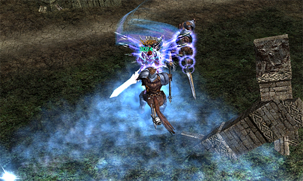

Scouts from Kundun scouting around Crywolf Fortress. Together with various espionage activities, they carry out sabotage operations. They have fast movement speed and have various types of attack patterns according to their characteristics, so the short-range type uses a mace, the mid-range type uses a bow, and the long-range type uses a bow.

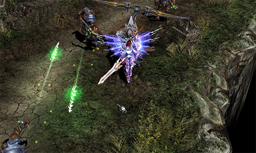

A dark knight who rules the night in Crywolf. In the form of huge wolves, they roam in packs, attacking travelers and taking their blood and flesh. They often shout loudly to encourage their comrades in battle, and the name Crywolf is derived from this.
It can be said that it is a monster suitable for the Crywolf Fortress, which is completely different from the concept of the existing monsters. But aren't there werewolves? I'll go up to the development team later and ask.

The two screenshots below show a panoramic view of the Crywolf Fortress map. Looking at the screenshots, I feel something completely different, and I think this is the charm of the Crywolf Fortress map. A similar yet contradictory atmosphere, a view of a gloomy and dreary forest... Through the sunset in the forest and scattered bones, you can feel the ancient atmosphere, and you can get another feeling while continuing the dreary atmosphere of the forest.

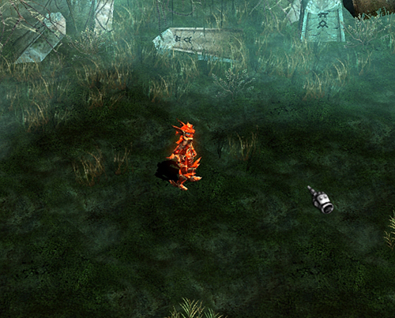
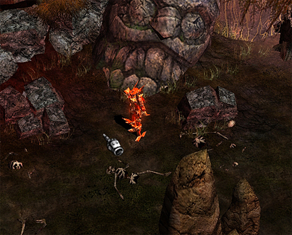

It's like a scene from a movie. Warriors with armor and majestic swords, watching their opponents and waiting for the command to "attack". But this is a monster! Don't be mistaken... You thought it was a new character and looked forward to it, but was disappointed when you heard it was a monster? Don't be disappointed. Our development team will make a cooler character than this. yes? Are there really new characters coming out? Phew~ I can't speak. I was just talking to get over the situation.

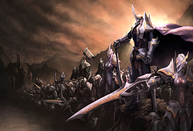

## Second map. Aida (dazzlingly beautiful Aida!)

A hunting ground for mid-level and low-level people! It is said that it is a background with a bright and dark image that combines the atmosphere of an ancient battlefield and a beautiful forest. As you can see through the screenshot, I think it's a map where the expression 'beautiful' comes out. I think this is very welcome news in that it is a hunting ground for mid-level and low-level users who can move through Noria and have not been patched in the past. The concept of the map is a primeval forest abandoned by people due to war that has been devastated for a long time as a place where the forest clans live.

As expected, let's talk about the map's story while looking at the screenshots of the map you're looking forward to while leaving it up to your imagination.

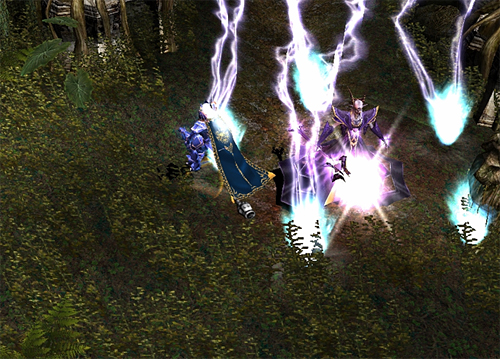

The witch queen, called the queen of all witches, was not a demon born in the demon realm, but a witch who lived in the ancient continent of Mu. Having even reached the limit of magic that can be obtained as a human, she finally came to long for the power of demons beyond the limits of humans. Through the establishment of the contract, she obtained an infinite body made of spiritual thoughts. Her greatest hobby is to seduce and corrupt weak humans using powerful thoughts. The concept of being seduced and corrupted is like a flower snake (yes, [GM] private thinks like this -\_-)

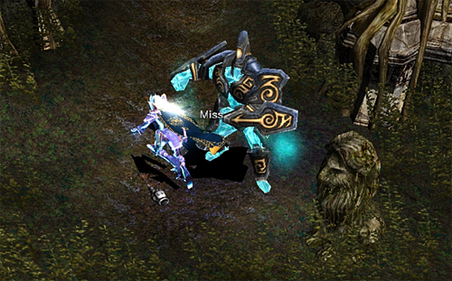

A representative artificial life form of the Demon Realm. Since it is driven by mana, it instinctively sucks in mana from the surroundings, and it is said that it instinctively destroys those who stand in its way due to its reckless tendency. What does it mean to instinctively destroy? That's pretty much killing it. Haha

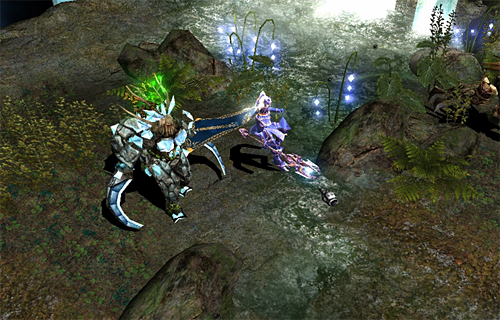

An elite division of Lemuria, and the main force of the operation to capture Aida. Using its strong four legs, it employs tactics that make use of its mobility with its fast movement ability, and cuts down enemies without hesitation with its scythe-shaped hands.
Why do I think it would be nice to take that monster and use it for rice farming while watching that..

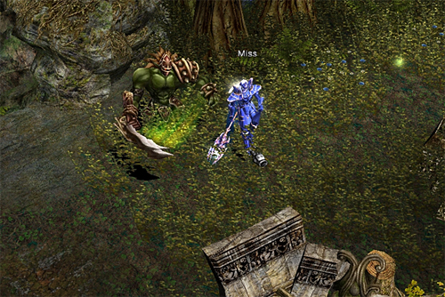

Orcs living in the Old Forest of Ida. As descendants of cruel and proud warriors, they were a race that continued to rebel even after being incorporated into Kundun's army during the 2nd Demon God War. Even after being incorporated into Lemuria's Dark Division in the Aida capture operation, he is still attempting a rebellion for the freedom of his species. Wouldn't I also be assigned to a unit in Kundun when I was assigned to my own unit at the Nonsan Training Center--?

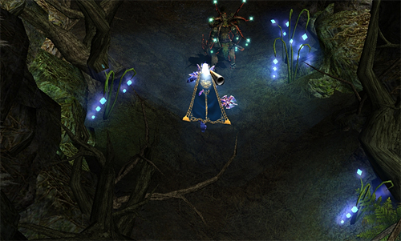

A tree spirit who lives in the forest of Aida. They were created by fairies during the war between fairies and black magicians, and after the war, they have been living independently as one race. Although it is not of a warlike nature, special care is required when passing through Aida's Forest as it has no mercy for beings that invade the forest. I wrote a conceptual story, but in fact, when the forest is invaded, if you stab a little bit, it will take care of it. Like all societies, this monster may have learned to some degree how to live in a corrupt society. Haha

I introduced some of the Aida map monsters. This time, let's take a look at a screenshot of Aida's overall scenery.

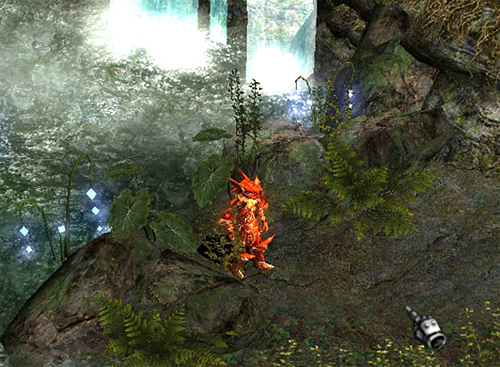
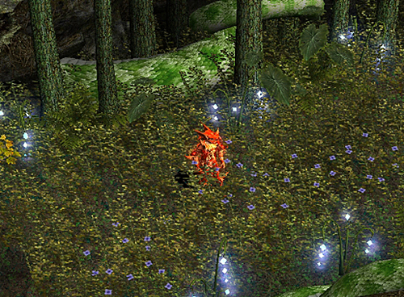

Now, the description of the map is over. Did you have a hard time seeing this far? How can I explain.. haha

The picture above shows the suffering [GM] Private, covering his face from the pain of creation after the map explanation.
The reason why his seat is clean and cool is because he gave it to his colleagues due to his leave of absence.
Here is a brief introduction to the two new maps. I met the QA team and the development team with a digital camera because I wanted to tell a more detailed story through interviews with the QA team and the development team about the patch part. Everyone was literally exhausted from the busy work, but they were full of anticipation for the new patch. (Does that make sense? You said you were exhausted, but you are full of anticipation..)

hello. I am a former GM sergeant at GM Broadcasting Station.
Let's talk about the new map that will be released this time.

We interviewed the busy QA team due to the patch.

As expected, as a test team, we were testing various parts of the game with multiple monitors.
I found Mr. Son who is testing around the Aida map with 3 monitors!
It was chosen as the subject of investigation.

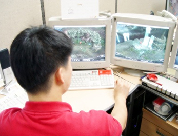

I took a picture of a part of the map that is not open. Now, shall we take a look at the Aida map screen?

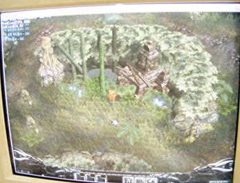

The graphic splendor is not conveyed, perhaps because it was taken on a monitor screen, but the overall atmosphere seems to be very different from the existing MU. It's kind of peaceful.
Now, let's talk about the new map with Mojun Son from the QA team.

[GM] Private: What do you think of this map patch?

QA Team/Son Mo-Jun: Above all, I have high expectations for Aida maps and monsters in that they break away from the colorful graphics and the existing concept atmosphere. I fell in love with a few monsters at first sight and haunted me for days in my dreams.
[GM] Private: Ah.. yes -\_- I think you are really looking forward to it, to the extent that it appears in your dreams (perhaps it is Byeontae haha)
Then, what about another map, Crywolf Fortress?
QA Team/Mojun Son: Huh. Don't even talk. Just thinking about Crywolf Fortress gives me a sense of dread and I'm afraid to test it. In fact.. the atmosphere of the map expresses the grandeur and drearyness of the forest very well, so when I test it in game, I have the illusion that I am alone in this forest. It's a good map to immerse yourself in the game.

[GM] Private: Yes... (Oh, that's too much... Maybe I'm not addicted to games.. lol) Thank you for the interview. Finally, please tell us about the overall atmosphere.
QA Team/Mojun Son: Yes. It feels like being the main character in a fairy tale. Of course, it's not a cute image, but it felt like a fairy tale that combines mystery, adventure, and danger. Also, I felt that the image was soft and delicate by breaking away from the heavy atmosphere of the previous one.

[GM] Private: You tested a part of this patch. How do you feel?
QA Team/Mojun Son: Hahahaha.. I am very satisfied. (laughter below)

[GM] Private: Yes, thank you. ^^;;;;;;;;;;;;
As you can feel from the very lively and refreshing expression above, you should look forward to this map patch.

Now, let's go to the development team and listen to the details of the development.^^
When I opened the door and entered, I felt a calm yet serious atmosphere different from that of the QA team. No matter how shy I am, I haven't done this type of interview often, so I was nervous.

Oh Seung-eon, manager of MU Planning, who plans, oversees, and carries out this summer update.
As you can see from his impression, he accumulated many stories with Mew. It would not be an exaggeration to say that you have seen all the sweet and bitter tastes of Mu
. I don't know if that's why he hated taking pictures.

You can see how much he hated taking pictures by looking at the two pictures below.

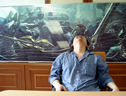

Development Team/Seungeon Oh: Leave me alone TT
[GM] Private: Show your face for Mutizen ^^;;;;;;;;;
[GM] Private: First of all, thank you for taking time out of your busy schedule to do this interview.
MU Season1. Please introduce the motivation and characteristics of the two new maps during the update.
Development Team/Oh Seung-eon: First of all, the two maps that will be patched this time have a strong story connection. The system linked to the story will gradually strengthen its connection through future patches. The map patch was planned to target the existing three, but the final ones were Aida and Crywolf Fortress.

First of all, speaking of the Aida map, if the motivation for planning this map was a high-level patch in which the existing maps or monsters gradually rise, it would be good to think of Aida as a patch for low levels.
In addition, the patch was planned as a larger-scale patch from a systemic patch in which the scale of the patch was partially made.

Event systems such as Blood Castle and Devil Square had a limit on the number of people, or siege warfare was a patch with many restrictions that were used when you became a member of a specific guild or guild.

[GM] Private: Ah. Yes, then the AIDA map part also meshes with the existing low-level training intention. I think it will be a patch that takes advantage of the strengths and compensates for the weaknesses.
Development Team/Oh Seung-eon: Yes. You can see that. The Crywolf Fortress map is meaningful in several ways. It can be seen as having both a general hunting ground personality (same part as the existing map) and an event personality. In terms of the nature of the event, the raid system is right there. Of course, it's difficult to say in detail because it's not yet in the raid system application stage, but to sum it up, you have to play the game without slowing down. This is because a massive battle of monsters versus characters takes place every minute. The setting is that monsters attack the characters at random for a certain period of time, so if that happens, the character will have to form a party to fight the monsters.

[GM] Private: Wow~ I'm looking forward to it. So, does it have a character that is somewhat different from the existing maps?
Development Team/Seungeon Oh: Hmm. It has field characteristics during general hunting, but it is a map with various planning characteristics. It has two personalities, so you can look forward to it because it is different in functionality from the previously patched maps. It took longer than the previous map patch and it took a lot of hard work, so it must bear fruit. In fact, I started planning it last October, but it was delayed because of the siege, so I'm paying special attention this time.
The graphic quality of monsters and map details is also better than expected, and the development team themselves are looking forward to it, so customers can expect it too.

[GM] Private: Thank you so much for the exciting explanation. Thank you again for agreeing to this interview while you are busy. ^^;;

2. Lost Kalima

This time, let's take a look at the lost Kalima during the update.

1. Basic settings

There is no change to the existing Kalima basic settings, and they are all the same. The lost Kalima, that is, the 7th entry level limit, is commonly available from character level 380 or higher, and there is no distinction between normal character and magic swordsman entry level. If you are in the position from 380 or higher, you might think that it is a high-level patch. In fact, this patch can be considered as a high-level patch. This is because the whole thing has to be considered in game planning, so you have to plan while balancing the overall parts such as low level and high level. This may be good news for high-level customers.
Shall we check the part where the entry level was changed during the basic setting? Let's look at Table 1 together.

| Rating | normal character level to enter | magic swordsman level to enter |
| ------ | ------------------------------- | ------------------------------ |
| One    | 40~                             | 20~                            |
| 2      | 131~                            | 111~                           |
| 3      | 181~                            | 161~                           |
| 4      | 231~                            | 211~                           |
| 5      | 281~                            | 261~                           |
| 6      | 331~                            | 311~                           |
| ?      | 380~                            | 380~                           |

As you can see in Table 1, the part of 380 or more is specified in the Lost Kalima. Did you put a question mark because you lost the ? mark? well… lol I'm also suspicious. 2) How to move to Lost Kalima and how to move to Kalima

You can get '+7 Mark of Kundun' by hunting monsters with level 115 or higher in the 6th Kalima. In other words, if you collect 5 'Marks of Kundun' in the same way as the existing method, it will be changed to 'Lost Kalima' and you can move. You don't understand? Why are you like this... even though you know everything. ah! And you should remember that you can't get it in any other area except for the 6th Kalima. Did you know? ^^ I'm sure you know.

3. Lost Kalima's monsters and additional contents

So, shall we look into the lost Kalima's contents in more detail? A total of 7 types of monsters are added to the lost monsters. The names range from Isis to Shrieker, and the lost Kalima Gem is also added. In addition, 'Kundun', which exists in the existing 6th Kalima, is moved to the lost Kalima boss area. As that happens, the 6th Kalima is replaced with the boss-level monster, 'Kundun's Remnant'.^^

Shall we say good news?
If you kill the 'Kundun's Remnant', a boss-level monster for each grade of Kalima, a magic stone that can go to the next grade will be opened. Then you can enter the next Kalima. It is important to note that if you belong to the party group and character who killed the boss-level monster, you can move without limiting the level and that the magic stone lasts for 1 minute. (See Figure 1 for a better understanding.)

It would have been better if I had a screenshot of the lost Kalima, but I didn't have it ready. Forgive me. In that Lost Kalima is a high-level patch, I think it balances out Aida's low-level patch. I can't help but be thrilled with the fact that Mu is changing in many ways. 3. Jewel of Creation (Expansion = negative stat)
Default setting

This patch will be good news for customers who strongly requested stat redistribution. I'm even more happy because the development team made it after collecting the sad (?) suggestions from customers.

It is expected that it will be a very useful patch for those who tried to wear the item but could not wear it due to lack of spare points. Unconditional stat redistribution has many problems, so I would have thought there would be a way to reduce one's stats with such a good idea... Who would have dreamed of it? (You did? That's great.. gasping)
No major changes to the Gems of Creation default settings. There are no changes to the combination method, combination success probability, and selling price, but I would like to emphasize that the fruit created with the jewel of creation has the existing state creation and the reduction function is added.

Fruit items In addition to strength, agility, stamina, and energy, fruit for leadership will be added. However, the leader fruit can only be used by Dark Lord, and the function is the same as the basic fruit. (generates and reduces 1 to 3 points)

Leadership that has been raised as a fruit is not affected by the maximum number of guild members, and like the fruit of creation, the fruit of decrease cannot be used below character level 10.

Here's everything you need to know about what's coming this summer. How was it? Can you guess how Mu will change? _^^_ I hope it will be a patch that revitalizes your expectations.

In fact, there is a big difference between playing games and making them. I also graduated from a game-related department, but while enjoying games, I play games thinking, 'I'll develop something like this, if I do it, it will be better than this.' But it really is. It takes a lot of time and effort to make. And from experience to technology.

After taking charge of this update, I was at a loss as to how to explain it, but when I did it, this result came out. It seems like a fascinating thing to do something mindlessly without knowing it. Just like Mutizens are playing the game..

What I was most proud of while working at GM was spending a lot of time with customers above all else. We do events and play games together.

I'm going to have to prepare to go to the army soon. Haha I will post the address on the homepage/Mu Club/Lhasa Official Community Club as soon as I enlist and receive my assignment. If you have time, please send me a letter. I will be sure to reply. At that time, it will be an opportunity to communicate freely as a person to person, not as an operator and customer.

Then everyone is healthy and happy. [GM] Private is leaving. (\_\_)
