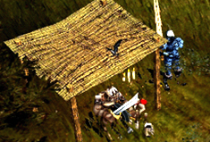
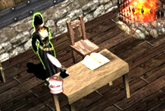

# Siege/NPC Patch Information <small>08/11/2005</small>

The siege system patch from the test server on October 27 will be applied to the main server on November 8. In the meantime, problems found during the siege have been corrected/supplemented, and a patch to adjust inventory and skills and change NPC names will be carried out together.

> Figures and contents may change when applied to this server.

## Siege related changes

1. In case of failure during seal registration, the time registered until the failure is accumulated.
   *However, if you die, are pushed away, or fail to register, the cumulative time will be reduced by -5 seconds.
   *Even if you have cumulative time, all cumulative values ​​will be lost if the air/water castle is changed.
2. Dark Lord will no longer be pushed back when attempting to register a job while wearing a dark horse.
3. If you press and hold the footholds on both the left and right sides of the Dragon Tower, the guild and character will be displayed.
4. The three siege-side guilds (guild unions) are divided into swords, staffs, and bows, and are changed to be distinguishable.
5. You can no longer see the application status and mark registration status of other guilds through the Guards NPC.
6. Guard NPC has been added to Crywolf Village (Coordinates 118, 11).

## NPC name changes

## Other changes

1. Blessing, Soul Jewel 1 Blessing, Soul Potion creation increased from 5 to 10.
2. Blessing Potion application time has been increased from 1 minute to 2 minutes, and Soul Potion from 30 seconds to 1 minute.
3. You can use the Warlock skill 'Telekinesis' in Lauren's Gorge.
4. You can use the Dark Lord skill "Sherman" in Loren's Gorge.
5. During the [Mark Registration] period, Mercury Guilds can no longer receive alliances.
