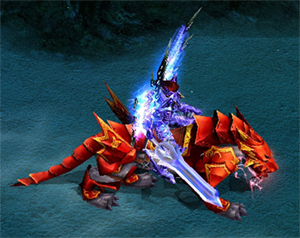
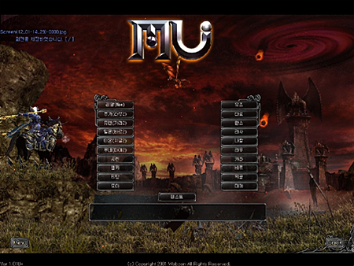
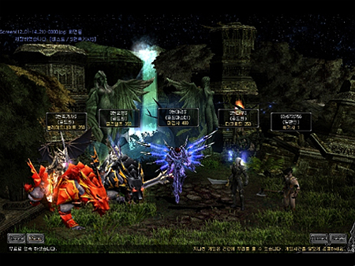
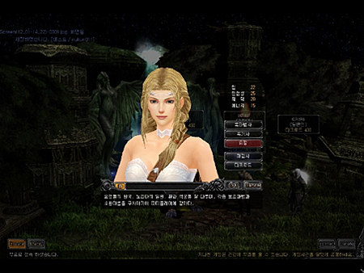

# Penril patch and interface improvement <small>06/122005</small>

Following Uniria and Dinorant, Fenrir will be added as a new vehicle for Gorap Mutizens. In addition, the server selection and character selection window interface images are improved to be more refined and neat.

## New Mount: Fenrir

A clan of wolves that serve Bearis, the goddess of forest and healing. As an old race that is said to have started with the beginning of the Mu continent, they possess intellectual abilities similar to humans and fairies. As Bearis' representatives, they play a role in protecting the forests within the continent of Mu, and in response to Bearis' order to help the warriors fighting against Kundun, they lend their strength to her qualified warriors. do.

### Acquisition method

Ingredients list

| name                                                             | How to get            | explanation                                                                                          |
| ---------------------------------------------------------------- | --------------------- | ---------------------------------------------------------------------------------------------------- |
| armor fragment                                                   | hunt                  | 1st combination material                                                                             |
| Goddess' Protection                                              | hunt                  | 1st combination material                                                                             |
| beast's claw                                                     | hunt                  | 2nd combination material                                                                             |
| Horn Fragment                                                    | Combination (Step 1)  | 2nd Combination Material                                                                             |
| (Armor Fragments x 20 + Goddess' Protection x 20 + Gem of Chaos) | broken horn           | Combination (Step 2) Tertiary Combination Material (10 Beast Claws + 5 Horn Fragments + Chaos Jewel) |
| Horn of Fenrir                                                   | Combination (3 steps) | Completion (Broken Horn + 3 Jewels of Life + Jewel of Chaos + 10 million Zen)                        |

- Armor Fragments, Goddess' Protection, and Beast's Claws are items that can be obtained while hunting.
- The Horn Fragment is completed when you combine Armor Fragments and Goddess' Protection, which are the first combination materials, and this item can be used in the next combination.
- The Broken Horn can be obtained by combining Horn Fragments and can be used in the final combination.

### Combination method

In order to complete the horn of Penril, materials are combined step by step and the next step is combined with the finished materials . - Fenrir's Horn is worn where Unilia, Dinorant, and Dark Horse are equipped. - Fenrir can enter all maps except Chaos Castle. - Fenrir has movement speed improvement and ranged attack skills

<md-clearfix></md-clearfix>

### Upgrade

You can upgrade the completed Horn of Fenrir through Chaos Combination . - If the upgrade fails, Fenril disappears, but if it succeeds, an additional option is created. - Upgrade materials are only available for items with level 4 or higher and 4 options or higher, and only weapons and armor types can be used as materials. The number of items is 2 or more, but it is impossible to put weapons and armor at the same time. - If the upgrade using a weapon succeeds, an additional option to increase attack power is created in the basic stats of Fenrir, and if the upgrade using armor is successful , an additional option to increase defense power is created.

")

")

### Use

#### Available classes

- Blade Knight, Soul Master, Muse Elf, Magic Swordsman, Dark Lord over level 300
  (2) Repair
- Fenrir's Horn can be repaired.
- Fenrir has maximum durability, and durability decreases when damaged.
- When durability reaches 0, Fenrir's Horn disappears.
- It can be repaired through the Jewel of Blessing.
- Left-click on the Jewel of Blessing and place it on top of Fenrir's Horn, then choose whether or not to repair it.
- If the repair is successful, durability is restored within a value of 50 to 100.
- If the repair fails, the Jewel of Blessing will disappear, but the Horn of Fenrir will not.
  (3) Attack while riding
- Normal attacks of all classes are possible.
  In the case of skill attacks , some skills cannot be used in the case of Blade Knight and Magic Swordsman, which are short-range attack characters, such as when riding Dinorant or Unilia, but skills
  can be used by Muse Elf, Magic Swordsman, and Dark Lord who use long-distance skill attacks. .
- Can use "Plasma Storm", an area attack skill that can only be used when wearing Fenrir. (Consumes 50 mana, 20 AG)
- Plasma Storm does not damage surrounding characters except for the target during PvP.
- It can be used in siege battles, but it can also damage allies. (Same as using existing range magic)

## interface improvements

The server selection and character selection screen interface images have been changed to match modern games. Also, the internal game interface will be changed and updated later.

