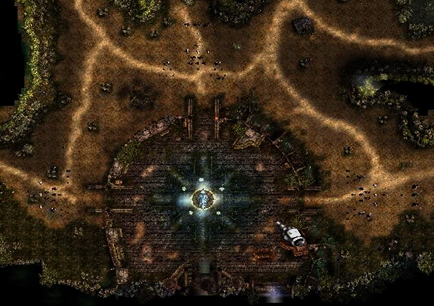

# Crywolf Battle Patch Information <small>10/01/2006</small>

In order to break the stalemate on the frontlines, Kundun entrusts the invasion of Crywolf Fortress to the demonic corps led by Bargas. So, after receiving Kundun's order, Valgas struggled to find a way to attack the Cry Wolf Fortress.

## Battle of Crywolf PROLOGUE

In order to break the stalemate on the frontlines, Kundun entrusts the invasion of Crywolf Fortress to the demonic corps led by Bargas. So, after receiving Kundun's order, Valgas struggled to find a way to attack the Cry Wolf Fortress. Through relentless and careful reconnaissance, Bargath finally discovered that the source of the fortress's protective power was a wolf statue in the center of the fortress, and that the statue's power weakened once a week for unknown reasons. Thus, Bargas begins to advance towards Crywolf Fortress, aiming for the time when the power of the god is weakening.

## appearing monster

### Balgass

As the supreme commander of the corps attacking Crywolf Fortress, he appears when the siege of Crywolf reaches its climax.

<md-clearfix></md-clearfix>

### Dark Elf

As a key commander in the siege of Crywolf, he serves as the commander of each unit. They focus on summoning and healing their units rather than direct attacks.

<md-clearfix></md-clearfix>

### Soram

It is in charge of the front line of the attack at the forefront of the unit and has powerful destructive power that blows away enemies approaching with a huge axe.

<md-clearfix></md-clearfix>

### Balram

It is in charge of the rear support attack within the unit and is mainly located between the Dark Elves and Soram. Be careful because the arrows shot by Balaam contain the power to nullify attack and defense enhancement magic.

<md-clearfix></md-clearfix>

### Death Spirit

As a monster that freely uses forbidden magic, it has the ability to suck the opponent's mana and AG with powerful magic power.

<md-clearfix></md-clearfix>

## How the Crywolf Battle proceeds

- Duration: Every Monday/Thursday at 9:30 PM
- Duration: 15 minutes (Bargas appears 10 minutes after the start)

### Clear conditions

1. Protect the statue of the wolf

- There are 5 altars around the statue. There is, and only fairies of level 350 or higher
  can empower and protect the altar .
- If the fairy who contracted with the altar leaves the altar or dies, the number of possible contracts with the altar decreases.
- If all the altars are destroyed, the statue loses its power to protect Crywolf Fortress, and the battle will fail.

2. Destroy Vargas When the siege reaches its climax, Vargas will appear, and unless you defeat it, the safety of Crywolf Fortress
   cannot be guaranteed. While protecting the statue, you must defeat the balgas.

If both of the above conditions are not satisfied, the siege of Crywolf Fortress will fail.

## related interface

- The red bar at the bottom indicates the HP of the statue of the wolf, and when the HP reaches 0, the
  statue of the wolf is stained with the power of darkness.
- The number in the five green circles indicates the number of contracts that can be made with each altar, and
  when the number of contracts for the corresponding altar is consumed, the green circle becomes gray. - The bar below the statue's HP indicates the number
  of Dark Elves invading Crywolf , and each time the Dark Elf dies, the number displayed decreases. - The gauge at the bottom of the Dark Elf displays the state of Bargas, and you can check the current level of Bargas.

## progress screenshot

