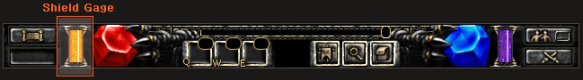

# The second story of 2006 Preview <small>21/04/2006</small>

In May 2006, Mutizen's opinions are collected and a supplementary patch is implemented for the overall system. Please look forward to the new Mu Online with an easier and more convenient game system.

## Introduction of the Shield System that is only applied during PvP

- SD Gage is only applied during PvP and is an extension of HP.
- In addition to HP, MP, and AG, SD Gage (short for Shield Gage) is added to all characters.

- In case of damage during PvP, 90% of SD and 10% of HP are consumed.
- If damage greater than the current SD is received, the SD is consumed first and then the rest is consumed as HP.
- In case of poison damage, SD is consumed first and then HP is consumed.
- SD can be automatically recovered under certain conditions.

  - Recovery is also possible through the added SD recovery potion.
  - A new type of potion is added, which restores HP and SD at the same time.
  - Complex potions can be obtained by hunting monsters, and SD recovery potions can be obtained through normal combinations.

## Penalties added according to PK Level

Admission to event maps (Blood Castle, Chaos Castle, Devil Square) is restricted according to Chao level according to PK.

| PK Level   | Whether or not to enter the event map |
| ---------- | ------------------------------------- |
| 1 (heroic) | possible                              |
| 2 (Hero)   | possible                              |
| 3 (normal) | possible                              |
| 4 (cao)    | not allowed                           |
| 5 (cao)    | not allowed                           |

## Added shop NPCs to Kalima

- After entering Kalima, there was an inconvenience of having to leave Kalima to purchase potions and arrows.
- To compensate for this, a shop NPC is added to the coordinates (6, 23) of the Kalima entrance.

## Muse Elf new skill added

- A skill that eliminates arrow consumption is added to Muse Elf.
- [Infinity Arrow] skill will be added to the skill tree when changing jobs from Fairy to Muse Elf.

- The [Infinity Arrow] skill has a duration and cannot be cast on others, only you can use it.
- While the skill is active, arrow durability is not consumed in normal attacks and skill attacks.
- When the skill activation time is over, it will return to the original method.

_If you use a bundle while the Infinity Arrow skill is active, mana consumption increases depending on the type of arrow equipped._

## Reward changes for successful battles

| reward for success                       | change     |
| ---------------------------------------- | ---------- |
| 10% monster HP reduction                 | keep as is |
| Ticket combination rate increased by 5%  | keep as is |
| Kundun auto-regeneration ability removed | delete     |

## Penalty change in case of failure of defense battle

| penalty in case of failure        | change     |
| --------------------------------- | ---------- |
| NPC withdrawal                    | keep as is |
| Decreased chance of dropping gems | delete     |
| Gain only 10% of Bonus XP         | delete     |

## Additional rewards and monster hunting benefits added for successful battles

- Advanced items will drop when hunting Dark Elves and Bargas.
- If the hunt is successful with multiple attacks, priority for acquiring the item goes to the character with the largest sum of cumulative damage.
- When the battle ends successfully, 1 jewel of blessing is given to the characters ranked 1st to 5th on the HeroList .
- When the battle is successfully completed, 1 jewel of blessing is given to the fairy maintaining the altar contract .

_Characters who canceled the Altar contract before the battle is over are excluded._

## Modification of the defense system

- The level limit of the fairy character who contracts with the altar is lowered from 350 to 260 .
- The battle, which was held twice a week at 9:30 PM on Monday and Thursday nights, will be held once every Monday at 9:30 PM.

