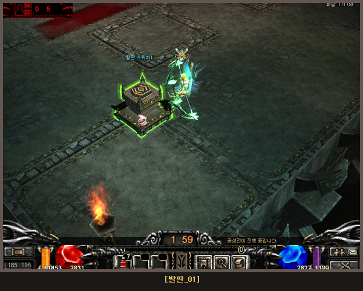
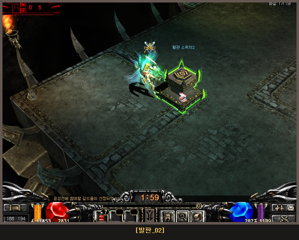
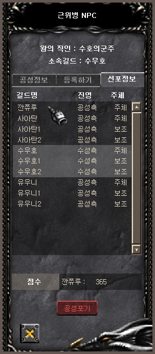
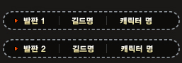
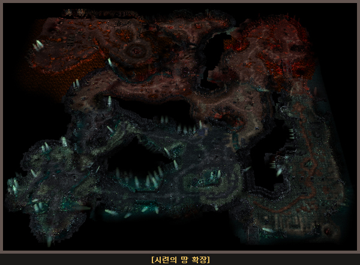

# Siege Modifications and Supplements <small>12/05/2005</small>

The Siege of Mu Continent, which is more exciting with the change of the siege schedule, supplementation of the system, and expansion of the castle lord benefits, begins.

Siege warfare schedule changes, system supplements, and castle house makeup make the siege warfare on Mu continent more exciting.

## Siege War Modification and Supplement History

Firing the position of the dragon's step platform

The position of Vilpan at the inner corner of the Dragon's Deep has been changed to the inside of the map.
switch

### Siege Guild Selected guild scores released with announcement

### Information of the character stepping on the stepping pad

Displays the information of the character stepping on the stepping
pin on all Garrickders in the Air/Water Alliance as shown below
It's possible.

## Water Castle Guild Benefits Expansion

### Expansion of Land of Trials

The ding of the existing 1.5 bashing ordeal is widened, and the number of equaling masters increases accordingly.

### Singju combination item list

The chance of higher-level items appearing is higher
