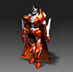

# Season 2. Legacy of RuinAdded new items, supplemented the system <small>29/08/2006</small>

In August 2006, the large-scale update of Season 2, which supplements the system, such as new items for each class, support for window mode, and expansion of negative stats, will be applied to the continent of Mu.

## New Skill Fire Scream

### Main points

- As a skill exclusive to the Dark Lord, it is a higher level skill of Fire Burst.
- You can learn skills through 'Fire Scream Scroll'.
- 'Fire Scream Scroll' will drop from monsters level 102 or higher.

### Skill details

| skill name | level    | required energy | demand leadership | amount of mana used | Use AG |
| ---------- | -------- | --------------- | ----------------- | ------------------- | ------ |
| fire scrim | no limit | 150             | 70                | 45                  | 10     |

## Add new items

### Weapons

| image                              | item name           | drop level | demand force | demand agility | base figure                                                                                                                          |
| ---------------------------------- | ------------------- | ---------- | ------------ | -------------- | ------------------------------------------------------------------------------------------------------------------------------------ |
|  | day break           | 115        | 682          | 132            | <ul><li>Minimum Attack Power: 182</li><li>Maximum Attack Power: 218</li><li>Attack Speed: 40</li><li>Skill: Turn</li>                |
|  | Platinum Wing Staff | 110        | 185          | 72             | <ul><li>Hand use: One hand</li><li>Magic power increase: 60</li><li>Attack speed: 30</li>                                            |
|  | albatross bow       | 110        | 218          | 894            | <ul><li>Skill: 4 bundles</li><li>Minimum attack power: 155</li><li>Maximum attack power: 177</li><li>Attack speed: 45 </li>          |
|  | sword dancer        | 115        | 489          | 216            | <ul><li>Skill: Power Slash</li><li>Magic Power Increase: 54</li><li>Minimum Attack Power: 109</li><li>Maximum Attack Power: 136</li> |
|  | Shining Scepter     | 110        | 376          | 92             | <ul><li>Skill: Force Wave</li><li>Pet% Increase: 30</li><li>Minimum Attack Power: 99</li><li>Maximum Attack Power: 111 </li>         |

### Armors

| image               | item name     | drop level | demand force | demand agility | level 0 armor defense |
| ------------------- | ------------- | ---------- | ------------ | -------------- | --------------------- |
|   | Ashcrow Armor | 75         | 380          | 132            | 42                    |
|  | eclipse armor | 75         | 139          | 47             | 27                    |
|   | iris armor    | 75         | 132          | 177            | 36                    |
|   | Valiant Armor | 115        | 489          | 216            | 52                    |
|   | Glorius Armor | 110        | 376          | 92             | 47                    |

## Add 380 item options

### Combination materials

- Weapons or armor level 4 or higher + 4 additional options or higher level 380
- Jewel of harmony, guardian jewel, 10,000,000 Zen

### Type of combination

- Combination by selecting the 'Add Options' menu of the combination goblin It has a fixed numerical value.

- There are the same options as the item enhancement system, but the two options are treated as separate options, so overlapping is possible.

### Probability of success

| item upgrade level | probability of success |
| ------------------ | ---------------------- |
| +4 to +6           | 50%                    |
| +7 to +9           | 60%                    |
| +10 to +13         | 70%                    |

### Types of additional options

| type   | item enhancement | option contents                                       |
| ------ | ---------------- | ----------------------------------------------------- |
| weapon | duplication      | 　 Increased success rate of person-to-person attacks |
| weapon | single           | 　 Anti-Personal Attack Additional Damage             |
| armor  | duplication      | 　 Increased anti-personnel defense success rate      |
| armor  | single           | 　 Increases anti-personnel defense                   |
| armor  | duplication      | 　 Max HP increase                                    |
| armor  | single           | 　 max SD rise                                        |
| armor  | single           | 　 SD auto recovery                                   |
| armor  | single           | 　 SD recovery amount increased                       |

### Option application details

| type     | item enhancement   | option contents                                                                                           |
| -------- | ------------------ | --------------------------------------------------------------------------------------------------------- |
| weaponry | ALL                | 　 Increases the success rate of person-to-person attacks and increases the person-to-person attack power |
| armor    | helmet/helmet/mask | 　 SD recovery amount increased, anti-personnel defense success rate increased                            |
| armor    | Armor              | 　 SD automatic recovery, anti-personnel defense success rate increase                                    |
| armor    | pants              | 　 Increased anti-personnel defense, increased anti-personnel defense success rate                        |
| armor    | Gloves             | 　 Max HP increase, anti-personnel defense success rate increase                                          |
| armor    | Boots              | 　 Max SD increase, anti-personnel defense success rate increase                                          |

## Other additions

1. Changed the number of points reduced when using minus stat fruit to 1, 3, 5, 7, 9.
2. Descriptions have been added for skills that can be used during sieges and in certain situations.
3. When playing the game, windowed mode is supported.

The entry level and movement level of Lorencia, Noria, Debias, Dungeon, Lost Tower, and Atlans have been changed.

| map name     | old entry level | old move level | new entry level | new move level |
| ------------ | --------------- | -------------- | --------------- | -------------- |
| Laurencia    | 10              | 50             | 10              | 10             |
| noria        | 10              | 50             | 10              | 10             |
| Debias       | 15              | 50             | 15              | 20             |
| dungeon 1    | 20              | 50             | 20              | 30             |
| dungeon 2    | 40              | 50             | 20              | 40             |
| dungeon 3    | 50              | 60             | 20              | 50             |
| Lost Tower 1 | 80              | 90             | 40              | 50             |
| Lost Tower 2 | 80              | 90             | 40              | 50             |
| Lost Tower 3 | 80              | 100            | 40              | 50             |
| Lost Tower 4 | 80              | 100            | 50              | 60             |
| Lost Tower 5 | 80              | 110            | 50              | 60             |
| Lost Tower 6 | 80              | 110            | 50              | 70             |
| Lost Tower 7 | 80              | 120            | 50              | 70             |
| atlas 1      | 60              | 70             | 60              | 70             |
| atlas 2      | 60              | 70             | 60              | 80             |
| atlas 3      | 60              | 70             | 60              | 90             |
| Tarkan 1     | 130             | 140            | 130             | 140            |
| Tarkan 2     | 130             | 140            | 130             | 140            |
| Icarus       | 160             | 170            | 160             | 170            |
| Aida         | 130             | 130            | 130             | 130            |
