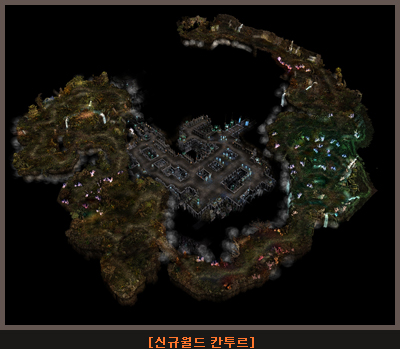
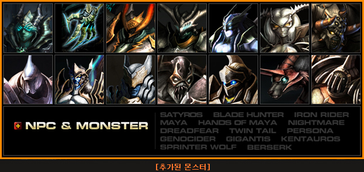
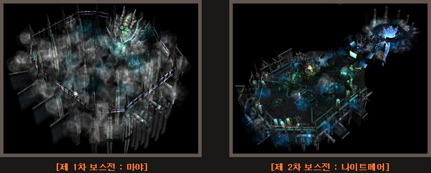
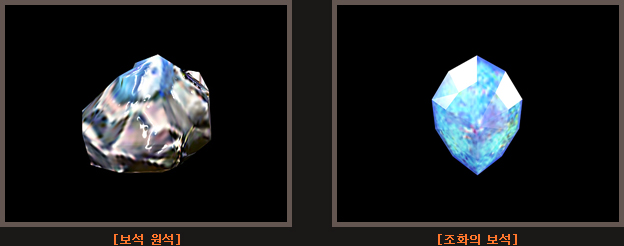
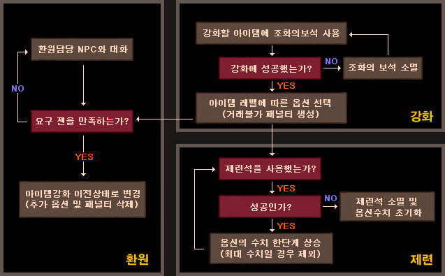
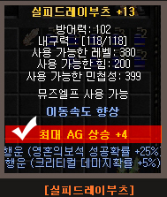

# Season 2. Legacy of Ruin - Kantur World Update <small>29/08/2006</small>

August 2006! SEASON 2 major update adds a new World Cantur. Experience the continent of Mu, which is getting hotter with the **7th jewel, the jewel of harmony and the item reinforcement system.**

## New World Kantur

### Movement and admission related

Kantur can be entered via Tarkan coordinates (199, 6). You can also enter through the movement command and movement window (m-key), and the contents are as follows.

- `/move Kantur Ruins` → Kantur Ruins Zone
- `/move Kantur Ruins` → Kantur Ruins

For a certain period of time, Kantur entry/movement level is 10, and movement Zen is applied for free.

The following settings will be changed in the future.

| map name                   | entry level | movement level | consumption when moving |
| -------------------------- | ----------- | -------------- | ----------------------- |
| Kantur Archaeological Zone | 150         | 160            | 12,000                  |
| Kantur Ruins               | 220         | 230            | 12,000                  |

### Add monsters

11 normal monsters and 2 boss monsters are added.

### Cantur Boss Battle

11 normal monsters and 2 boss monsters are added.

- Maximum number of admissions: 15 people
- Items required for entry: Moonstone Pendant (Obtained by hunting monsters in the Kantur Ruins)
- Process

#### start-up stage

- You can enter the Tower of Refinement for 23 hours, after which the door will be closed.
- 23 hours and 40 minutes after entering the Tower of Refining, all users in the Tower of Refining are moved to the safe zone of the 2nd map of Kantur.
- Entrance to the boss map starts after 23 hours and 58 minutes after entering the Tower of Refining
- You can enter the boss map for 2 minutes, but once 15 people are full, you can no longer enter.

#### 1st Boss Battle_Maya Left Hand

- When the boss battle starts, a group of monsters are summoned by Maya, and when all the monsters are dealt with, Maya's left hand appears.
- Battle with Maya's left hand begins
  - **Success/failure conditions**
  - SUCCESS: Victory in battle with Maya Left Hand
  - Failure: All characters died during battle (failed to kill Maya's Left Hand within 15 minutes of time limit)

#### 1st Boss Battle_Right hand of Maya

- After dealing with Maya's left hand, you can enter the boss map for 2 minutes, but you can no longer enter the boss map when 15 people are full.
- After 2 minutes, a group of monsters will be summoned again by Maya, and if all the monsters are dealt with, Maya's right hand will appear.
- Beginning of battle with Maya's right hand
  - **Success/failure conditions**
  - SUCCESS: Victory in battle with Mayan right hand
  - Failure: All characters died during battle (failed to kill Maya's right hand within 15 minutes time limit)

#### 1st boss battle_Maya both hands

- After dealing with Maya's right hand, you can enter the boss map for 2 minutes, but you can no longer enter the boss map when 15 people are full.
- After 2 minutes, a group of monsters will be summoned by Maya again, and if all the monsters are dealt with, Maya's left and right hands will appear.
- Battle between Maya's left hand and right hand begins
  - **Success/failure conditions**
  - Success: Victory in battle with Maya's left hand and right hand.
  - Failure: All characters died during battle (failed to kill Maya's left and right hands within the 20 minute time limit)

#### 2nd Boss Battle_Nightmare

- Dealing with Maya's left and right hands causes Maya to lose power and the player to fall to the floor.
- After 30 seconds, the 2nd boss, Nightmare, appears and summons a group of monsters.
- When the number of monsters summoned is below a certain number, Nightmare activates the summoning skill.
- After defeating the Nightmare, the boss fight ends.
  - **Success/failure conditions**
  - Success: Win the battle against Nightmare
  - Failure: All characters died during battle (failed to kill Nightmare within 20 minutes time limit)

highlights

- If you die during a boss fight, you will be moved to a safe area within the ruins.
- If you fail the boss battle, you can try again after a certain amount of time.

## New jewel: Jewel of Harmony

- The Jewel of Harmony drops in the form of a gemstone and can be obtained from monsters in Kantur.
- By refining raw gemstones, you can obtain gems of harmony, which can be used to enhance items.
- Refining is possible through the Refining NPC Elpis (77,177) at the Refining Tower in the Kantur Ruins.
- There is a success/failure in refining with a certain probability, and if successful, the jewel of harmony is obtained, and if it fails, the gem stone is destroyed.
- If refining is successful, you will get 1 Gem of Harmony for each raw gemstone.

## New gems: enchanced items

### Reinforcement system

Justice

- It refers to a series of processes that give new options to weapons/armor using the jewels of harmony.
- Items that can be enhanced are normal and excellent items, and set items cannot be enhanced.
- One enhancement option is granted per item.
- Enhancement options are affected by the type and level of the enhanced item, and the higher the item level, the higher the chance of higher-level options being attached.
- Enhanced items cannot be sold in stores, nor can they be traded through individual stores.

reinforcement method

- Click the Jewel of Harmony and place it on the item you want to enhance to strengthen the item.
- There is a success/failure for enhancement with a certain probability, and if it succeeds, one of the item options that can be attached at that item level is randomly given to the item.

| type                                        | detail                                                                                                                                                                                                                                                                                  |
| ------------------------------------------- | --------------------------------------------------------------------------------------------------------------------------------------------------------------------------------------------------------------------------------------------------------------------------------------- |
| Minimum attack power increase               | Increases the weapon's minimum attack power by a set amount.                                                                                                                                                                                                                            |
| Maximum attack power increase               | Increases the weapon's maximum attack power by a set amount.                                                                                                                                                                                                                            |
| reduced force                               | The weapon's required strength value is reduced by a set amount.                                                                                                                                                                                                                        |
| Decreased Agility Required                  | The weapon's required agility value is reduced by a set amount.                                                                                                                                                                                                                         |
| Attack power increase (minimum, maximum)    | The minimum and maximum values ​​of the weapon are simultaneously increased by the set value.                                                                                                                                                                                           |
| Critical Damage Increase                    | Critical damage increases by a set amount.                                                                                                                                                                                                                                              |
| Increase skill attack power                 | When using a skill, the skill's final attack power increases by a set amount.                                                                                                                                                                                                           |
| Increase attack success rate (PVP)          | During PVP, the attack success rate increases by a set number.                                                                                                                                                                                                                          |
| SD reduction rate rise                      | In PvP, the damage absorbed by the target's shield directly deals damage to HP by a set amount. Example) If the SD reduction rate increases by 5%, the opponent's shield absorption rate is reduced from 90% to 85%, and the damage directly inflicted on HP increases from 10% to 15%. |
| SD ignoring chance increases when attacking | Ignores opponent's SD with a set probability and directly deals damage to HP.                                                                                                                                                                                                           |

#### Enchanced options by type/level: weapons

| item level | Enhancement options available                                                                                                                                                                                                                                                                                                        |
| ---------- | ------------------------------------------------------------------------------------------------------------------------------------------------------------------------------------------------------------------------------------------------------------------------------------------------------------------------------------ |
| +0 to +5   | Minimum attack power increase, maximum attack power increase, required strength reduction, required agility reduction                                                                                                                                                                                                                |
| +6 to +8   | Minimum attack power increase, maximum attack power increase, required strength reduction, required agility reduction, attack power increase (minimum, maximum), critical damage increase                                                                                                                                         |
| +9 to +12  | Minimum attack power increase, maximum attack power increase, required strength decrease, required agility decrease,  attack power increase (minimum, maximum), critical damage increase, skill attack power increase,  attack success rate increase (PVP), SD decrease rate increase                                          |
| +13        | Minimum attack power increase, maximum attack power increase, required strength decrease, required agility decrease, attack power increase (minimum, maximum), critical damage increase, skill attack power increase, attack success rate increase (PVP), SD reduction rate increase, SD ignoring rate increase when attacking |

#### Enchanced options by type/level: canes

| item level | Enhancement options available                                                                                                                                                                                                                      |
| ---------- | -------------------------------------------------------------------------------------------------------------------------------------------------------------------------------------------------------------------------------------------------- |
| +0 to +5   | Magic power increase, required strength reduced, required agility reduced                                                                                                                                                                          |
| +6 to +8   | Increases magic power, decreases required strength, decreases required agility, increases skill attack power, increases critical damage                                                                                                         |
| +9 to +12  | Magic power increase, required strength decrease, required agility decrease, skill attack power increase, critical damage increase, SD reduction rate increase, attack success rate increase (PVP)                                              |
| +13        | Magic power increase, required strength decrease, required agility decrease, skill attack power increase, critical damage increase, SD reduction rate increase, attack success rate increase (PVP), SD ignoring rate increase when attacking |

#### Enchanced options by type/level: armors

| item level | Enhancement options available                                                                                                                                                                                                |
| ---------- | ---------------------------------------------------------------------------------------------------------------------------------------------------------------------------------------------------------------------------- |
| +0         | defense increase                                                                                                                                                                                                             |
| +3 to +5   | Defense Up, Max AG Up, Max HP Up                                                                                                                                                                                             |
| +6 to +8   | Defense increase, maximum AG increase, maximum HP increase, life auto increase increase                                                                                                                                   |
| +9 to +12  | Defense increase, maximum AG increase, maximum HP increase, life auto increase amount increase, mana increase amount increase, defense success rate increase (PVP), damage reduction increase                             |
| +13        | Defense increase, maximum AG increase, maximum HP increase, life auto increase amount increase, mana auto increase amount increase, defense success rate increase (PVP),  damage reduction increase, SD ratio increase |

### Smelting system

Justice

- It is a system that can increase the value of options granted to items through enhancement.
- Smelting requires smelting stones that can be obtained through smelting NPCs.
- Enhanced items cannot be sold in stores, nor can they be traded through individual stores.

smelting stone

- You can make smelting stones through the smelting NPC Osborn (86, 13) in Aida.
- There is success/failure in crafting smelting stones with a certain probability.
- If you successfully craft a smelting stone, you will get a high-grade smelting stone from an excellent item and a low-grade smelting stone from a normal item.
- If the smelting stone production fails, the item will be destroyed.
- It is possible to make smelting stones with normal and excellent items, and the items in the list below must be level +4 or higher.
