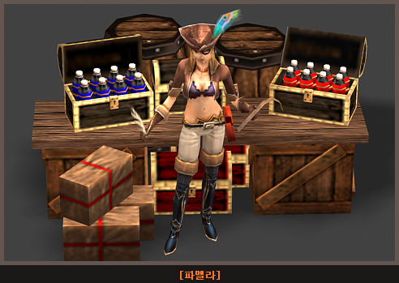

# Play system improvements <small>30/01/2007</small>

Changed so that only higher values ​​are applied when overlapping ATK/DEF improvement skills are applied, and the drop rate of complex potions is lowered. The system will be improved so that Mutizens can explore the Continent of Mu with more manners and enjoyment by removing obstacles in the Kalima Kundun Regen area.

- It is changed so that only the higher value is applied when the ATK/DEF improvement skill is overlapped, and it is a complex potion.
- Drop rate is lowered. Remove obstacles in Kalima Kundun Regen area to make mutizens more
- The system will be improved so that you can explore the Continent of Mu with manners and enjoyment.

## Improve play system

### Attack power/defense enhancement skill improvement

- It is higher than the value of the new skill applied to the target to which the ATK/DEF improvement skill is applied.
  If higher or equal, it applies to the target.
- It is higher than the value of the new skill applied to the target to which the ATK/DEF improvement skill is applied.
  If it's low, it doesn't apply to the target.

### Adjusted the drop rate & drop level of complex potions

- In order to improve the inconvenience caused by the drop of too many complex potions in the past, the probability has been lowered.
- Guide to change drop level

| type                  | Monster drop level before change | Monster drop level after change |
| --------------------- | -------------------------------- | ------------------------------- |
| small compound potion | 68                               | 68                              |
| Medium Complex Potion | 96                               | 86                              |
| large complex potion  | 118                              | 100                             |

### Kalima map fix

Removes obstacles near areas where Kundun respawns, preventing unintended hunting of Kundun.
prevented.

### Change the lost map creation sound

The sound that occurs when Kundun's marks gather and transform into a lost map is the same as the existing jewel drop sound, causing confusion.
Fixed the problem given.

### Loran Canyon Potion NPC Replacement

The potion girl NPCs deployed in the two locations in Loren Gorge are changed to “Pamela, Supply Officer” and “Angela, Supply Officer” respectively.

_There is no change in sales items due to the NPC change._
