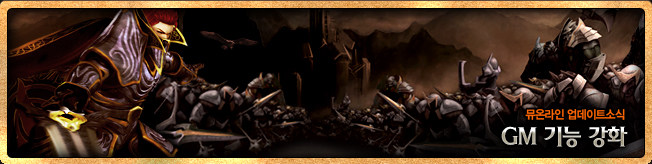
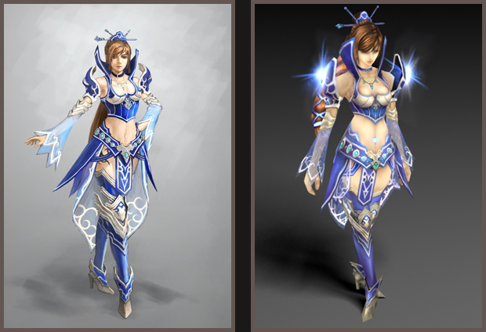
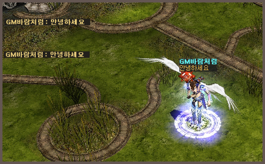
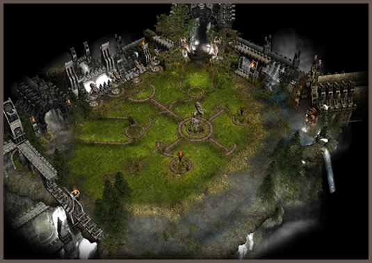
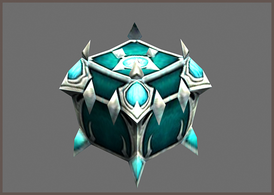
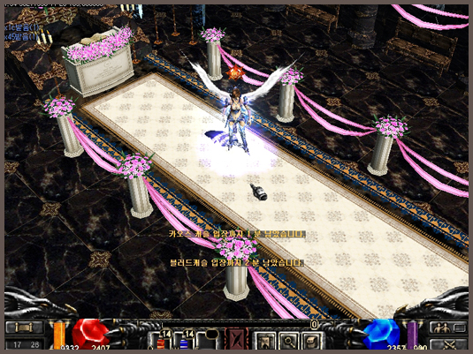
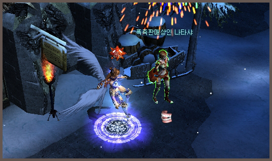

# Enhanced GM function <small>2007.03.27</small>

A GM unique character that is different from the general character and a GM gift box given as a reward when winning an event are added. In addition, a wedding hall will be newly established in Devias 2, allowing weddings to be held with the help of GMs.

- GM's unique character that is different from the general character and given as a reward when winning an event
- GM gift box is added. In addition, a wedding hall was newly established in Devias 2 with the help of GM.
- The wedding ceremony is possible.

## Addition of new GM characters

A GM character that is differentiated from the appearance of a normal character is introduced.

GM characters can be easily distinguished from general characters in chat text color and shape.

## GM field

It is a place where the GM responds to normal characters in the game, and it is not accessible by normal methods, and the GM summons the character.

## GM gift box

It is given as a reward when winning the GM event in the game. If you throw a GM gift box on the floor, you can acquire a special item.

## GM wedding

A new wedding hall will be built in Devias 2, and weddings and other events will be possible with the help of the GM.

You can purchase firecrackers from Firecracker Vendor Natasha (Locations: 32,31) outside the wedding hall and use them during the ceremony.

