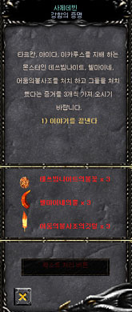

# Update News - 3rd Change Up <small>28/06/2007</small>

For each class, a 3rd job advancement quest is added to become a more powerful character. In addition, the name of the new class is decided by Mutizen's collusion, making the quest more enjoyable.

- A 3rd job transfer quest is added for each class to become a more powerful character.
- In addition, the name of the new class is decided by Mutizen's collusion, so you can enjoy the quest more.

## 3rd class information

### Class name

| 1st class       | 2nd class    | 3rd class    |
| --------------- | ------------ | ------------ |
| black knight    | Blade Knight | Blade Master |
| warlock         | soul master  | Grand Master |
| fairy           | muse elf     | High Elf     |
| magic swordsman | -            | Duel Master  |
| dark lord       | -            | Lord Emperor |

### Tertiary Class Description

| class name   | explanation                                                                 |
| ------------ | --------------------------------------------------------------------------- |
| Blade Master | All items and skills used by the Black Knight and Blade Knight can be used. |
| Grand Master | All items and skills used by Warlocks/Soul Masters can be used              |
| High Elf     | Can use all items and skills used by fairies/muse elves                     |
| Duel Master  | All items and skills used by magic swordsmen can be used                    |
| Lord Emperor | All items and skills used by the Dark Lord can be used                      |

## 3rd change up quest information

### 3rd change-up order

The 3rd change-up can be performed by 5 classes (Blate Knight, Soul Master, Muse Elf, Magic Swordsman, Dark Lord).

1st Quest Level 380 -> 2nd Quest Level 400 -> 3rd Quest Level 400 -> 3rd change-up complete

### Compensation for each stage of the 3rd change-up

| level | division  | compensation                                                                                              |
| ----- | --------- | --------------------------------------------------------------------------------------------------------- |
| 380   | Primary   | State Points +20                                                                                          |
| 380   | Secondary | State Points +20                                                                                          |
| 400   | tertiary  | State Point +30 Character Change Up (Job Change) Can wear 3rd wing (After completing 3rd Change Up) |

## Progress guide for each quest

### 1st Quest (Proof of Strength)

Conditions and Rewards

- Quest start and end: Priest Devin [Crywolf: 228, 48] Go to npc and try to talk
- Conditions: Character level 380 or higher who has completed Change-up Mastery, 5 million Zen (however, the Black Knight class
  must complete the 2nd quest for the Change-up Mastery, and the Magic Swordsman and Dark Lord classes do not require a preceding quest)
- How to do it: Start and complete the quest by talking to the quest npc
- Completion condition: Acquire 3 each of Deathvim Knight's Flame, Helmaine's Horn, and Dark Phoenix's Feather items
- Completion Reward: State Points +20
  Even if a party member without a quest hunts a monster, there is a certain probability of dropping a quest item (acquisition of an item is only possible for characters with a quest)

### 2nd Quest (Infiltrate the barracks of Bargas)

Conditions and Rewards

- Quest start and end: Go to the priest Devin NPC and try to talk to him
- Execution Conditions: Character level 400 or higher who has completed the 1st quest, 7,000,000 Zen
- Completion condition: Enter the barracks map of Bargas and kill 10 Balram (Trainee)/Death Spirit (Trainee)/Soram (Trainee) each
- Completion Reward: State Points +20
- Kill count Acquisition method: Obtained by the individual (the party to which the individual belongs) who gave the most damage to the designated monster
  Vargas Barracks Map Guide
- How to enter: Werewolf Quarrel [Crywolf: 62, 239] After trying to talk to the NPC, click the entry button (
  Party members of level 350 or higher within close range will also enter)
- Entry condition: During or completion of the 3rd changeup 2nd quest
  Even if party members without quests hunt monsters, the kill count of party members with quests increases.
  Current kill count can be confirmed by talking to Priest Devin

### 3rd Quest (Into Darkness)

Conditions and Rewards

- Quest start and end: Go to the priest Devin NPC and try to talk to him
- Conditions: Character level 400 or higher who has completed the 2nd quest, 10 million Zen
- Completion condition: Enter the Bargas' Sanctuary map located inside the Barracks of Bargas and kill 1 Dark Elf (Trainee).
- Completion Reward: State Points +30 granted, 3rd change-up completed
- Kill count Acquisition method: Obtained by the individual (the party to which the individual belongs) who gave the most damage to the designated monster
  Bargath's Haven Map Information
- How to enter: After trying to talk to the Gatekeeper [Bargas Barracks: 119, 168] NPC, click the Enter button (
  Party members of level 350 or higher within close range will also enter)
- Entry condition: During the 3rd Change Up 3rd Quest
  Even if party members without quests hunt monsters, the kill count of party members with quests increases.
  Current kill count can be confirmed by talking to Priest Devin

## Guide to quest related elements

### Quest NPC

Conditions and Rewards

- Saja Devin: Located at Crywolf Coordinates 228, 48
- Werewolf Quarrel: Located at Crywolf Coordinates 62, 239
- Gatekeeper: Located at barracks coordinates 119, 168 in Bargas

### Quest Map

Barracks of Vargas: The place where Vargas raises his legion to invade Crywolf

The haven of Vargas: The place where Vargas, who wants to re-invade Crywolf, rests to recover his powers.

caution

- If the party member of the character performing the quest is level 350 or higher and is nearby, they will enter together when entering.
- Dark Lord's Sherman skill cannot be used.
- If you die/reconnect (end the game, select a character), it will respawn as Crywolf.

| image                  | designation                 | explanation                                                                                                       |
| ---------------------- | --------------------------- | ----------------------------------------------------------------------------------------------------------------- |
|  | Deathvim Knight's Flame     | A stone containing the fire energy of the Death Beam Knight (can be obtained by hunting the Death Beam Knight) |
|  | Hellmeine's Horn            | Horns that can be said to be the symbol of Hellmeine (obtainable by hunting Hellmeine)                         |
|  | Feather of the Dark Phoenix | The Burning Feather of the Dark Phoenix (obtained by hunting the Dark Phoenix)                                 |

### Related interfaces

Quest progress window

- Click on the Priest Devin NPC to see the quest progress window.

Quest map entry window

- When the entry conditions (quest) are satisfied, the entry button is activated.

