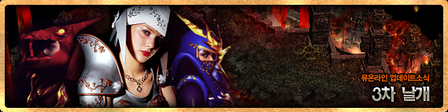
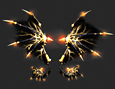
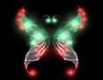
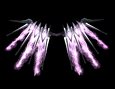
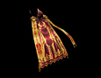
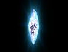
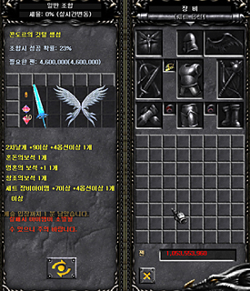
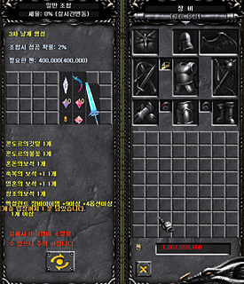

# Update News - 3rd Wing <small>28/06/2008</small>

A wing item has been added that can be worn by the class that has performed the 3rd change-up.

A wing item has been added that can be worn by the class that has performed the 3rd change-up.

# 3rd wing

A wing item has been added that can be worn by the class that has performed the 3rd change-up.

| image                     | item name               | Description and figures                                                                                                                                                                                                                                       |
| ------------------------- | ----------------------- | ------------------------------------------------------------------------------------------------------------------------------------------------------------------------------------------------------------------------------------------------------------- |
|  | wings of storm          | Wings worn by Blademaster Defense: (60) + (wing level _ 4) [levels 10-13 increase by +5 to +8] Damage increase: 39 + (wing level _ 2) damage absorption: 39 + (wings Level \* 2) HP decreases by 3 upon successful attack                         |
|  | Wings of time and space | Wings worn by grandmaster Defense: (45) + (wing level _ 4) [Levels 10-13 increase by +5 to +8] Damage increase: 39 + (wing level _ 2) Damage absorption: 39 + (wings Level \* 2) When the attack is successful, life is reduced by 1              |
|  | Wings of Illusion       | Wings worn by High Elves DEF: (45) + (Wings Level _ 4) [Levels 10-13 increase by +5 to +8] Damage Increase: 39 + (Wings Level _ 2) Damage Absorption: 39 + (Wings Level \* 2) When the attack is successful, life is reduced by 1                 |
|  | Wings of Ruin           | Wings worn by the Duel Master DEF: (55) + (wing level _ 4) [+5 to +8 for levels 10-13] Damage increase: 39 + (wing level _ 2) damage absorption: 39 + (wings Level \_ 2) When an attack is successful, life is reduced by 3                       |
|  | King's Cloak            | Wings worn by the Lord Emperor Defense: (45) + (wing level _ 4) [levels 10 to 13 increase by +5 to +8] Damage increase: 39 + (wing level _ 2) damage absorption: 24 + (wing level) Level \_ 2) When an attack is successful, life is reduced by 3 |

### Option setting

- Up to 3 options will be attached.

option(a)

- Randomly applies one of the three options that can be applied to wings (different for each wing).
- If options are not applied at the time of initial creation, options can be added using the Jewel of Life, just like existing wings.

| option name             | Black Knight 3rd | Warlock 3rd | Fairy 3rd | Magic Swordsman 3rd | Dark Lord 3rd |
| ----------------------- | ---------------- | ----------- | --------- | ------------------- | ------------- |
| bonus attack power      | O                | X           | O         | O                   | O             |
| extra horsepower        | X                | O           | X         | O                   | X             |
| extra armor             | O                | O           | O         | X                   | O             |
| automatic life recovery | O                | O           | O         | O                   | O             |

Option (b)

- A random “lucky” option may appear.

option (c)

- Randomly, one of the four options may be attached, or none of the options may be attached.
- Option 1: [If the attack hits the target] 5% chance to ignore the enemy's defense
- Option 2: [If the target's attack hits the character] 5% chance to return the enemy's attack power
- Option 3: [If the target's attack hits the character] 5% chance of fully recovering the character's life
- Option 4: [If the target's attack hits the character] 5% chance of fully recovering character's mana

_The returned enemy attack power is a certain % of the pure enemy attack power without damage reduction calculations such as defense / wing absorption.
Returning enemy attack power overlaps with damage reflection of excellent items._

_Full life (mana) recovery is an instant recovery of 100% of life (mana), and it is applied after the opponent's attack hits and HP decreases._

## 3rd wing combination

### 1st combination

- Required Combination Ingredients
  - 1 secondary wing at 4 on 9 (native is 1%) or higher
  - At least 1 set item with 4 or more ops in 7 (multiple possible)
  - Chaos Jewel x1, Soul Gem x10 bundle, Creation Jewel x1
- Max Combination Success Chance 60%
- combination cost
  - Probability of success \* 200,000 Zen
- combination success result
  - Create condor feathers
- combination failure result
  - 2nd wing [option and item level drop]
  - Set item [options and item level drop]
  - Jewel of Chaos, 10 bundle of Jewel of Soul, Jewel of Creation[all gone]
  - Combination cost [disappeared]

### 2nd combination

- Required Combination Ingredients
  - 1 or more excellent items with 4 or higher ops on 9 (multiple possible)
  - Condor Feather x1, Condor Flame x1
  - 1 Chaos Gem, 10 Soul Gem Bundle, 1 Blessing Gem 10 Bundle, 1 Creation Gem
- Max Combination Success Chance 40%
- combination cost
  - Probability of success \* 200,000 Zen
- combination success result
  - Create 3rd wing [Random 1 out of 5 types of 3rd wing, option is random]
- combination failure result
  - Excellent item [option and item level drop]
  - Condor's Feather, Condor's Flame [Disappeared]
  - Jewel of Chaos, 10 Jewels of Soul, 10 Jewels of Blessing, Jewel of Creation [All Disappeared]
  - Combination cost [disappeared]

## Set related items

| item name               | chuck | warehouse storage | sell to NPC | private store | individual transaction |
| ----------------------- | ----- | ----------------- | ----------- | ------------- | ---------------------- |
| wings of storm          | X     | O                 | O           | O             | O                      |
| Wings of time and space | X     | O                 | O           | O             | O                      |
| Wings of Illusion       | X     | O                 | O           | O             | O                      |
| Wings of Ruin           | X     | O                 | O           | O             | O                      |
| King's Cloak            | X     | O                 | O           | O             | O                      |

### Combination material item

Combination success result.

| image                     | item name        | Description and figures                                                                                             |
| ------------------------- | ---------------- | ------------------------------------------------------------------------------------------------------------------- |
|  | Condor's Flame   | Dropped with a designated probability only in the barracks map of Bargas (item used in the 3rd wing combination) |
|  | condor's feather | Combination Items (Items used for tertiary wing combinations)                                                    |

Process related to combination material transaction

| item name        | chuck | warehouse storage | sell to NPC | private store | individual transaction |
| ---------------- | ----- | ----------------- | ----------- | ------------- | ---------------------- |
| Condor's Flame   | X     | O                 | O           | O             | O                      |
| condor's feather | X     | O                 | O           | O             | O                      |
