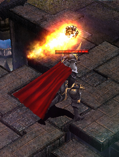

# Update News - Temple of Illusion <small>11/07/2007</small>

Welcoming Temple, a new concept quest system in which entering characters are divided into two camps to carry out missions, is added.

| morning time | Quest Name           |
| ------------ | -------------------- |
| 0:30         | welcome temple       |
| 1:00         | PC Room Chaos Castle |
| 1:30         | Blood Castle         |
| 2:00         | Devil's Square       |
| 2:30         | welcome temple       |
| 3:00         | -                    |
| 3:30         | Blood Castle         |
| 4:00         | -                    |
| 4:30         | welcome temple       |
| 5:00         | Devil's Square       |
| 5:30         | Blood Castle         |
| 6:00         | -                    |
| 6:30         | -                    |
| 7:00         | -                    |
| 7:30         | Blood Castle         |
| 8:00         | Devil's Square       |
| 8:30         | welcome temple       |
| 9:00         | -                    |
| 9:30         | Blood Castle         |
| 10:00        | Chaos Castle         |
| 10:30        | PC Room Chaos Castle |
| 11:00        | Devil's Square       |
| 11:30        | Blood Castle         |
| 12:00        | PC Room Chaos Castle |

| afternoon time | Quest Name           |
| -------------- | -------------------- |
| 12:30          | welcome temple       |
| 13:00          | Chaos Castle         |
| 13:30          | Blood Castle         |
| 14:00          | Devil's Square       |
| 14:30          | welcome temple       |
| 15:00          | PC Room Chaos Castle |
| 15:30          | Blood Castle         |
| 16:00          | Chaos Castle         |
| 16:30          | welcome temple       |
| 17:00          | Devil's Square       |
| 17:30          | Blood Castle         |
| 18:00          | PC Room Chaos Castle |
| 18:30          | welcome temple       |
| 19:00          | Chaos Castle         |
| 19:30          | Blood Castle         |
| 20:00          | Devil's Square       |
| 20:30          | welcome temple       |
| 21:00          | Chaos Castle         |
| 21:30          | Blood Castle         |
| 22:00          | PC Room Chaos Castle |
| 22:30          | welcome temple       |
| 23:00          | Devil's Square       |
| 23:30          | Blood Castle         |
| 24:00          | Chaos Castle         |

_You can check the event map time and event map entry level by pressing the 'F1' key in game._

Notice of change in position

- Blood Castle: 12 times every 2 hours (no change in number, no change in time)
- Devil's Square: 8 times every 3 hours (2 hours → 3 hours, 12 times → 8 times)
- Welcome staff: 8 times every 2 hours (general) / 2 times every 4 hours (dawn) → Total 10 times
- Chaos Castle: 6 times every 3 hours (2 hours → 3 hours, time variable)
- PC room Chaos Castle: Unspecified 6 times (time change)
- Admission level information

| temple grade | entry character level |
| ------------ | --------------------- |
| One          | 220-270               |
| 2            | 271-320               |
| 3            | 321-350               |
| 4            | 351-380               |
| 5            | 381-400               |

## Admission rules

### Personnel

- A minimum of 4 to a maximum of 10 people are admitted on a first-come, first-served basis, and an odd number of people can enter.
  The maximum number of entries allowed in 24 hours is limited to 6.
- If the number of entries is not met, the temple will be closed and moved to Debias.
- You can enter through “Mirage” located in Debias (224,52).

### How to acquire the item

- Acquired by hunting monsters of a certain level or higher.
- Combine the Old Scroll and the Oath of the Illusion Church through the Chaos Goblin. (Only materials of the same grade can be combined when combining)
- Chaos Goblin Guild > Normal Guild > (Old Scroll x1 + Illusion Church's Pledge x1 + Chaos Gem x1 + Zen) Required

Monster drop level by item

| item name     | monster drop level | Item name                        | monster drop level |
| ------------- | ------------------ | -------------------------------- | ------------------ |
| Old Scroll +1 | 66                 | Pledge of the Welcoming Cult +1  | 70                 |
| Old Scroll +2 | 72                 | Pledge of the Illusion Church +2 | 76                 |
| Old Scroll +3 | 78                 | Pledge of the Illusion Church +3 | 82                 |
| Old Scroll +4 | 84                 | Pledge of the Illusion Church +4 | 88                 |
| Old Scroll +5 | 90                 | Pledge of the Illusion Church +5 | 94                 |

Combination Probability and Required Zen

| item name          | Combination Success Probability | need zen   |
| ------------------ | ------------------------------- | ---------- |
| Scroll of Blood +1 | 70%                             | 3,000,000  |
| Scroll of Blood +2 | 70%                             | 5,000,000  |
| Scroll of Blood +3 | 70%                             | 7,000,000  |
| Scroll of Blood +4 | 70%                             | 9,000,000  |
| Scroll of Blood +5 | 70%                             | 11,000,000 |

## Battle

| Wait after entering the waiting room | wait for starting point | battle time | Completing rewards and events | entire     |
| ------------------------------------ | ----------------------- | ----------- | ----------------------------- | ---------- |
| 5 minutes                            | 1 min                   | 15 minutes  | 4 minutes                     | 25 minutes |

- You can enter for a total of 5 minutes, and after 5 minutes you can no longer enter.
- If the maximum number of people have entered, you will not be able to enter even if the waiting time remains.
- When the entry is complete, you will move to the starting point, and at this time, the players in the waiting room will be randomly divided into two camps.
- When you move to each faction, you automatically become a party, and you cannot forcibly leave the party.
- The camp will change its appearance to suit its role with the Welcoming Church and the MU Alliance.

| 

### How to proceed

- When you enter the battle, you can enter the inside of the temple from the starting location.
- In order to win, you must acquire the Holy Relic from the stone statues that appear randomly in two places on the map and store it in your inventory.

- Click on the statue and hold for 10 seconds to obtain the holy relic.
- If the user holding the relic clicks on the storage box and holds it for 10 seconds, points can be earned.
  - _Relic Acquisition and Relic Storage will be canceled if a binding skill or stun skill is applied._
- Players who have acquired the Relic will have their movement speed reduced and their location displayed on the minimap.

- If you store the relic in the storage box and score points, the relic will regenerate again.
- If the character carrying the relic dies, the relic will drop in its place.
- exclusive skill
  - It is a special skill that can be used at the temple and can be used when the Kill Point is satisfied.
  - All accumulated points are reset when a character dies, and 10 points are received again when the character dies and is regenerated. (accumulate up to 90 points)
  - Skill Selection: Mouse Wheel
  - Use Skill: Shift + right mouse click
  - Acquiring Kill Points

| image                             | skill name          | effect                                                               | Kill Count | hold time  |
| --------------------------------- | ------------------- | -------------------------------------------------------------------- | ---------- | ---------- |
|  | spell of protection | Temporarily creates a shield that absorbs 100% of damage             | 5          | 15 seconds |
|  | spell of bondage    | Temporarily unable to move character                                 | 5          | 15 seconds |
|  | Order of Pursuit    | Move to the current location of the character who acquired the relic | 10         | -          |
|  | shieldburn          | Reduces target's current shield value by 50%                         | 5          | -          |

| Target  | points that can be earned |
| ------- | ------------------------- |
| Monster | 2                         |
| Player  | 5                         |

- Since there are two respawn points for the Relic, it is recommended to distribute the number of people appropriately to explore.
- Once the relic is acquired, it can be moved to the location of the player it is carrying through the Pursuit spell.
- More strategic play is possible by using appropriate skills according to the situation.

### Success/Failure

success condition

- Among the teams that score 2 or more points in time, the high-scoring team wins.
- If you reach 7 points first, you succeed regardless of how much time is left.

| success     | detail                                                 | compensation   | Target                |
| ----------- | ------------------------------------------------------ | -------------- | --------------------- |
| condition 1 | Earn 2 or more points within the set time & high score | Chaos Jewel x1 | all successful groups |
| condition 2 | If you get 7 points first                              | Chaos Jewel x1 | all successful groups |

failure condition

- Failure to obtain the same score
- Fail if the score is lower than the opponent's
- Fail if scoring less than 2 points

### Compensation

- The winning team will receive 1 Gem of Chaos per player.
- Experience is obtained as a basic reward, and is applied differently depending on the employee's rank and success time. (applies to both success and failure teams)
- If you do not use the skills exclusive to the Temple of Illusion (Protection Spell, Binding Spell, Pursuit Spell, Shield Burn) more than 3 times, you will not receive reward EXP.
- Reward EXP Acquisition Formula

| Rating | A value base experience reward | B value acquisition points (per piece) |
| ------ | ------------------------------ | -------------------------------------- |
| 1      | 300000                         | 50000                                  |
| 2      | 340000                         | 60000                                  |
| 3      | 380000                         | 70000                                  |
| 4      | 420000                         | 80000                                  |
| 5      | 460000                         | 90000                                  |

- Reward EXP for Success
  - = (A+(Success Points - Failed Faction Points)*B)*2
- In case of failure (if there is a score)
  - reward EXP = A + points for the failed faction \* B
- In case of failure (if no points are earned)
  - reward experience = A

_Reward EXP is earned equally per group._

Official Ranking Points for Ranking Points

The more points you earn, the greater the reward experience you receive, so the point is to score a lot of points.

= Player Individual Reward EXP Value + (Player Kill Count _ C) + (Relic Carrying Count _ D) + E

| Rating | Player Kill Point (C value) | Number of relics carried (D value) |
| ------ | --------------------------- | ---------------------------------- |
| 1      | 600                         | 1200                               |
| 2      | 1200                        | 2400                               |
| 3      | 1800                        | 3600                               |
| 4      | 2400                        | 4800                               |
| 5      | 3000                        | 6000                               |

| survivors | 1   | 2   | 3   | 4   | 5   |
| --------- | --- | --- | --- | --- | --- |
| E value   | 10  | 20  | 30  | 40  | 50  |

Ranking points are accumulated according to individual performance, and the more party members you play with, the more bonus
points you get.
